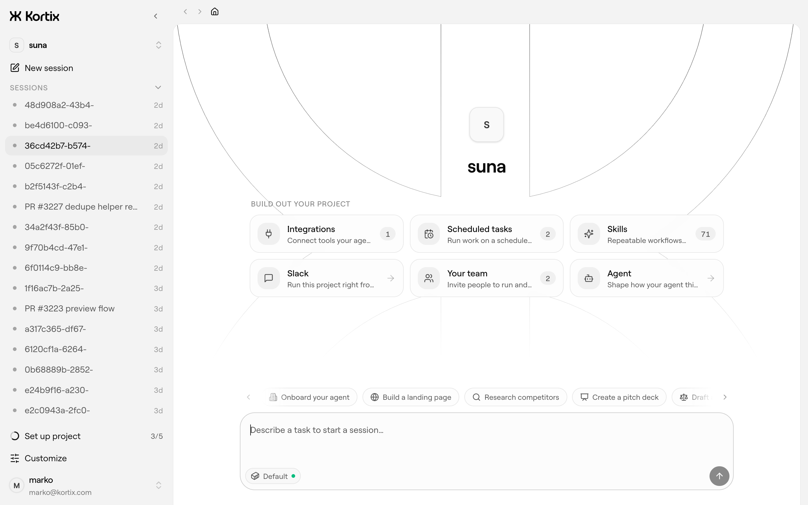

<div align="center">


# Kortix

### The AI command center for your company

**One repo. One config. A workforce of AI agents that does the real work — and everything is code you own.**

[](https://github.com/kortix-ai/suna/stargazers)
[](VERSION)
[](https://kortix.com/docs)
[](#contributing)

[Website](https://kortix.com) · [Documentation](https://kortix.com/docs) · [Cloud](https://kortix.com) · [Manifesto](MANIFESTO.md)

<br />



</div>

---

## Quickstart

Three commands. Build your company like a codebase, then bring it live.

```bash
# 1 · Install the CLI
curl -fsSL https://kortix.com/install | bash

# 2 · Scaffold a project — creates kortix.toml + your agents, skills and runtime config
kortix init

# 3 · Ship it — pushes your repo and brings the whole thing live in the cloud
kortix ship
```

That's the loop. From here:

```bash
kortix sessions new --prompt "Summarize this week's commits and open a change request"
kortix cr ls          # review what an agent proposes — merge to keep it
kortix chat           # talk to a session's agent from your terminal
```

Prefer zero setup? Sign up at **[kortix.com](https://kortix.com)**, create a project, and start a session — nothing to install. Full command surface: **[CLI reference](https://kortix.com/docs/reference/cli)**.

---

## A company is going to be a git repository

Not as a metaphor — literally something you can clone. Inside it: your agents, the skills they've built up, the way the work actually gets done, every fact the company has learned, and the definition of the machines it all runs on. **Versioned. Diffable. Owned outright.** Running on its own around the clock, opening pull requests against itself, getting better at being your company while everyone's asleep.

Most AI tools give you a chat box. Kortix gives you a **command center** — one place where your agents, skills, integrations, automations and memory all live, and a workforce of agents that produces real output (decks, reports, code, replies, deployed work), not just chat. It feels as simple as a chat app. Underneath, everything is code you own.

```
project  (git repo + kortix.toml)
   └─ session ──> isolated cloud sandbox on a branch named after the session
                     └─ agent (OpenCode) works, commits, pushes
                           └─ change request ──> you review & merge ──> main
```

- Every **session** runs in its own disposable Linux sandbox on its own branch — the agent can install, run and break anything; only what it commits survives.
- Work reaches `main` only through a **change request** you approve, so the company self-improves one reviewed change at a time.
- Run **thousands of agents in parallel** on the same config, each fully isolated, each feeding work back through change requests.

---

## What's in the command center

| | |
| --- | --- |
| **Agents** | Markdown personas with a scoped reach into tools — one per role or task. Installable in a click, able to rewrite themselves. |
| **Skills** | Reusable know-how that encodes how your company does a job. Written once, shared into every session. |
| **Connectors** | 3,000+ apps in a click — plus MCP, OpenAPI, GraphQL and raw HTTP — brokered server-side through one scoped token. |
| **Secrets** | Encrypted, scoped per person and group, injected into sandboxes at runtime, never exposed to the model or logs. |
| **Channels** | Slack and chat surfaces — one click stands up a bot that starts sessions where your team already works. |
| **Triggers** | Cron and signed webhooks that spawn sessions automatically — every morning, or the instant something happens. |
| **Memory** | A living company brain — plain files today, a system that compounds what it learns over time. |

Work runs three ways: **on-demand** (ask in chat, get it now), **human-assisted** (the agent works and checks in for the calls that matter), and **automated** (runs on a schedule or trigger, end to end).

---

## Why Kortix

- **Open & yours.** Open source and self-hostable — your data, your models, your infrastructure. No lock-in, fully auditable.
- **A workforce, not one assistant.** Org-scale specialist agents that run in parallel and compound a shared memory.
- **Real work, not chat.** Agents run on real computers and return finished deliverables — and take real actions in your tools.
- **Everything is code.** Versioned, reviewable, portable, governable — never a black box. `grep` your entire company.
- **Bring your own models.** Any provider, your own keys — or the ChatGPT, Claude, or Cursor subscription you already pay for.

---

## Self-host

Kortix runs on your own infrastructure — laptop, VPS, your VPC, or fully air-gapped. Start a production-style local instance from Docker images, then switch the CLI between Cloud and your own hosts:

```bash
kortix self-host start
kortix hosts use local     # ↔  kortix hosts use cloud
```

The first interactive setup asks only for the integration credentials that unlock managed git, GitHub access, and Pipedream connectors — ports, local URLs, keys and Docker Compose defaults are generated for you.

Managed hosting is **[Kortix Cloud](https://kortix.com)**.

---

## Enterprise & security

Built to survive a security review, not slip past one: microVM isolation · members, groups & roles that match your org · per-resource permissions for people **and** agents · a secrets manager (encrypted, injected at runtime, never exposed) · a full audit trail · human approval gates on sensitive actions · on-prem, VPC, or air-gapped deployment.

---

## Contributing

Monorepo managed with **pnpm 8** (Docker required for sandboxes).

```bash
pnpm install
pnpm dev            # web + API (scripts/dev-local.sh)
pnpm dev:web        # web app only
pnpm dev:api        # API only
pnpm dev:sandbox    # build the local sandbox image
pnpm build          # build all packages
pnpm nuke           # tear down the local Docker environment
```

#### Secrets

API secrets live in **`apps/api/.env`, encrypted with [dotenvx](https://dotenvx.com)** and committed to the repo — the ciphertext is safe in git; only the private decryption key is secret. To run locally you need that key, which we keep off-device in **[Dotenv Armor](https://dotenvx.com/armor)**:

```bash
curl -sfS https://dotenvx.sh/armor | sh   # one-time install
dotenvx-armor login                        # grants this machine decryption
pnpm dev                                   # dev-local.sh decrypts apps/api/.env on boot
```

There are two encrypted profiles, one file each (each with its own keypair in `apps/api/.env.keys`):

| Profile | File | Used by |
| --- | --- | --- |
| local | `apps/api/.env` | `pnpm dev` / `pnpm dev:api` (default) |
| dev | `apps/api/.env.dev` | `dotenvx run -f apps/api/.env.dev -- …` |

Production secrets are **not** kept in the repo — the prod runtime injects them. To add or rotate a secret in a profile: `pnpm dlx @dotenvx/dotenvx set KEY value -f apps/api/.env[.dev]` (re-encrypts in place), then commit. `apps/web` and `supabase` env stay as plain local files — `apps/web/.env` is client-facing (`NEXT_PUBLIC_*`) and `supabase/.env` is read by the Supabase CLI directly.

CI doesn't need any of these today (builds use placeholders, and the `secret-scan` workflow allowlists the encrypted file via `.gitleaks.toml`). If a future job needs real values, add the dotenvx private key as a single `DOTENV_PRIVATE_KEY` GitHub Actions secret and prefix the step with `dotenvx run -- …` — it decrypts `apps/api/.env` in memory, no other secrets required.

Apps live under `apps/` (`web`, `api`, `cli`, `desktop`, `mobile`, `sandbox`); documentation source is in `apps/web/content/docs`. The whole platform ships under one version (root `VERSION`) — API, frontend, CLI and desktop release together as `vX.Y.Z`. Issues and pull requests are welcome.

---

<div align="center">
<br />
<strong>We're building the thing that takes a company from human to AGI — and lets it keep every byte of itself on the way there.</strong>
<br /><br />
<a href="https://kortix.com">kortix.com</a>
</div>
