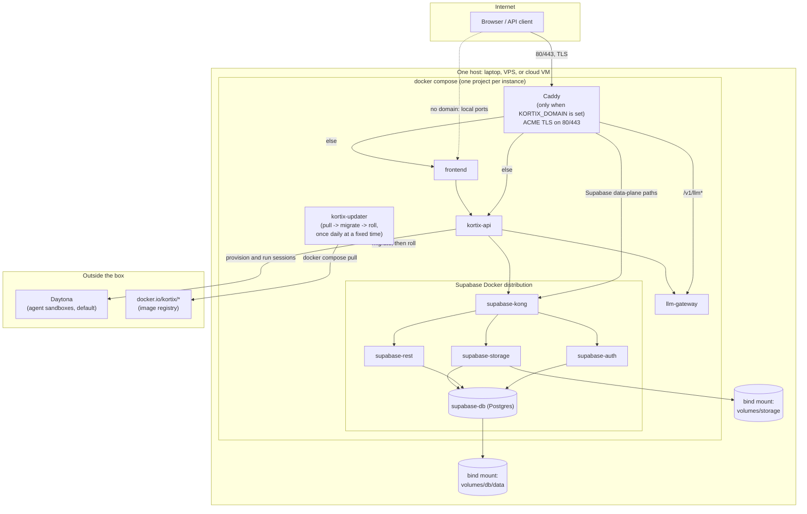

import { Callout } from 'fumadocs-ui/components/callout';

This page shows how the pieces of a self-hosted Kortix instance fit
together: one Docker Compose stack, plus the compute that stays outside it.
For install steps, see the [self-hosting guide](/docs/guides/self-hosting).

Self-hosted Kortix is one generic Docker Compose system, not a family of
deployment targets. `kortix self-host init` renders a `docker-compose.yml`
and `.env` file (plus a `Caddyfile` and `updater.sh` when you set a domain)
into `~/.config/kortix/self-host/<instance>/`. `kortix self-host start` runs
`docker compose up`. The same artifact runs on a laptop, a VPS, or any cloud
VM. A domain is only the `KORTIX_DOMAIN` environment variable, not a
different setup.

Production self-hosting needs a persistent domain pointed at the box. A
domain gives Caddy a stable name for ACME TLS, and gives agent sandboxes a
stable URL to call back to. Without a domain or a tunnel, sessions cannot
run, because the sandbox has no way to reach the API. For evaluation without
a domain, use `kortix self-host init --tunnel cloudflare` instead.

## One box, one Compose stack

## What runs on the box

- **Caddy** — reverse proxy and ACME TLS. Kortix renders this service only
  when you set `KORTIX_DOMAIN`; a domain-less instance never opens ports
  80/443. Caddy routes `api.<domain>` to the gateway (for `/v1/llm*`) or the
  API, and `<domain>` to Kong (for Supabase data-plane paths) or the
  frontend.
- **`kortix-api`, `llm-gateway`, `frontend`** — the three application
  images. They track the same channel, or a version you pin explicitly.
- **The Supabase Docker distribution** — Kong, GoTrue auth, PostgREST,
  Storage, Realtime, Studio, imgproxy, meta, functions, and the Supavisor
  connection pooler. Kortix vendors this from upstream Supabase and pins
  every image by digest.
- **`kortix-updater`** — a small container with the Docker socket mounted.
  It checks for a new image once a day, at a fixed local clock time
  (`KORTIX_UPDATE_TIME`, default `02:00`, in `KORTIX_UPDATE_TZ`, default
  `America/New_York`). If an image changed, it runs the `kortix-migrate`
  job, then starts new containers before it stops the old ones. This
  start-first swap is zero-downtime only when the box runs two replicas
  (domain mode). A single-replica box (tunnel or local mode) uses a
  different, brief-downtime swap instead.
- **Data** — two bind mounts under the instance directory:
  `volumes/db/data` for Postgres and `volumes/storage` for Supabase
  Storage. The `.env` file holds every secret.

## What runs outside the box

- **Agent sandboxes** — by default, Daytona. You can configure Platinum or
  E2B instead. `kortix-api` reaches the sandbox provider over egress;
  sandbox compute never runs on the self-host box. One exception:
  `local-docker` is an experimental provider that runs sandboxes on the same
  Docker socket as the box. It does not scale beyond one machine. Kortix
  does not recommend it for production.
- **The image registry** — `docker.io/kortix/*`. The updater and
  `kortix self-host start` pull from it. It needs no credentials.

<Callout type="warn">
`kortix self-host uninstall` runs `docker compose down --volumes
--remove-orphans` and deletes the instance directory. This removes your
database and storage bind mounts. Back them up first.
</Callout>

## Channels and updates

Every instance tracks one of two moving tags, or a version you pin
explicitly:

| Channel | Meaning |
|---|---|
| `stable` (default) | Curated. A human promotes a proven version to `stable` on a separate schedule from prod releases. |
| `latest` | Every prod release retags `latest` automatically. |
| `--tag <version>` | Pins an exact version. Overrides the channel. |

`kortix-updater` and `kortix self-host update` (alias `reconcile`) resolve
the same way: an explicit pin wins, otherwise the configured channel.
Self-hosted instances only consume images this pipeline has already built;
they never build or sign anything themselves.

See the [self-hosting guide](/docs/guides/self-hosting) for install steps
and the [CLI reference](/docs/reference/cli) for the full
`kortix self-host` command surface.
