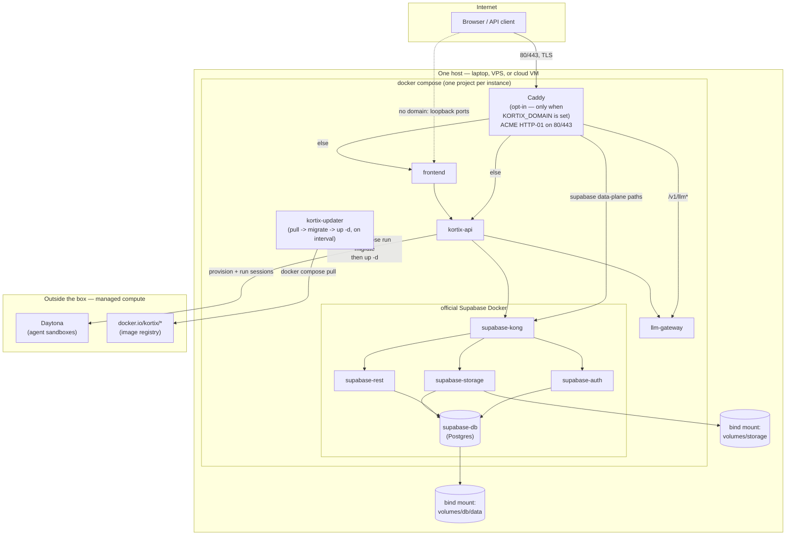

**Kortix self-host is VPS-first.** The supported production deployment is
your own VPS/server with a persistent domain pointed at it — that's the
combination that gives you a stable, durable public URL for Caddy/ACME TLS
and for agent sandboxes to call back to. A laptop can run the identical
artifact for evaluation, but only via a Cloudflare tunnel (ephemeral URL) or
loopback-only (no external reachability at all, agent sandboxes will not
work) — neither is a deployment target.

Architecturally, Kortix self-host is **one generic Docker-native system**,
not a family of deployment targets. `kortix self-host init` renders a
`docker-compose.yml` + `.env` (plus a `Caddyfile` and `updater.sh` when a
domain is configured) into `~/.config/kortix/self-host/<instance>/`, and
`kortix self-host start` runs `docker compose up`. The exact same artifact
runs on a laptop, any VPS, or a cloud VM (EC2, Droplet, …) — a public domain
is just an env var (`KORTIX_DOMAIN`) the same stack reacts to, not a
different mechanism. See the [CLI reference](/docs/reference/cli#self-host)
for the full command surface and the
[self-hosting runbook](https://github.com/kortix-ai/suna/blob/main/docs/runbooks/self-hosting.md)
for the VPS-first quickstart and day-2 operations.

## One box, one Compose stack

## What's on the box vs. outside it

**On the box** (this Compose stack):

- **Caddy** — reverse proxy + ACME TLS. Only rendered into the Compose file at
  all when `KORTIX_DOMAIN` is configured (`renderFullDockerCompose` in
  `apps/cli/src/self-host/compose-assets.ts` deletes the service entirely
  otherwise) — a domain-less instance never even opens 80/443. Routes:
  `api.<domain>` → `/v1/llm*` to the gateway, else to the API;
  `<domain>` → the Supabase data-plane path prefixes to Kong, else to the
  frontend.
- **`kortix-api` / `llm-gateway` / `frontend`** — the three application
  images, `kortix/kortix-api`, `kortix/kortix-gateway`, `kortix/kortix-frontend`,
  all tracking the same moving tag (channel) or pinned version together.
- **Official Supabase Docker** — Kong, Postgres, Auth (GoTrue), PostgREST,
  Storage, Realtime, Studio, imgproxy, meta, functions, the connection pooler.
  Vendored from the upstream Supabase self-hosting distribution and image-pinned
  by digest (see `SUPABASE_IMAGE_DIGESTS` / `image-lock.json` in the same
  file) — Kortix reviews and locks the Supabase images it ships, independent
  of the app-image channel.
- **`kortix-updater`** — a small `docker:cli` container with the Docker
  socket mounted. On an interval it pulls this stack's configured image tags,
  and only if something actually changed: runs the `kortix-migrate` one-shot,
  then rolls the stack forward (`docker compose up -d --wait`). This is the
  entire update mechanism — there is no separate updater binary, no systemd
  timer, no SSM. A `flock` keeps overlapping cycles from racing each other.
- **Data** — two bind-mounted directories under the instance directory
  (`volumes/db/data` for Postgres, `volumes/storage` for Supabase Storage),
  plus the `.env` holding every secret. See the runbook's Backups section.

**Outside the box** (managed compute, unchanged from Kortix Cloud):

- **Agent sandboxes** run on Daytona (or another configured
  `ALLOWED_SANDBOX_PROVIDERS`), reached over egress from `kortix-api`. Sandbox
  compute never runs on the self-host box itself — the box is light (API,
  gateway, frontend, Supabase), the heavy compute is external by design.
  Platinum (dedicated sandbox infrastructure) sits in this same "outside the
  box" category.
- **The image registry** (`docker.io/kortix/*`) the updater and `start` pull
  from — publicly pullable by digest/tag, no credentials required.

## Channels and the update contract

Every instance tracks one of two moving Docker tags — **`stable`** (default)
or **`latest`** — or an explicit pinned version (`--tag <version>`). The
`kortix-updater` service and `kortix self-host update`/`reconcile` both
resolve the same way: an explicit pin wins, otherwise the configured channel.

This is a **release-pipeline contract**, not a self-host CLI concern: the
Kortix release flow must publish/repoint the moving `stable` tag on all three
app images (`kortix-api`, `kortix-frontend`, `kortix-gateway`) on every
production release, the same way it already republishes `latest` and the
exact `X.Y.Z` tag. Self-host installs — laptop or production — consume
whatever that pipeline publishes; they never build or sign anything
themselves.

## What changed from the old enterprise-VPC design

Earlier iterations of enterprise self-hosting (see `docs/specs/2026-07-13-enterprise-vpc-single-tenant-deployment.md`,
`docs/specs/2026-07-14-enterprise-ecs-simplification.md`, and
`docs/specs/2026-07-14-enterprise-appliance.md`, all now superseded) used a
signed TUF release channel, a dedicated AWS VPC (EKS, then ECS, then a single
EC2 appliance), Terraform-managed infrastructure, an on-box systemd updater
binary, and SSM RunCommand for remote operation. All of that is gone. The
generic Docker self-host system replaces it: no signing, no Terraform, no
AWS-specific bootstrap, no SSM — one Compose stack, one CLI, one update
mechanism, running the same way everywhere.
