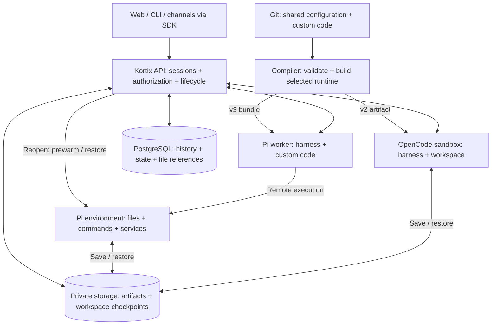

# Agent runtime: shared configuration and recoverable workspaces

Design proposal · 2026-09-10 · Canonical plan; implementation status appears below.

**Goal: configure an agent once, select OpenCode or Pi with the YAML version,
and keep its conversation and files when compute is replaced.**

Use existing provider sandboxes. No Durable Objects in this phase. For Pi,
only the worker runs the agent harness. Its environment runs files, commands,
and services. YAML v2 retains the existing combined OpenCode sandbox.
The session keeps `session_id`; provider instance IDs and generations remain internal.

## 1. One configuration, two runtime adapters

| Contract | YAML v2 | YAML v3 |
| --- | --- | --- |
| Runtime selected by `kortix_version` | OpenCode | Pi |
| Agent names, prompts, models, permissions, skills, commands, platform grants | Same source and documented semantics | Same source and documented semantics |
| Custom tools and lifecycle | OpenCode adapter | Pi adapter |
| Harness placement | Existing environment sandbox | Small worker sandbox |
| Workspace execution | Same sandbox as OpenCode | Separate environment; neither Pi nor OpenCode runs there |

**Changing only `kortix_version` is the target for portable configurations.**
Omit the redundant `runtime` field; contradictory declarations fail validation.
Pin compiler, harness, and dependency versions separately.

“Same configuration” does not promise identical model responses or support for
arbitrary native plugins. A shared capability must work through both adapters.
Unsupported fields, model options, tools, or hooks fail compilation with their
source path and reason. Never silently omit them or start the other runtime.

### Shared source example

This is the **proposed neutral layout**, replacing runtime-specific authoring directories:

```text
kortix.yaml
.kortix/agents/analyst.md
.kortix/agents/analyst.ts                 # optional portable custom code
.kortix/skills/reporting/SKILL.md
.kortix/commands/review.md
.kortix/package.json + package-lock.json # optional locked dependencies
.kortix/native/pi/                       # optional native escape hatch
.kortix/native/opencode/
```

```yaml
kortix_version: 3 # change to 2 for OpenCode
default_agent: analyst
agents:
  analyst:
    connectors: none
    secrets: none
    skills: [reporting]
```

The agent declaration joins `analyst.md` and `analyst.ts` by name. Environment
templates, mounts, connectors, and secret references stay in `kortix.yaml`.
Secrets are injected at execution time; never compile their values into bundles.

Example `.kortix/agents/analyst.md` under the proposed shared contract:

```markdown
---
description: Analyze reports
model: gpt-5.6-luna
permission:
  '*': deny
  read: allow
  write_note: ask
---
Read the supplied reports. Ask before saving a note with write_note.
```

Existing `.kortix/opencode` and `.kortix/pi` projects retain their legacy behavior.
Provide a migration that moves portable files into the shared layout. Report
conflicting definitions instead of merging them implicitly.

## 2. Compile before startup; activate where the harness runs



1. **Commit/deploy:** validate the shared schema and selected runtime's capability
   support. Compile declared agents separately, with locked dependencies.
2. **Publish:** retain immutable artifacts identified by source SHA, agent,
   runtime, compiler, and dependency versions. Failed builds preserve the previous
   deployment. A session pins one artifact.
3. **Start/replacement:** download that artifact and activate its configuration
   before starting the harness. OpenCode receives its generated config and native
   directories. Pi receives its compiled bundle in the worker.
4. **Resume:** reuse the pinned artifact. Do not clone, reinstall dependencies,
   or regenerate configuration on every message. An unbuilt source reference
   needs one deduplicated server build before startup.

`.opencode` and `.pi` are adapter outputs, not two configurations users maintain.
OpenCode needs native files such as agent Markdown, skills, commands, and plugin
entries. The current Pi worker uses Agent Core and consumes configuration inside
its executable bundle. A `.pi` folder alone does not load extensions. Materialize
only resources its adapter actually needs. Native OpenCode directory conventions
are documented [here](https://opencode.ai/docs/config/).

Generate nothing for an agent harness inside the Pi environment. Its setup only
installs workspace dependencies and execution helpers. Generated configuration
never syncs back into Git. Adapters control configuration discovery so ambient
user/global files cannot override the selected artifact or platform policy.

A version change selects the next deployment. Existing sessions keep their pinned
runtime. Switching an existing session requires an explicit migration or fork,
including transcript, pending tools, and state compatibility checks.

## 3. Custom configuration and executable behavior

| Customization | Shared contract |
| --- | --- |
| Prompts, models, sampling/reasoning, tool permissions, skills, commands | Validate common fields and each model's supported options. |
| Tools, context transforms, turn/tool hooks, cancellation | Portable API with equivalent adapters; explicit failure where equivalence is unavailable. |
| Native Pi extensions or OpenCode plugins | Explicit native entrypoints and declared target support; no automatic translation. |
| Python, native packages, MCP servers, LSP, watchers | Environment helpers called remotely by Pi. Declare setup and readiness. |
| Persistent state | Session-scoped state with atomic revisions and schema migrations. |
| Jobs, triggers, child agents | Durable identities, cancellation, leases, quotas, and explicit workspace sharing. |
| Arbitrary replacement agent loop or TUI extension | Separate harness/compatibility contract; not implied by accepting JavaScript. |

Proposed portable tool API **pseudocode**, not an SDK export available today:

```ts
export default defineAgent(({ env, state }) => ({
  async initialize() {
    await state.open('notes', { schemaVersion: 1, initialValue: { count: 0 } });
  },
  tools: [{
    name: 'write_note',
    description: 'Save a note in the workspace',
    input: { type: 'object', properties: { text: { type: 'string' } }, required: ['text'] },
    async execute({ text }) {
      const result = await env.writeFile('/workspace/note.txt', text);
      if (!result.ok) throw result.error;
      return { text: 'Note saved', file: '/workspace/note.txt' };
    },
  }],
}));
```

`env` always addresses the workspace. Under Pi it makes a remote call; it never
writes the worker's local disk. The runtime adapter translates schemas, results,
and lifecycle events. A workspace path becomes a durable chat attachment only
through the publication step below.

Native customization already exists for Pi through `definePiAgent` from
`@kortix/sdk/pi`: initialization, context/tool/provider hooks, cancellation,
shutdown, custom tools, and durable state. Exact executable examples and limits
are in [Custom Pi agents](./PI_CUSTOM_AGENTS.md). These exports are not yet a
portable OpenCode/Pi API.

For example, a Pi-only native hook prevents a version-only switch until it has
an OpenCode implementation or a portable replacement. Compile-time diagnostics
must name that dependency.

Behavior precedence is defaults → agent configuration → allowed session overrides.
The portable schema rejects duplicate declarations across Markdown and code.
Platform grants bound every layer; session overrides cannot grant new access.
Custom source is trusted project
code; tool approvals do not isolate it. Initialization can repeat, shutdown can
be skipped, and retries can follow uncertain external effects. Persist important
state during work, make effects idempotent where possible, and reject incompatible
state migrations without changing the stored value.

## 4. Files: where they live and where they sync

| Data | Authoritative storage / synchronization |
| --- | --- |
| Agent configuration and source | Git → compiler → selected runtime. One direction. |
| Conversation and custom state | PostgreSQL, independent of both sandboxes. |
| Active workspace | Environment disk. Pi accesses it through remote tools; no worker mirror. |
| Workspace recovery | Environment → verified checkpoints in private storage; reverse on restore. |
| Chat attachments | Immutable file versions in private storage, referenced by PostgreSQL. |
| Shared organization files | Separately owned storage and grants; session cleanup does not delete them. |

A workspace synchronization service captures writes from tools, terminals,
editors, and other processes. Watchers need periodic reconciliation for missed
changes. Save during active work and before removal. Show the last verified
checkpoint and unsaved changes; a local write is not proof of remote durability.

Checkpoint declared persistent roots, untracked work, local Git state, deletions,
renames, permissions, and supported symlinks. `.gitignore` is not a backup policy.
Databases need consistent backups. Exclude rebuildable caches and injected secrets.
One active environment owns a workspace; concurrent editors use revision checks.
Shared mounts and forked workspaces need explicit ownership rules.

Publish `report.pdf` before committing its saved file card. Verify the bytes;
store its version, hash, owner, and metadata. Old cards retain old bytes after
edits. Upload user attachments to durable storage first, then materialize them
in the environment when needed. Authorized previews/downloads work without either
sandbox; expired URLs are renewed from the saved reference.

### Should we use Lix?

**Lix is not integrated in this branch. Evaluate it behind the Kortix file API,
not as a prerequisite for the runtime switch.**

Lix offers file versioning, branches, and synchronization. Its server can use
S3-backed persistence and run on existing infrastructure without Durable Objects.
It can provide a backend for versioned workspace files; PostgreSQL still owns
sessions and custom agent state. [Persistence](https://lix.dev/docs/persistence),
[hosting](https://lix.dev/docs/hosting).

Four requirements prevent adopting it blindly:

- **Durability:** Lix sync writes commit locally and upload asynchronously. Its
  documented API cannot await server confirmation of every commit; closing is
  not that guarantee. Cleanup needs a separately verified remote checkpoint.
  Remote mode acknowledges server writes, with different latency/offline tradeoffs.
  [Sync semantics](https://lix.dev/docs/collaboration-and-sync).
- **Conflicts:** the documented sync client can discard pending work after an
  incompatible server update. It provides no divergent-head merge API. Require
  controlled writers and independent recovery before enabling concurrent editing.
  [Conflict behavior](https://lix.dev/docs/collaboration-and-sync).
- **Filesystem coverage:** its filesystem synchronization covers regular files,
  not symlinks or special entries. A `.lixsnap` captures a Lix repository, not
  the whole environment. Preserve additional workspace metadata and consistent
  database backups separately. [Persistence](https://lix.dev/docs/persistence),
  [snapshots](https://lix.dev/docs/snapshots).
- **Access:** Kortix must authenticate and authorize access through a trusted
  gateway. Treat session isolation and sharing as our responsibility.
  [Hosting contract](https://lix.dev/docs/hosting).

Prototype crash recovery, offline writes, large binaries, many small files,
rename/delete conflicts, tenant isolation, and restoration into a fresh sandbox.
Adopt Lix only after those checks and latency/cost measurements pass. Ordinary
private file storage remains sufficient for the first verified checkpoint implementation.

## 5. Seven-day cleanup and immediate preparation on reopen

Proposed policy; these fields are **not implemented configuration**:

```yaml
compute_policy:
  on_session_reopen: warm_environment
  worker_idle_stop: 5m
  environment_idle_stop: 15m
  environment_delete_after_unused: 7d
  unused_warmup_limit: 15m
  require_verified_restore_point: true
  on_backup_failure: retain_disk_and_alert
```

- **Open an existing session:** show history and attachments immediately. The SDK
  explicitly starts/resumes/restores its environment in parallel. Start the Pi
  worker on a message. Workspace tools wait for readiness; text-only work can proceed.
- **Avoid accidental startup:** lists, prefetch, heartbeats, and downloads never
  warm compute. Agents without an environment stay worker-only. New sessions can
  start their environment lazily. Deduplicate concurrent opens and bound retries,
  warmup concurrency, budgets, and the unused 15-minute allowance.
- **Measure actual use:** workspace operations, terminal/preview use, and job
  leases count. Automatic warmup, idle connections, and text-only messages do not
  reset the **7 days / 168 hours** clock. Worker and environment leases are independent.
  Persist that clock across replacements; use first creation until the first operation.
  A bounded warmup lease protects restoration. Idle stop retains the disk; deletion removes it.
- **Remove safely:** claim the current generation, recheck leases, quiesce writes,
  verify a fresh checkpoint and restore dependencies, then record the restore
  descriptor before deletion. Failed verification retains the disk. Provider
  auto-deletion must obey this gate. Reconcile deletion timeouts without touching replacements.

On day ten, the same `session_id` opens with the old downloadable PDF. A new
environment immediately starts restoring unfinished files. Pi can discuss history
while restoration runs. Processes and RAM do not return; declared services restart.
An unused warmup stops within 15 minutes and does not renew seven-day retention.
History, artifacts, and checkpoints have separate retention rules.

## 6. Implementation order and acceptance

| Next step | Required proof |
| --- | --- |
| Shared schema, source layout, migration, and two adapters | A fixture changes only `kortix_version`; supported configuration remains equivalent. Unsupported native code fails explicitly. |
| File publication, checkpoints, optional Lix prototype | Old attachments load with no sandboxes. Fresh compute restores uncommitted files and metadata. Backup failure prevents deletion. |
| Independent lifecycle, reopen warmup, gated seven-day cleanup | Concurrent opens create one environment. A terminal survives worker stop. Day-ten recovery works with the same session ID. |
| Remaining customization, parity, and performance | Real custom agents and client flows pass. Compare split Pi, direct Pi, and OpenCode under equal conditions; restore worker mode afterwards. |

**Current:** version selection, compiled Pi agents, native hooks/tools, and
PostgreSQL state exist. State recovery was preview-verified at `8b60e2c2b2`.
The neutral layout, portable custom API, general file checkpoints, Lix integration,
and gated reopen/cleanup lifecycle remain work. Existing orphan deletion is not
a verified-backup policy; replace its gate before enabling this design.

Acceptance also covers corrupt/missing backups, storage quotas, lost disks and
checkpoint lag, provider failures, stale writers, cancellation/deletion races,
pending questions/approvals, SSE replay without duplicate effects, hook crashes,
revoked grants, missing pinned bundles, failed migrations, fork/rewind file effects,
shared-data retention, and deletion tombstones that prevent resurrection.

Define numeric checkpoint-lag, recovery-time, and cost budgets before rollout.
Measure p50/p95 first-token, first-tool, and restore latency, plus failures and
prewarming cost. Match models, resources, regions, and cold/warm states.
Do not promise zero file loss between checkpoints. Test supported providers and
clients; keep an explicit capability matrix instead of claiming arbitrary extension compatibility.

Detailed references: [custom authoring](./PI_CUSTOM_AGENTS.md) ·
[parity inventory](./PI_OPENCODE_PARITY.md) · [verification](./PI_WORKER_VERIFICATION.md).
