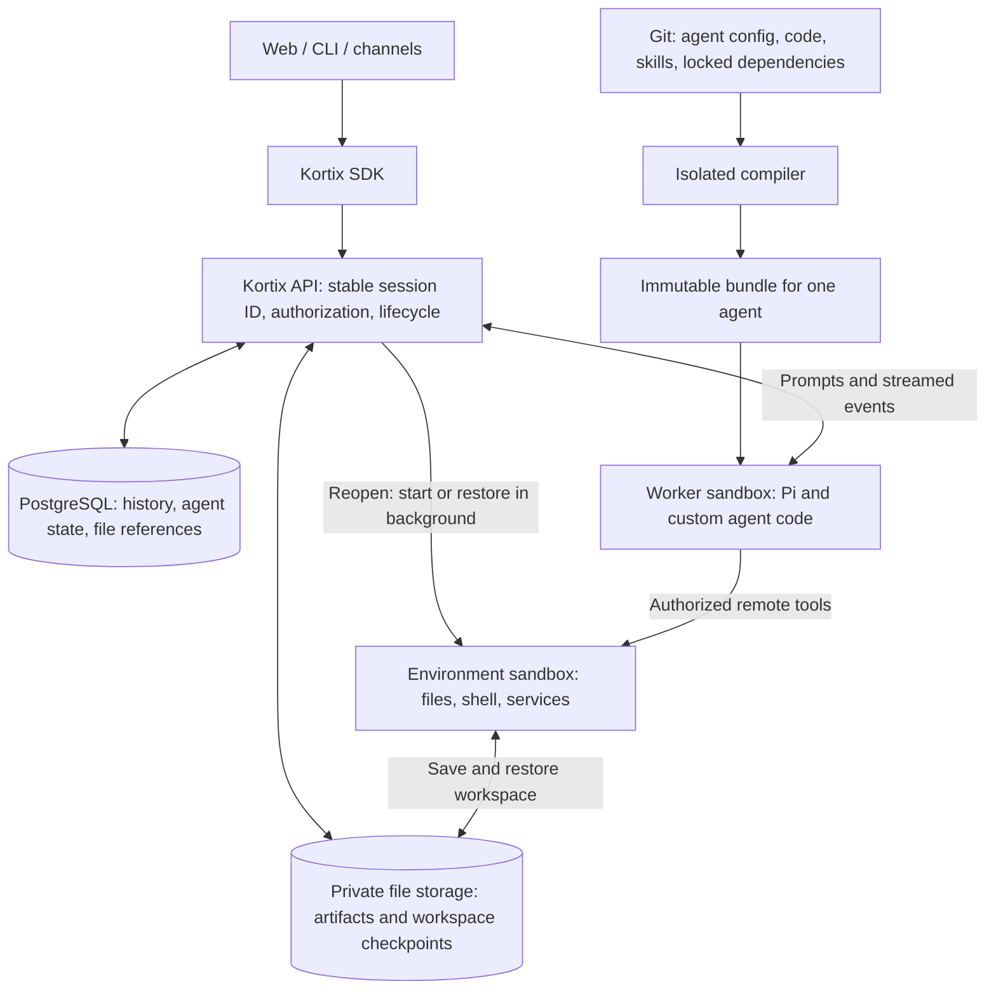

# Pi runtime: idea and implementation plan

Proposal · 2026-09-10 · This is the canonical architecture document.

**Keep the session and its data. Replace the machines when needed.**

Pi runs in a small worker sandbox. A separate environment sandbox holds the
workspace and runs commands. After **7 days without environment use**, we can
remove that environment **once its files have a verified restore point**.
Reopening the session starts environment recovery immediately in the background,
so it can become ready while the person reads history or types a message.

Checkpoint-backed seven-day cleanup and startup on reopen are proposed behavior.
This document does not enable them. The current implementation status is listed at the end.

## 1. What we are solving

- Slow startup and resume because the agent depends on preparing a full workspace.
- Chat history and files becoming unavailable when a sandbox stops or disappears.
- Idle environments retaining compute and disks indefinitely.
- Custom agent code assuming the worker and workspace are the same machine.
- Agent configuration and credentials reaching machines that do not need them.

Use existing provider sandboxes on Platinum, Daytona, and other supported
platforms. **No Durable Objects in this phase.** Storage and execution adapters
keep a later infrastructure change possible. A new agent framework is not a prerequisite.

## 2. Architecture



| Component | Responsibility |
| --- | --- |
| Session | Stable `session_id`, history, agent identity, and references to current compute. |
| Worker | Pi model loop, custom tools/hooks, questions, approvals, and streaming. Boots from its bundle. |
| Environment | Working files, Bash, dependencies, terminals, and preview servers. Runs neither Pi nor OpenCode for a Pi session. |
| PostgreSQL | Durable conversation, custom state, pending interactions, ownership, and lifecycle records. |
| Private file storage | File bytes that must survive environment deletion. Ordinary storage; no Durable Object required. |

YAML **v3 selects Pi**. YAML **v2 keeps OpenCode**. Conflicting runtime declarations
fail validation. The SDK owns session transport and lifecycle for every client.

A session keeps its public ID when either sandbox changes. Provider IDs and
runtime generations are internal mappings. Old workers cannot write after losing
ownership. Deleting compute is a different operation from deleting a session.

## 3. The session lifecycle

### Opening an existing session

1. Show saved history, questions, approvals, and published file cards from durable storage.
2. In parallel, request environment warmup through the SDK. This is an explicit
   action on entering the session, not a side effect of fetching history.
3. Reuse a running environment, resume a stopped one, or create a replacement
   and restore its checkpoint if the old environment was removed.
4. Start the worker when a message arrives. Pi restores its conversation and
   custom state independently of environment recovery.
5. Allow responses that need no workspace to proceed. File tools, commands,
   terminals, and live previews wait until the environment is verified ready.

**“Start immediately” means begin provisioning immediately. It does not mean
restoration takes zero time.** Show environment status separately from the
agent's streaming/working status. An environment failure must not hide saved chat.

This default applies to existing sessions whose agent has an environment configured,
including a first environment if none existed before. Agents configured without an
environment stay worker-only. A new session can retain lazy environment startup
until its first workspace operation. An agent can explicitly require earlier setup.

Sidebar lists, hover prefetch, background tabs, health polling, and artifact
downloads do not trigger warmup. Multiple tabs share one startup operation.
Warmup runs only the declared environment setup and restore steps; it does not
start an agent turn or replay old commands. Authorization and budget checks apply. Limit concurrent warmups per account;
active work takes priority over speculative startup.

### Stopping and removing compute

These are proposed defaults, with account policy setting the allowed limits:

| Policy | Proposed default | Meaning |
| --- | --- | --- |
| Worker startup | On a message or other agent work | Restoring a terminal alone needs no worker. |
| Existing-session environment startup | On session open | Prepare it while the person reads or types. |
| Worker idle stop | 5 minutes | No active turn or worker lease. |
| Environment idle stop | 15 minutes | Stop compute and retain the disk after saving dirty files. |
| Unused warmup allowance | At most 15 minutes | Stop a warmed environment if no work follows. |
| Environment removal | 7 days / 168 hours without actual environment use | Remove the provider instance only after the restore gate passes. |
| History and file retention | Separate account policy | Seven days does not expire the conversation or its saved files. |

Use server-side activity timestamps. Workspace operations and explicit terminal
or live-preview use count as environment activity. A running job holds an explicit
lease. Text-only messages, automatic warmup, and idle browser/SSE heartbeats do
not reset the seven-day environment clock. An unused environment uses its creation
time until its first real operation.

A bounded warmup lease protects startup and the 15-minute allowance, even if the
seven-day deadline already passed. After it expires, cleanup can proceed if the
environment remains unused. Deduplicate warmup and bound retries; reconnect loops
must not keep compute alive indefinitely. A cost-focused deployment can choose
startup on the first tool instead. That is an explicit policy choice.

Worker and environment leases are independent. Stopping the worker must not stop
an actively used terminal or delete an environment with unfinished work. A worker
can be recreated from its retained bundle and journal without waiting seven days.

### Safe seven-day cleanup

1. Claim cleanup for the specific environment generation. Recheck activity and leases.
2. Quiesce filesystem writers and save the latest workspace checkpoint.
3. Verify its manifest, referenced bytes, hashes, and compatible restore image/setup.
4. Commit the restore descriptor before requesting provider deletion.
5. Remove only the captured old instance. Retain the session, checkpoint, and artifacts.
6. Reconcile timed-out provider requests until deletion is confirmed.

**If backup or verification fails, keep the recoverable disk and report cleanup
as blocked.** Provider auto-deletion must obey this gate or remain disabled.
Chat history alone cannot restore workspace files.

## 4. Where files live, and what appears in chat

| Data | While working | After environment removal |
| --- | --- | --- |
| Messages and custom agent state | PostgreSQL | Read directly; no sandbox required. |
| Editable workspace files | Environment filesystem | Restore from the last verified workspace checkpoint. |
| Published PDFs, images, and other deliverables | Immutable private file bytes plus database metadata | Preview/download directly through authorized storage access. |
| Agent code and dependencies | Git and retained compiled bundle | Boot the exact pinned version. |
| Shared organization data | Separately owned storage with explicit grants | Remains independent of session cleanup. |
| Running processes, RAM, sockets, shell state | Current machine | Restart explicitly; filesystem restore does not restore them. |

When an agent creates `report.pdf`, its editable copy lives in the environment.
Before chat shows it as a saved attachment, publish and verify an immutable copy.
Store its filename, MIME type, size, hash, ownership, and version in PostgreSQL.
Yesterday's file card keeps yesterday's bytes even if today's working file changes.
A mentioned path or an expiring provider URL is not a durable attachment.

The current Pi branch stores supported image bytes in PostgreSQL. General files
and checkpoints need a private storage adapter suitable for each hosted/self-hosted
installation. Shared storage access through an API is separate from filesystem mounts.

Checkpoint declared persistent roots, including untracked/uncommitted work and
local Git state. Do not treat `.gitignore` as a backup policy. Capture terminal,
watcher, and database writes too; databases need consistent backups. Exclude only
rebuildable caches and platform credentials. Reauthorize and reinject current
secrets during restoration.

Checkpoint during active work as well as before cleanup. Define and display the
maximum checkpoint lag; otherwise an unexpected provider disk loss can lose recent
changes. Preserve the last restorable checkpoint while the session promises recovery.
A saved workspace browser shows the checkpoint time until the live workspace is ready.

### Example: returning on day ten

You created a PDF and left an unfinished spreadsheet. On day seven, the environment
was removed after a verified checkpoint. On day ten:

- The same session opens with its old messages and downloadable PDF.
- A replacement environment starts restoring the spreadsheet in the background.
- You send a message. The worker starts from the pinned agent bundle and saved state.
- Pi can discuss saved history immediately. Editing the spreadsheet waits for restoration.
- A revised PDF becomes a new attachment version. The old PDF stays available.

If you only read history and leave, unused warmup stops within the allowance.
This spends some speculative compute to reduce the next workspace wait. Measure
that cost alongside the latency improvement; prewarming does not accelerate the model itself.

## 5. Custom agents and lifecycle

Custom configuration includes executable behavior, not only prompts and model settings.
Keep the code's execution location explicit:

| Custom behavior | Where it runs / required contract |
| --- | --- |
| Prompts, context transforms, tool selection, provider hooks | Worker, inside the supported native Pi hook API. |
| Reading/writing files or running commands | Environment, through the worker's remote `env` interface. |
| Python, native binaries, local MCP servers, LSP, file watchers | Declared environment helpers; the worker calls them remotely. |
| State that survives replacement | Session-scoped `state.open()`, atomic updates, and explicit schema migrations. |
| Background jobs | Durable job IDs, environment leases, status, cancellation, and recovery. Still required. |
| Child agents | Child sessions/workers with explicit grants and quotas. No second Pi process inside the environment. Still required. |
| Questions, approvals, and UI interactions | Structured platform events rendered by clients through the SDK. |
| Pi CLI/TUI extensions or an arbitrary replacement loop | A compatibility adapter or a defined harness contract. Not automatically supported unchanged. |

Configuration has three owners:

- `kortix.yaml`: agent declarations, grants, environment selection, and platform policy.
- `.kortix/pi/agents/<name>.md` and optional `.ts`/`.js`/`.mjs`: behavior and custom code.
- Session choices: allowed overrides that cannot broaden platform grants.

Build one selected-agent bundle from a pinned source commit and locked dependencies.
Do not clone the organization's full configuration into every runtime. Source editing
and deployment are privileged capabilities. Custom lifecycle code is trusted code;
model tool approvals do not sandbox that code. Current access revocations remain authoritative.

Document every supported field, API version, precedence rule, quota, and failure.
Reject unknown options and incompatible dependencies. Native hooks do not imply
support for every coding-agent extension. Initialization can run again after a
restart; shutdown might never run. Persist important changes before acknowledging
them. Retrying a tool is not a guarantee of exactly-once external effects.

Agent updates do not silently replace an archived session's bundle. Upgrades need
an explicit version choice and compatible state migration. Failed builds/migrations
preserve the previous deployment and state. Retain required bundles and images.

### Configuration example

The current declaration and authoring layout are:

```yaml
kortix_version: 3
default_agent: analyst
pi:
  config_dir: .kortix/pi
agents:
  analyst:
    connectors: none
    secrets: none
    skills: none
```

Add `analyst.md` for prompt/model/permissions and `analyst.ts` for custom tools and
hooks. A file tool uses `env.writeFile()` or `env.readTextFile()`. A persistent
counter uses `state.open('counter', { schemaVersion: 1, initialValue: { count: 0 } })`
and `counter.update(value => ({ count: value.count + 1 }))`.
The [authoring guide](./PI_CUSTOM_AGENTS.md) has executable examples and exact limits.

The following policy is **proposed schema**, not valid configuration implemented today:

```yaml
compute_policy:
  on_session_reopen: warm_environment
  worker_idle_stop: 5m
  environment_idle_stop: 15m
  unused_warmup_limit: 15m
  environment_delete_after_unused: 7d
  require_verified_restore_point: true
  on_backup_failure: retain_disk_and_alert
```

The default targets existing sessions with an environment configured. The alternate
reopen policy is `on_first_tool`. Persistent roots, storage destinations, and
history/file retention must be explicit before automatic deletion is enabled.

## 6. Implementation order

| Phase | Deliverable | Completion proof |
| --- | --- | --- |
| 1. Independent environment lifecycle | Separate leases, activity clocks, instance generations, and SDK warmup on actual session entry. | A terminal survives worker stop. Concurrent opens create one environment. History stays usable during startup failure. |
| 2. Durable files and workspace recovery | General file publication, indexed checkpoints, restore validation, and storage/retention configuration. | A fresh environment restores uncommitted work. Historical attachments load with both sandboxes absent. |
| 3. Safe seven-day cleanup | Cleanup ownership, verified checkpoint gate, provider reconciliation, and restored-session UX. | Advance the test clock past 168 hours, remove the environment, reopen, and continue editing the same files. Inject deletion/restore races. |
| 4. Remaining customization | Environment helpers, durable jobs, child agents, explicit extension compatibility, and configuration validation. | Representative custom agents survive restart/cancellation without changing authority or repeating uncertain effects. |
| 5. Parity, performance, and rollout | Finish applicable OpenCode behavior across SDK, web, CLI, mobile, white-label, and channels. | Real session tests for streaming, questions, approvals, queues, Stop, files, compaction, fork/rewind, and supported live changes. |

Phase 1 can warm environments that still exist. A removed environment without a
checkpoint must report recovery unavailable. **Do not enable new automatic
removal until phases 2 and 3 pass on that provider and storage configuration.**
Qualify provider snapshot semantics, run restore drills, and enforce the last
restorable checkpoint's retention. Existing sessions need a first verified checkpoint.

The current branch already has a seven-day orphan-environment deletion path.
It is not this checkpoint-backed policy. Replace its deletion decision with the
restore gate; changing the timer alone does not implement this design. Decouple
worker-stop teardown before relying on independent environment warmup.

Compare split Pi, direct Pi, and OpenCode in isolated benchmarks using equal
models, resources, regions, prompts, and cold/warm states. Measure history display,
first token, environment-ready time, first workspace tool, p50/p95, failures, and
unused-warmup cost. Direct Pi is a benchmark mode; restore worker mode afterwards.
Set numeric acceptance budgets from these measurements before rollout.

## 7. Current position

| Capability | Status |
| --- | --- |
| Worker/environment split, compiled agent config, custom tools, native hooks | Implemented in the Pi branch; detailed limits remain in the authoring guide. |
| Durable conversation and custom agent state | Preview verified, including restart, state migration, conflicts, and session isolation. |
| Supported image attachments | Preview verified; general file/checkpoint storage is incomplete. |
| Independent environment warmup on reopen and verified seven-day recycling | Planned. The existing lifecycle is not sufficient for this policy. |
| Background jobs, child agents, general Pi extension compatibility, full parity | Incomplete; separate implementation and compatibility work remains. |

Latest state-feature preview proof: `8b60e2c2b2`, 2026-09-10. This revision changes
the plan only. It does not change runtime settings or activate deletion/prewarming.

Implementation references: [custom Pi authoring](./PI_CUSTOM_AGENTS.md) ·
[parity inventory](./PI_OPENCODE_PARITY.md) · [verification](./PI_WORKER_VERIFICATION.md).

## 8. Acceptance cases

These are acceptance requirements, not claims that tests already pass.

<details>
<summary>Failure and recovery checklist</summary>

| Case | Required result |
| --- | --- |
| Two tabs, reconnect, or duplicate startup requests | One environment creation/restore; stable session identity; bounded warmup. |
| Message arrives during restore | Chat and Pi proceed independently; workspace operations wait and retain cancellation. |
| Person leaves without sending anything | Stop unused warmup; do not extend seven-day retention through heartbeats. |
| Reopen races cleanup or provider deletion times out | One fenced transition; reconcile the old instance; never delete its replacement. |
| Worker stops while terminal, preview, or job is active | The environment's own lease protects it. Idle connections alone do not lease it forever. |
| Backup/upload fails, quota is full, or files change during capture | No verified checkpoint or ready attachment; preserve the source and report failure. |
| Restore is corrupt, unsafe, or missing an image/key/blob | Reject unsafe paths, symlinks, special files, and expansion abuse. Keep chat readable; never substitute an empty workspace silently. |
| Provider loses a disk before checkpoint | Restore the last verified version; report its age and possible lost changes. |
| Old file URL expires or local file changes | Authorize a fresh download of the saved version; show explicit missing/revoked/expired states. |
| Artifact publish/message commit or backup/blob cleanup disagree | Idempotent commits and retention references protect accepted bytes and in-flight uploads. |
| Hook crashes, hangs, or commits before a worker dies | Apply time/resource limits, durable ownership, and bounded retries. Reconcile uncertain effects instead of replaying blindly. |
| Question/approval pending; two answers arrive; Stop races a write | Persist the request, resolve once, enforce current grants, and prevent late writes by cancelled owners. |
| SSE disconnects, client is old/slow, or context compacts | Restore ordered events and partial output; preserve display history, attachments, and interaction state. |
| Source, model, credentials, or policy changes before resume | Preserve pinned behavior; enforce current authorization; validate overrides and state compatibility. |
| Background jobs, duplicate triggers, or child agents overlap | Durable identities, event deduplication, quotas, scheduling/cancellation policy, and explicit workspace sharing. |
| Fork/rewind or shared roots, mounts, submodules, Git LFS | Define history and file effects separately. Retain required objects; never rewind/delete another session's shared data. |
| Credits exhausted, service unavailable, or resource limits exceeded | Preserve accepted data; report bounded startup/execution failure and settle runtime status. |
| Session/account deletion, retention change, export, or backup recovery | Tombstones and current policy prevent resurrection; preserve required export/shared references and apply explicit retention. |
| Network partition, stale ownership, or orphan provider instance | Server time, leases, generation fencing, and provider reconciliation prevent duplicate writers and untracked compute. |

Run these across supported clients and providers, with cold, stopped, running,
and removed environments. Include real custom agents that combine hooks, tools,
approvals, state, and restart. Add an acceptance case whenever a new capability
introduces another failure mode; no document proves every arbitrary extension compatible.

</details>
