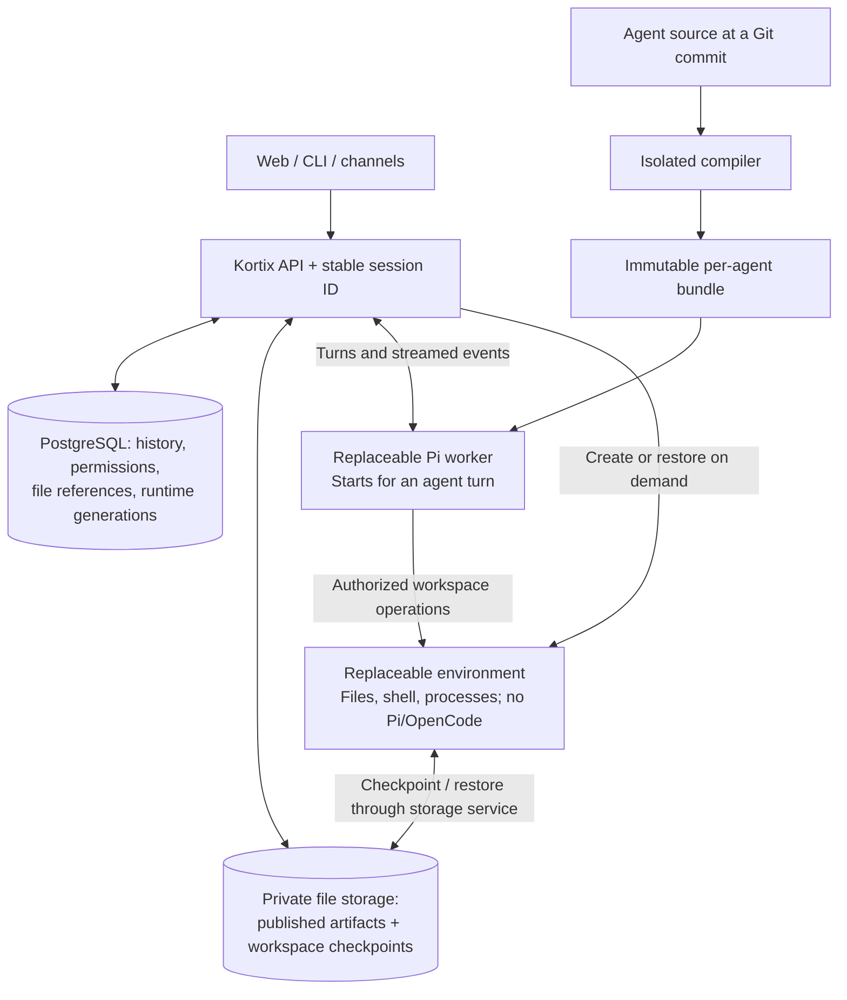
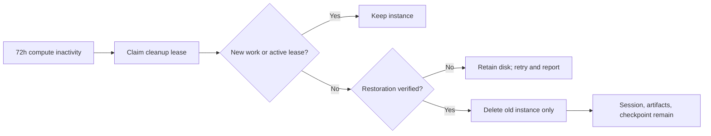

# Agent runtime — architecture and requirements

Discussion draft · 2026-09-10 · Canonical document for the meeting proposal.
Source review: `pi-worker` at `037c172f750fff8736b0098f40e3c3bc330cf007`.

**Goal:** faster startup/resume, durable conversations and files, isolated agent
configuration, and custom lifecycle control on existing sandbox infrastructure.

**Coverage is not implementation.** This document defines required behavior,
known failure cases, examples, and open decisions. Three-day recycling, workspace
checkpoints, general file artifacts, and the proposed configuration APIs are not
implemented by writing this specification. No finite document proves every possible
failure or arbitrary extension compatible.

**Customization promise:** every declared supported capability has a contract,
limits, and acceptance tests. Unknown or unsupported configuration fails explicitly.
Arbitrary local Pi/OpenCode extensions are not automatically supported unchanged.

Contents: [architecture](#the-recommendation) · [identity](#1-identity-belongs-to-the-session) ·
[data and files](#2-where-the-data-lives) · [cleanup and resume](#3-the-three-day-lifecycle) ·
[custom configuration and examples](#4-what-full-custom-configuration-means) ·
[failure cases](#5-failure-and-boundary-cases) · [delivery and decisions](#6-delivery-and-acceptance).

## The recommendation

Keep one stable logical session for its declared retention period. Recycle its compute after inactivity.
Store conversation state and file references in PostgreSQL. Store durable file
bytes outside both sandboxes. Start replacement compute only when an action needs it.

**Opening chat starts zero sandboxes. Sending a message starts a worker.
Using workspace tools starts an environment.** A custom startup hook that needs
workspace files explicitly opts into starting the environment earlier.

No Durable Objects are required. Use the existing provider infrastructure first.

“Stateless” describes replaceable compute; it does not remove durable session
state. A single sandbox simplifies local extensions but couples harness and
workspace lifecycle. The split improves isolation and permits lazy compute, while
adding network operations and a second lifecycle to manage.

The control plane compiles, authorizes, routes, schedules, and meters. Its isolated
build step validates the selected agent and locked dependencies before activation.
The worker boots from an immutable bundle without Git clone/package installation.
Workspace checkout happens separately. Runtime selection remains YAML v3 → Pi,
YAML v2 → OpenCode; contradictions fail rather than silently switching engines.

Keep execution and storage behind replaceable interfaces. Future isolates, Durable
Objects, or third-party frameworks must satisfy these contracts and self-hosting
requirements. Select components by measured delivery/operating cost; a framework
rewrite is not a prerequisite.



The API serves saved history and artifacts even when the two bottom boxes do
not exist. File storage is ordinary durable storage, not a Durable Object.

## 1. Identity belongs to the session

Use a platform-generated, stable `session_id`, scoped by project/account. An
optional readable name is separate from this identifier. Do not use a provider
sandbox ID as the public identity or allow arbitrary IDs to bypass authorization.

Illustrative identities:

| Identity | Before cleanup | After restoration |
|---|---|---|
| Logical session | `session_123` | `session_123` |
| Worker instance | `worker_7` | `worker_8` |
| Logical environment | `environment_123` | `environment_123` |
| Environment provider instance | `sandbox_20` | `sandbox_21`, only when needed |
| Published report | `artifact_report_v1` | Same reference and bytes |

These are explanatory names, not a proposed public ID format. Persist mappings,
instance generations, the installed agent bundle, and native conversation identity.
Old instances cannot write after their generation loses ownership. Cleanup targets
the captured old instance, never whichever instance is currently attached.

**Compute recycling must not call “delete session.”** Session deletion has a
different data-retention contract and can remove conversation records and assets.

## 2. Where the data lives

| Data | Authoritative location | Available without compute? |
|---|---|---|
| Messages, tool results, pending prompts/questions/approvals | PostgreSQL journal and projections | Yes |
| Uploaded images and published deliverables | Immutable private file bytes; PostgreSQL ownership/version references | Yes |
| Current mutable workspace | Environment filesystem | Only while that filesystem is accessible |
| Saved workspace checkpoint | Private blobs plus a committed file manifest | Yes, as the last saved version |
| Agent code, configuration, skills, locked dependencies | Git source and immutable compiled bundle | Yes; boot uses the bundle |
| Shared organization memory/data | Independently owned shared storage with grants | Yes through its API; mounts are a separate capability |
| Variables, sockets, process memory, shell state | Current worker/environment process | No |

The Pi branch currently stores supported image bytes in PostgreSQL. For large
files and workspace checkpoints, prefer private object storage with PostgreSQL
metadata. This changes physical byte storage, not the session-facing contract.

### Chat attachments and workspace files are different

Suppose Pi creates `/workspace/reports/revenue.pdf`:

1. The environment owns the editable working file.
2. Before showing it as a durable chat attachment, a publish operation copies
   its bytes to private storage and verifies the upload.
3. The API commits an artifact reference: session, version/hash, filename, MIME,
   size, and ownership. Only then does the message contain a ready file card.
4. The browser fetches metadata and authorized bytes through the SDK. It renders
   an image/document preview or a download fallback without contacting a sandbox.

If the working file changes tomorrow, yesterday's card still opens yesterday's
bytes. “Open current workspace file” is a separate action. A Markdown path alone
is not a saved artifact; parsing every mentioned filename is not a durability contract.

Use stable application references, not expiring provider URLs. Authorize each
download; refresh temporary delivery URLs when needed. Missing, revoked, and
retention-expired files need explicit UI states. Never replace an old artifact
with a newly generated approximation.

HTML/app previews remain live processes. Persisting their source or a screenshot
does not keep their server running. Historical HTML downloads need isolated
rendering; a live preview must restore its environment and restart its service.

### Workspace checkpoints preserve unfinished work

Publish deliverables immediately. Also checkpoint the workspace at safe points
and before destructive cleanup. Include uncommitted/untracked files and local Git
state that is not already durable. A local commit is not an off-machine backup.

Use an indexed manifest of paths, content hashes, sizes, and required metadata,
with immutable file blobs. Upload changed content, then commit the manifest only
after all required bytes are verified. This supports browsing the last checkpoint
without restoring an entire machine. Label that view with its checkpoint time.

Capture declared persistent roots. Exclude rebuildable caches only when the
environment image/locked setup can recreate them. `.gitignore` is not a backup
exclusion policy. Reinject platform secrets on restore; never snapshot worker
credentials. User-created sensitive files require the same private storage controls.

All filesystem writers count, including terminal edits and background processes.
Watching only Pi file tools misses data. Quiesce writers or use a proven consistent
snapshot mechanism; databases need an application-consistent backup. Preserve
required permissions, symlinks, and Git index state. Do not follow links outside
authorized roots or restore path traversal entries.

This is a filesystem checkpoint, not a promise to restore RAM, TCP connections,
or running processes. Provider-specific snapshots can optimize it after their
restore semantics pass testing. [Daytona distinguishes filesystem and VM-memory snapshots](https://www.daytona.io/docs/en/snapshots/).

## 3. The three-day lifecycle

Three days controls **compute retention**, not chat or file retention. Proposed
idle-stop examples are five minutes for the worker and fifteen for the environment;
these values require measurement and product agreement.
Track activity and leases per resource. A text conversation need not keep an
unused environment alive, and an active terminal need not keep a worker alive.

1. **Active:** model turns, file operations, terminal writes, or explicitly leased
   jobs keep their required compute available. A connected browser/SSE heartbeat
   alone does not count as work. Define activity using server-side timestamps.
2. **Idle:** checkpoint dirty workspace state, drain/record active operations, and
   stop unused compute. A stopped environment retains its disk under the provider
   contract. Keep durable jobs/approvals independently of the process.
3. **After 72 hours without compute use:** claim a cleanup lease and recheck for
   new work. Verify that the retained bundle, journal checkpoint, and latest dirty
   workspace generation can be restored. No environment means no workspace backup.
4. **Delete physical instances only after verification.** Clear their active
   mappings, retain restore descriptors and history, and mark compute archived.
   Keep retryable deletion records until the provider confirms cleanup.
5. **Backup failure:** retain the recoverable disk, mark cleanup blocked, retry
   within limits, and report the storage/cost issue. Time alone never authorizes
   throwing away uncommitted work. Do not silently switch to a destructive fallback.

Provider auto-deletion must respect this gate or remain disabled. Provider disk
loss is still a failure case; a timer setting is not a durability guarantee.

A verified restore point requires a committed manifest with all referenced bytes
and checksums, the latest quiesced workspace generation, durable journal/state,
and retained compatible bundle/image descriptors. An upload-started flag or a
Git SHA alone is insufficient. Test restoration into a fresh environment before
enabling cleanup, then run scheduled restore drills and integrity checks.



Checkpointing only on day three protects planned cleanup, not an earlier provider
failure. Set a maximum allowed checkpoint lag before launch. Display the last
successful checkpoint; never promise zero lost workspace changes without proving it.

Use separate retention policies for history, artifacts, workspace checkpoints,
and shared data. Keep the last restorable checkpoint and referenced artifacts
while the session promises resumability. Expiry must update that promise in the UI.
Object-store versioning can protect overwrites; it does not replace application
references or retention rules. [S3 versioning and lifecycle](https://docs.aws.amazon.com/AmazonS3/latest/userguide/Versioning.html).

### Returning on day ten

| Action | What happens |
|---|---|
| Open the conversation | Read PostgreSQL; zero sandbox creation. |
| Download last week's PDF/image | Read the saved artifact; zero sandbox creation. |
| Browse saved workspace | Read the checkpoint index; show its saved timestamp. |
| Ask “summarize this report” | Start the worker, restore context and artifact access; environment stays absent. |
| Ask “edit the report” | Start/reuse worker, restore environment, edit working files, publish a new artifact version. |
| Open terminal or resume live preview | Restore the environment; a worker is unnecessary unless agent work is also requested. |

Restore the worker from its pinned bundle and persisted execution state. Display
history can remain complete while model context uses saved compaction summaries.
Load referenced image/file bytes only when needed; do not stuff every old file
into every model request.

Restoration is single-flight. The environment uses its pinned image/setup and
checkpoint, verifies restored bytes, then becomes writable. If a person resumes
during cleanup, cancel cleanup before deletion or finish the fenced transition
and restore once. Never let an old delete request remove the new instance.

## 4. What “full custom configuration” means

Marko's requirement includes executable behavior: native hooks, custom tools,
context transforms, compaction, background work, and child agents. Prompts and
model settings alone do not satisfy it.

Separate three configuration layers:

| Layer | Examples | Authority |
|---|---|---|
| Project/platform declaration | Agent identity, grants, environment image, persistence, resource limits, retention | Limits what code can do |
| Agent behavior | Prompt, model, skills, commands, native lifecycle hooks, tool implementation | Custom source inside those limits |
| Session choices | Input, approved model choice, selected workspace, explicit configuration upgrade | Cannot broaden project grants |

Pin behavior and dependencies to a deployed bundle. Evaluate current grants on
every operation; restoring an old bundle must not restore revoked access.
Granting permission to edit/deploy agent source grants code-execution authority.
Model tool approvals are not a security boundary against trusted lifecycle code.

### Configuration rules

- Platform policy sets the hard ceiling. Project/agent grants authorize resources;
  session scope can narrow access. A model prompt or custom hook cannot raise limits.
- Each setting has one documented owner and precedence rule. Allowed explicit
  session behavior overrides compiled defaults. Preserve the current documented
  Markdown/source precedence; changing it requires a schema migration.
- Validate schema/runtime versions, types, references, unknown keys, conflicting
  settings, required resources, dependency integrity, and supported model options.
  Report the field/file and remedy. Known unsupported declarations fail deployment;
  dynamic violations still require runtime enforcement.
- Pin source, dependency lock, artifact identity, and state-format compatibility.
  Show the effective configuration without secret values before activation. Failed
  builds retain the previous deployment. Updates/rollback cannot mutate a running
  session implicitly; state migrations must be atomic and rollback-compatible.
- Scope files, storage, credentials, and connector profiles per agent/session.
  Organization sharing grants access to an agent definition, not other sessions'
  history. Full Git history, repository credentials, compiled bundles, and build
  caches must not expose another agent's configuration. Self-edit/deploy access is explicit.
- Secrets resolve at execution time under current grants. Custom provider routing
  must preserve gateway authorization, network policy, metering, and redaction.
  Declaring a URL is not permission to reach private/control-plane services.

### Capability inventory and current support

**Preview** means implemented in the inspected Pi branch, with earlier evidence;
not production certification or a fresh live test in this documentation task.
**Required gap** means needed by this design and still incomplete. Unsupported
behavior needs an adapter or an explicit product decision, not a silent fallback.

| Configuration surface | Contract / limit | Current position |
|---|---|---|
| Agent identity, prompts, model defaults, sampling, reasoning, steps, tool permissions | Per-agent source and grants; validate model-supported values | Preview |
| Skills, commands, custom tools and remote workspace operations | Only authorized compiled resources; workspace I/O targets the environment | Preview |
| Native Agent Core hooks | `transformContext`, `beforeToolCall`, `afterToolCall`, `shouldStopAfterTurn`, `onPayload`, `onResponse` | Preview |
| Process lifecycle and events | `initialize`, `onEvent`, `cancel`, `shutdown`; initialization can replay; shutdown is not guaranteed | Preview |
| Hook deadlines | Default 5,000 ms; configurable 1–30,000 ms; asynchronous cancellation does not preempt a CPU loop | Preview; process resource enforcement must also be verified |
| Additional worker dependencies | Locked, bundled public pure-JavaScript packages; static imports | Preview within compiler limits |
| Private/Git packages, native addons, install scripts, runtime module loading | Explicit trusted build/runtime capability needed | Unsupported in current worker compiler; environment execution requires an adapter |
| Pi coding-agent extensions and OpenCode plugins | Separate APIs; native hooks alone do not implement CLI/TUI extension compatibility | Not drop-in compatible |
| Arbitrary replacement model loop or other harnesses | Must implement transport, checkpointing, cancellation, policy, and metering contracts | No general custom-entrypoint contract; explicit scope decision |
| Durable extension state | Session namespaces, atomic updates, forward schema migrations, and session retention | Implemented on branch; local verification recorded in PI_WORKER_VERIFICATION.md. Quotas apply; cross-namespace transactions and history compaction remain gaps |
| Background jobs, child agents, coordinator behavior | Durable IDs, grants, quotas, cancellation, scheduling and recovery | Required gap |
| Remote MCP | Existing connector grants; tool/resource/prompt operations | Preview; local stdio, subscriptions and complete discovery UI remain gaps |
| Environment customization | Pinned image/setup, working files, tools, terminal, previews | Preview foundation; multiple environments, mounts, checkpoint policy and independent terminal leases remain gaps |
| Generic file artifacts and workspace restoration | Immutable published versions plus verified checkpoints | Images have preview proof; general files/checkpoints/recycling remain gaps |
| Live agent/model changes, fork, rewind, historical edits | Defined history/file effects, authorization and state migration | Required gaps; queued-message deletion is already supported |
| LSP/formatters and native client rendering extensions | Environment services plus SDK/client adapters | Required gaps or explicit compatibility decisions |

Publish an exact runtime-version/API compatibility list, not “supports Pi” alone.
Evaluate real extensions in five groups: pure worker hooks, workspace I/O/native
helpers, durable state/jobs, child agents, and UI/session manipulation. Custom
compaction and provider hooks must preserve durable history and budget enforcement.

Additional compiler limits currently include 256 source files/8 MiB source,
128 production packages, and bounded archive/download sizes. Unknown options are
not a way around those limits. Existing source contracts and detailed evidence
remain linked at the end; the requirements themselves are all in this document.

The current adapter exposes Pi **Agent Core** hooks. Pi coding-agent CLI
extensions are a separate API, including local filesystem/process and terminal
features. Full customization does not mean all existing extensions run unchanged.
[Native Pi extension reference](https://github.com/earendil-works/pi/blob/main/packages/coding-agent/docs/extensions.md).

| Extension behavior | Correct execution |
|---|---|
| Change prompts, model payloads, context, or tool selection | Custom worker hooks. |
| Read/edit workspace files | Explicit remote environment capability. |
| Run Python, a binary, file watcher, local MCP server, or LSP | Environment helper/process; worker communicates with it. |
| Store progress across worker replacement | Durable session-scoped state, with versioning/migrations. |
| Schedule a background job | Durable job record plus environment execution or a platform scheduler. |
| Spawn another agent | Create a child session/worker through Kortix; no recursive Pi process in the environment. |
| Ask a question or request approval | Structured platform event that each client renders. |
| Use arbitrary terminal widgets or unsupported runtime APIs | Adapt or reject clearly before deployment; never silently substitute behavior. |

Helper code can be bundled separately and installed in the environment. It gets
only the grants/files it needs, not the complete organization configuration.
There is still one harness for each agent session. Native addons and install
scripts need a declared environment build; they must not appear unexpectedly on
the worker boot path. CPU loops require process-level enforcement, not only a
JavaScript timeout.

### Configuration example

The following is **schema-design pseudocode**. The `compute_policy`, `storage`,
`extension_capabilities`, and environment structure are proposed schema additions.
Values illustrate the proposed separation, not current defaults.

```yaml
kortix_version: 3
default_agent: analyst

agents:
  analyst:
    connectors: none
    secrets: none
    skills: none
    # Prompt: .kortix/pi/agents/analyst.md
    # Code:   .kortix/pi/agents/analyst.ts
    extension_capabilities:
      environment: reports
      session_state: read_write
      artifacts: publish
      background_jobs: reports_only

environments:
  reports:
    image: registry.example.com/report-tools@sha256:<pinned-digest>
    restore_workspace_before_tools: true
    processes:
      build-report: python /opt/report-tools/build.py

compute_policy:
  worker_idle_stop: 5m
  environment_idle_stop: 15m
  recycle_after_compute_idle: 72h
  require_verified_restore_point: true
  on_backup_failure: retain_disk_and_alert

storage:
  workspace:
    environment: reports
    root: /workspace
    checkpoint: before_stop_and_recycle
    include_uncommitted: true
    retain_last_restorable: true
  artifacts:
    immutable: true
    scope: session
    retention: explicit_account_policy
  shared_memory:
    resource: finance_knowledge
    access: read_only
    interface: api
```

The agent Markdown then supplies behavior. This part uses the existing Pi
frontmatter shape; `build_report` refers to a custom tool implemented by its source:

```markdown
---
model: gpt-5.6-luna
steps: 8
permission:
  '*': deny
  build_report: allow
  question: allow
---
Produce reports from authorized input. Publish the result before calling it ready.
Ask the user when required input is missing. Never claim a failed report exists.
```

Do not run workspace provisioning inside every factory/initialization hook.
Defer workspace work to the tool that needs it unless startup explicitly requires
that environment. Document which hooks replay on restart; shutdown may never run.

### Extension example

This is **capability pseudocode**, not the current `@kortix/sdk/pi` interface:

```ts
async function buildReport(ctx, input) {
  const job = await ctx.jobs.start({
    environment: 'reports',
    task: 'build-report',
    input,
    operationId: ctx.operationId,
  });

  const result = await job.wait({ signal: ctx.signal });
  const artifact = await ctx.artifacts.publishFile({
    environment: 'reports',
    path: result.outputPath,
    operationId: `${ctx.operationId}:publish`,
  });

  await ctx.state.set('lastReport', { artifactId: artifact.id });
  return { text: 'Report ready.', artifacts: [artifact] };
}
```

Register that function as the `build_report` tool. The worker controls the job;
Python/PDF generation runs in the environment.
Publishing saves bytes before the reply becomes a durable file card. Stable
operation IDs let recovery find prior jobs/uploads instead of repeating effects.
A new worker loads `lastReport`; an in-memory variable would have disappeared.
Exactly-once external execution still requires task-specific deduplication or
reconciliation. Existing remote-file/hook examples are in [Custom Pi agents](./PI_CUSTOM_AGENTS.md).

## 5. Failure and boundary cases

| ID | Case | Required behavior |
|---|---|---|
| RT-01 | Workspace never existed | Archive/restore conversation only; create no empty environment. |
| RT-02 | File path mentioned, but never published | Do not promise a durable attachment. Restore its workspace checkpoint if available. |
| RT-03 | Published file subsequently edited/deleted locally | Historical attachment retains its original version until its own retention expires. |
| RT-04 | Upload accepted but message commit fails | Retry publication idempotently; collect unreferenced uploads only after a safe grace period. |
| RT-05 | Upload incomplete, quota exceeded, checksum mismatch | No ready card and no verified checkpoint; preserve the source. |
| RT-06 | Huge file or unsupported preview MIME | Bounded upload/download with explicit size limits; download fallback, not silent omission. |
| RT-07 | Expired URL or revoked file permission | Refresh only after authorization; show unavailable when retention/access no longer permits it. |
| RT-08 | Live preview or terminal open during cleanup | Active compute lease prevents deletion; after lease expiry, restore/restart explicitly. |
| RT-09 | Shell, watcher, or database writes during checkpoint | Quiesce/checkpoint consistently; never mark a mixed file set complete. |
| RT-10 | User resumes while cleanup runs | One generation-fenced transition; never delete the replacement or accept writes into an archived generation. |
| RT-11 | Backup succeeds but provider deletion times out | Retain checkpoint and deletion ledger; reconcile the old provider instance and metering. |
| RT-12 | Provider loses disk before a checkpoint | Restore the last verified checkpoint; report its age and possible lost changes. |
| RT-13 | Checkpoint, encryption key, or pinned image unavailable | Chat/artifacts remain readable if available; workspace restoration fails explicitly, without an empty replacement. |
| RT-14 | Corrupt/path-traversing archive or external symlink | Reject unsafe restore; do not follow paths outside authorized roots. |
| RT-15 | Worker crashes after a side effect but before recording result | Mark the operation uncertain; reconcile it or request intervention, not blind replay. |
| RT-16 | Question/approval pending at idle shutdown | Persist it. An answer can wake the worker; validate current grants and the exact request. |
| RT-17 | Two clients answer or submit simultaneously | Deduplicate submissions; resolve answers atomically; one active session writer. |
| RT-18 | SSE gap, refresh, slow client | Recover ordered persisted state; retain available partial output and pending interactions. |
| RT-19 | Long-running background job or scheduler | Lease, quotas, cancellation policy, and independent job status; no forever-running worker required just to wait. |
| RT-20 | Custom hook throws, hangs, or mutates state during recovery | Enforce deadlines/resource limits; checkpoint/version extension state; report failures without bypassing platform policy. |
| RT-21 | Child agents share a workspace | Explicit sharing grant plus write coordination; default to isolated workspaces or read-only checkpoints. |
| RT-22 | Fork, rewind, or artifact reused elsewhere | Define separate history and workspace checkpoints; retain referenced blobs; no deletion of the parent's live files. |
| RT-23 | Agent code changes while session is archived | Restore the pinned bundle; upgrades require explicit selection and compatible state migration. |
| RT-24 | Secret/connector revoked before resume | Reauthorize/reinject current credentials; never recover old secrets from snapshots. |
| RT-25 | Storage outage or insufficient credits | Preserve accepted state; fail writes/startup clearly; do not delete the only recoverable copy. |
| RT-26 | Session/account deleted or retention expired | Tombstone stops late workers, queued prompts, and schedules from resurrecting it; apply authorized data cleanup separately. |
| RT-27 | Shared data referenced by several sessions | Delete only when its ownership/retention policy permits; reference counting alone does not authorize access. |
| RT-28 | Invalid/ambiguous YAML, unsupported model option, or conflicting defaults | Reject with a field-specific error; no partial activation or silent runtime/default substitution. |
| RT-29 | Missing agent/skill/command, wrong bundle hash, failed build, or unavailable registry | Preserve the prior deployment; valid retained bundles boot without Git/registry access. |
| RT-30 | Dynamic dependency import, native API, or forbidden network access inside a hook | Enforce declared capabilities at runtime; fail the operation without gaining host, tenant, or control-plane access. |
| RT-31 | Extension state migration fails or an older runtime attempts to load newer state | Preserve the original state; reject incompatible startup or roll back atomically through a tested migration path. |
| RT-32 | Compaction/context overflow with custom hooks or attachments | Preserve display history and references; do not repeat completed tools or drop input silently; reject unsupported model limits. |
| RT-33 | Duplicate webhook, delayed channel event, or overlapping scheduled trigger | Deduplicate by event identity; apply current grants, concurrency and missed-run policies; deleted sessions do not resurrect. |
| RT-34 | Cancellation during startup, upload, job wait, checkpoint, or restore | Persist the outcome, bound cleanup, and reconcile completed effects; late callbacks cannot commit after losing authority. |
| RT-35 | Resource exhaustion, OOM, runaway recursion, or excessive child fan-out | Enforce compute/token/storage/concurrency limits; settle job/turn status and leave accepted data recoverable. |
| RT-36 | Network partition, stale lease, or clock skew | Use authoritative server time and generation fencing; no two active writers; uncertainty cannot authorize destructive cleanup. |
| RT-37 | Orphan warm instance or provider request accepted before an API crash | Reconcile provider identity and billing; sanitize reused compute and never attach another tenant's data. |
| RT-38 | Old SDK/client cache, reconnect cursor, native conversation ID, or provider URL | Stable session IDs resolve current instances; negotiated compatibility and state resync prevent stale routing or duplication. |
| RT-39 | Filesystem case/metadata differences, special files, or archive expansion abuse | Support only declared filesystem semantics; validate paths, types, quotas and expanded size before restore. |
| RT-40 | Shared mount nested inside a workspace, submodule, or Git LFS object | Record ownership/restore rules explicitly; retain required Git objects; do not snapshot or rewind shared data as session-owned files. |
| RT-41 | Database recovery and blob garbage collection disagree | Restore metadata and retained objects consistently; grace/leases protect in-flight and referenced data; missing bytes are reported. |
| RT-42 | Whole-service recovery from an older backup | Reapply deletion/revocation records and verify keys, schemas, journal, artifacts, and checkpoints before granting access or resuming writes. |
| RT-43 | Person changes retention or requests export while cleanup runs | Version the policy decision; honor current authorization and minimum retained references; exports include their own complete manifest. |


## 6. Delivery and acceptance

1. Separate logical-session retention from physical-instance deletion across all
   lifecycle paths, SDK caches, native IDs, and authorization checks.
2. Generalize durable image handling into versioned file artifacts, including
   publish status, authorized downloads, previews, and retention.
3. Build workspace checkpoint/restore, dirty-generation tracking, validation,
   cleanup fencing, and the archived-workspace browser.
4. Add explicit extension capabilities, durable state/jobs, and compatibility
   tests using real extensions. Native core hooks already exist in the Pi branch.
5. Preserve existing product contracts across web, CLI, mobile, white-label,
   channels, and the SDK: streaming, questions/permissions, queues/Stop, files,
   compaction, forks/rewind, live changes, and runtime administration. Exclusions
   require explicit product agreement; unsupported controls must not appear functional.
6. Prove the complete day-ten journey, crashes/races, backup failure, restored file
   hashes, approvals, and runtime isolation on every supported provider.

Current source already separates `project_sessions.session_id` from provider
identities and stores Pi journal/image data under the logical session. Deleting
that session row cascades to those records. The environment reaper also contains
a seven-day idle-deletion path; it is not this proposed verified-checkpoint policy.
**Do not implement this design by changing seven days to three.** Replace the
deletion preconditions first. Its parked-worker rule also stops environments;
terminal-only operation needs an independent environment lease before that can
work as proposed. No runtime code or retention settings change in this
document-only update.

### Coverage and release gate

The case matrix is an acceptance inventory, not a list of tests already passed.
Give each case a stable test/evidence reference before release. Apply relevant
cases across cold/running/stopped/recycled compute, allow/deny/revoked access,
new/retried requests, and each supported client/provider. Inject failures before
and after durable writes and external effects, including simultaneous operations.

Check representative extension combinations, not isolated hooks alone: a custom
tool plus approval plus crash; an artifact plus fork plus retention; a scheduled
child job plus exhausted credits. Exercise empty/large inputs and configured
limits. When a new capability introduces a new failure mode, extend this contract
and its tests before claiming support.

Every shipped configuration surface needs a schema, supported API/version list,
effective-configuration preview, documented execution location, security limits,
failure/recovery semantics, and real input/output tests. Unsupported declarations
fail clearly. Run source typechecks separately: the current bundler does not
typecheck arbitrary custom TypeScript.

Instrument startup, bundle loading, first text, environment readiness, tool
latency, checkpoint lag, recovery, and cleanup failures. Correlate session, runtime
generation, operation, configuration version, and checkpoint IDs without secrets.
Record worker/environment/storage charges separately and reconcile uncertain
provider operations without double charging.

### Decisions still required

| Decision | Required before claiming completion |
|---|---|
| Extension compatibility | Exact native API/runtime versions, representative real extensions, and supported combinations; policy for unsupported local/TUI/custom-harness behavior. |
| Workspace durability | Persistent roots, metadata semantics, cache exclusions, maximum checkpoint lag, backup frequency and recovery time. |
| Retention and storage | History/artifact/checkpoint/shared-data lifetimes, last-restorable guarantee, limits, deletion/export rules, and backup/key recovery. |
| Lifecycle policy | Measured idle-stop/recycle thresholds, job leases, trigger timezone/missed-run policy, cancellation boundaries, and quota handling. |
| Updates and rollout | Config/state migrations, compatible runtime patch policy, v2 coexistence, explicit opt-in to new behavior, rollback and provider qualification. |
| Performance and cost | Numeric p50/p95/error/concurrency/cost budgets. Compare split Pi, direct Pi, and OpenCode with the same provider, region, resources, model, prompts and cold/warm state. |

Keep the split worker mode after direct benchmark runs. Do not infer a universal
response speedup from faster process startup. Until these decisions and the
applicable real-session checks are complete, production replacement and automatic
three-day deletion are **not ready**.

Implementation references, not additional requirement documents:
[current custom Pi API](./PI_CUSTOM_AGENTS.md),
[parity status](./PI_OPENCODE_PARITY.md), and
[recorded verification](./PI_WORKER_VERIFICATION.md).
