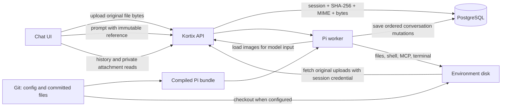

# Pi storage, speed, and remaining work

Goal: preserve OpenCode product behavior while reducing startup and response latency.
Pi runs in the worker. Files and commands use the environment. No Durable Objects run.

## Where data lives

| Data | Durable location | What history stores | After sandbox loss |
|---|---|---|---|
| Conversation and native Pi state | PostgreSQL `session_worker_log` | Ordered JSON mutations, message identities, tool state, and attachment references | The replacement worker replays the log |
| Stopped-session display | PostgreSQL `session_transcript_mirrors` and `session_transcript_messages` | Bounded message envelopes; same-session attachment URLs | Text and preserved image references load through the API |
| Uploaded chat images and tool images | PostgreSQL `session_attachments.content` (`bytea`) | MIME, filename, and a SHA-256 reference; no repeated base64 payload | Exact bytes remain readable without either sandbox |
| Ordinary Pi composer uploads | PostgreSQL `session_attachments.content`; editable copies under environment `uploads/.kortix-attachments` | MIME, original filename, immutable reference | Chat downloads work while stopped. A file tool restores the original into a replacement environment. Later edits need workspace backup |
| Edited code, generated documents, downloads | Environment filesystem | Tool history and paths; not a backup of the files | Only committed and pushed Git content can be restored today |
| Agent source and configuration | Project Git repository | Session pins the agent and source commit | Compile or fetch the artifact for that commit |
| Compiled Pi bundle | PostgreSQL `pi_runtime_artifacts`; API disk is a cache | Artifact identity and source commit | The worker downloads the saved `.mjs` bundle |
| Declared helper files | Source Git plus compiled environment resource release | Resource identity and installation mode | Restore read-only helpers; seed files need the original disk to preserve edits/deletions |

The Pi bundle and attachment stores use PostgreSQL. The upstream repository
snapshot system optionally stores committed Git archives in S3 for faster checkout.
It does not back up uploads, uncommitted edits, or the Pi conversation. This
preview does not configure an S3 bucket. Generated files are not durable chat
attachments merely because a message mentions them. Ordinary Pi uploads now use
the immutable attachment store. OpenCode uploads retain their existing path.

## Image lifecycle

1. The client computes SHA-256 and uploads bytes through the session attachment API.
2. Storage deduplicates by `(session_id, sha256)`. Bytes and MIME are immutable.
3. A prompt carries `kortix-attachment:sha256:<digest>`. The worker checks ownership,
   MIME, size, integrity, and model image support before accepting it.
4. The durable Pi log stores references. Provider requests hydrate those references
   into image content only when needed. A bounded worker cache holds verified bytes.
5. Display parts use `/projects/<id>/sessions/<id>/attachments/<digest>`.
   The SDK reads that path against the configured API without a runtime connection.
6. Mirror capture preserves only references for its project and session, including
   tool images. It strips inline data and external URLs. Older runtime references
   upgrade when the worker replays history and the API captures the new projection.

Limits: 8 MiB per image, 16 images and 16 MiB per prompt, and 16 MiB cached bytes.
Supported native formats are PNG, JPEG, GIF, and WebP. These limits are not full
OpenCode attachment parity. Missing images and MIME conflicts fail explicitly.

Inline first-prompt bytes and their inbox command commit in one database transaction.
Separate uploads can exist without a subsequent message when the user cancels.
Per-session orphan cleanup and aggregate storage quotas remain necessary before
expanding this store to arbitrary files. A deleted session becomes inaccessible;
physical row deletion cascades to its attachment rows. Stopping a sandbox does not
delete the session or its attachments.

## Changes from this audit

- Read chat images through the API without starting either sandbox.
- Preserve bounded image references in stopped-session history, including tool output.
- Keep saved history visible when the API reports a stopped session without a sandbox row.
- Upgrade old image display references during replay without rewriting the durable log.
- Hydrate two distinct images concurrently. Deduplicate repeated references within
  each replay. Preserve message order and cancel sibling downloads on failure or Stop.
- Prebuild the Pi worker image when the API starts its background workers and
  Daytona is enabled. Deployments with background workers disabled skip this step.
- After a successful Git push, prebuild distinct enabled-agent environment templates
  at the same source commit as the Pi artifacts. Run at most two builds per project.
  A failed template does not suppress another template. This creates images, not sessions.

Startup prebuilds retain the existing `KORTIX_SKIP_STARTUP_PREBUILD` test switch.
An uncached custom image can still take minutes. A prebuild reduces that delay only
when it completes before the first environment request. Explicit session template
overrides and newly selected project defaults can still miss the push-time prebuild.
Pi execution currently uses Daytona; provider-neutral APIs do not prove other providers work.

## Remaining implementation order

| Priority | Work | Completion proof |
|---|---|---|
| 1 | Finish generated chat files, public sharing, retention, and aggregate quotas. Ordinary Pi uploads now use immutable storage and lazy environment copies. | PDF, text, CSV, ZIP, duplicate names, failed/retried uploads, Stop, reload, sharing, and environment replacement preserve exact bytes and permissions |
| 2 | Environment backup and restore before idle deletion. Preserve uncommitted files and checkpoint identity, or reject destructive cleanup. | Delete an owned test environment, recreate it, and recover files, history, and valid rewind state. Never enable seven-day deletion before this passes |
| 3 | Session fork, children, subagents, agent switching, and remaining message mutations | Independent identities, copied history boundary, workspace rules, cancellation, permissions, and billing pass real sessions |
| 4 | Remaining OpenCode services and configuration adapters | LSP, formatters, runtime administration, shared configuration mapping, and declared extensions have tested equivalents or explicitly accepted differences |
| 5 | Scheduler, provider, and host parity | Scheduled runs survive worker downtime. Web, white-label, CLI, and mobile each pass their user flows. Add the required provider coverage |
| 6 | Final performance and release gate | Exact-source preview passes full REST/CLI/browser census. Same-provider Pi worker, direct Pi, and OpenCode benchmarks report cold/resume/warm p50/p95 and failures. Approved merge then passes dev verification |

The branch has the core conversation, tool, permission, question, custom-code,
streaming, and image paths. The remaining work contains six substantial areas;
it is not a final polish pass. The full inventory remains in
[PI_OPENCODE_PARITY.md](./PI_OPENCODE_PARITY.md).

Measure first visible text, first useful tool output, session open, upload completion,
and image display separately. Compare the same model, prompt, region, provider,
configuration, and resource limits. Include failed samples. The existing direct
benchmark finds faster Pi process readiness, but no general warm-response improvement.
Do not describe infrastructure savings as faster model generation.

## Verification for this audit

The preview storage benchmark uses eight distinct 16 × 16 PNGs and nine history
references. Ten runs per method alternate sequential and concurrent reads. Each
run starts with an empty worker cache and verifies the original bytes. Both
methods use the same authenticated preview API. The session stays stopped.

| Image replay reads | Median | p95 | Failures |
|---|---|---|---|
| Sequential baseline | 1,492 ms | 3,023 ms | 0/10 |
| Two concurrent reads | 810 ms | 887 ms | 0/10 |

This measures API round trips from the development machine. It does not measure
model generation or worker-to-API latency in the deployment region. The measured
median reduction is 46%. Repeated uploads return 204, MIME conflicts return 409,
and unauthenticated reads return 401. Every downloaded byte matches its original.

Preview verification at `91e30e27e5`:

- The real composer sends two named images as references. Vision identifies their
  color. The second run produces 73 text deltas and eight visible rendering states.
- Stopped history preserves user and tool image references. A fresh browser reads
  the exact 79-byte PNG. A later check exposes a terminal-screen replacement after
  that initial render; the additional fix and regression test are described below.
- PostgreSQL contains one image row after repeated uploads with different filenames.
  The native conversation log does not contain the image's base64 payload.
- Two stop/resume cycles preserve all 29 messages exactly. They take 4,374 ms and
  3,438 ms. An earlier resume takes 204,374 ms while `/start` reports a provider
  `start_failed` retry cooldown. Keep that outlier in the performance assessment;
  its original provider error remains unconfirmed. Direct provider starts later
  pass in 1,074 ms and 992 ms. Faster image loading does not resolve this delay.
- An owned Git push returns in 1,891 ms. Thirteen agent artifacts are stored for
  commit `9999e89ed7ea28fcae9f2c9141bf72775bbaed1a`. This fixture uses a warm default
  environment image; a newly built custom template remains a separate acceptance case.

Checks: the final `pnpm test` run passes 403/403 REST/CLI flows and every core lane.
The full run passes 21 browser journeys and package checks, including SDK typecheck
and packed-install smoke. Its initial history-fixture and duplicate-spec-ID errors
are corrected; the final core run passes both affected lanes. On the deployed Linux
preview, 67 focused tests pass. Deployed `SESS-30` and `SESS-33` pass 2/2 with no skips.

The full deployed parity census and the matched Pi/OpenCode performance comparison
remain required. Nothing in this audit enables environment deletion or proves
production replacement readiness.

Upstream integration at `2c09f25870` preserves the Pi runtime and merges `main`
through `7204e0609f`. The final core run passes 406/406 HTTP/CLI flows.
All 482 runner tests and the SDK gates pass. The package suite passes, including
9,544 API tests and 1,315 daemon tests. Database metadata matches the combined
schema; applied migration files remain unchanged.

A subsequent fresh-browser check finds an additional display gate: a stopped
response without a sandbox row replaces saved history with a restart screen.
The fix preserves the transcript in that case. Browser journey 29 reproduces
the failure before the fix, then verifies exact image bytes across reloads and
zero sandbox/environment rows. It also keeps the empty-history restart behavior.
The full local browser run passes 26 journeys with three configured skips.
The final focused run passes both populated and empty stopped-session cases.
Frontend typecheck passes. Focused lint reports zero errors and two existing warnings.

To test the attachment path on the preview: attach two PNGs, send a prompt, and
check that text appears incrementally. Reload the conversation and open each
image. Stop the session through the SDK/API, then reopen its history. Saved
images must remain readable during startup. Ordinary documents still require
the environment disk; do not delete that disk to test their persistence.

## Ordinary file attachment implementation

- `.attachments.file()` accepts non-empty files up to 8 MiB. A prompt accepts
  16 files and 16 MiB total. Original filenames stay in message history.
- The Pi composer uses immutable storage for documents and images. The chat
  downloads documents through the authenticated API, including while stopped.
- PDFs, CSV, text, archives, and SVG use a file reference in model context.
  Native PNG/JPEG/GIF/WebP remain image inputs. Documents work with text-only models.
- Before an environment tool runs, the daemon downloads earlier visible uploads
  with its own session credential. No file bytes cross worker RPC requests.
- Paths include full content and filename hashes. Sanitization preserves Unicode
  within the filesystem filename limit. Repeated uploads cannot overwrite a
  different file. Later queued prompts stay invisible to the active turn.
- A receipt outside the workspace prevents replay from undoing edits or deletions.
  A replacement environment restores original uploads. Restoring later workspace
  edits remains the backup task above. No automatic environment deletion is enabled.
- Original bytes are private. Public attachment sharing, document previews,
  generated-file capture, aggregate quotas, and orphan retention remain unfinished.
