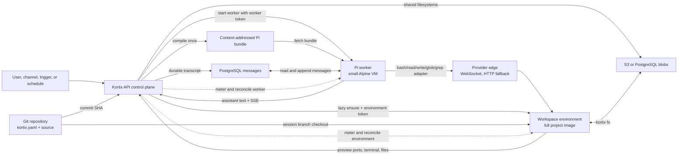
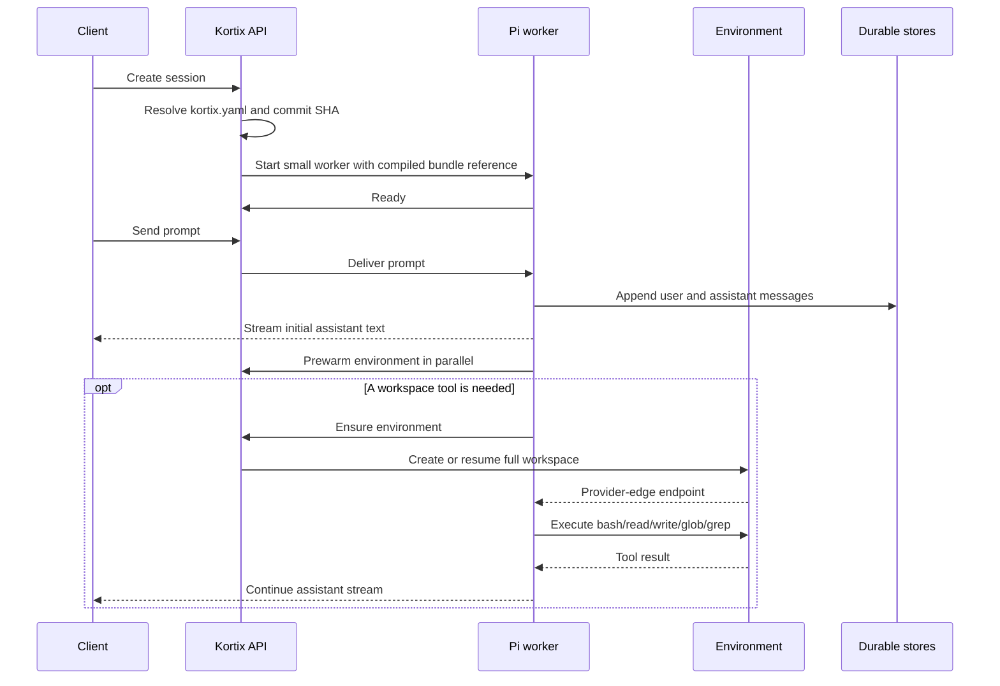

# Pi worker architecture

## Decision

A Kortix session is one logical conversation with two physical runtimes.

The Pi worker is the harness. It owns the model loop, messages, tool dispatch,
and turn authority. It boots from a small Alpine image and does not contain the
project repository.

The environment is the workspace. It owns the repository checkout, dependencies,
processes, ports, terminal, and mutable working tree. It starts lazily and can
stop independently when no compute is needed.

The API is the control plane. It compiles `kortix.yaml` at a Git commit into a
content-addressed Pi bundle. It authenticates both runtimes, coordinates their
lifecycle, stores messages, meters compute, and resolves routing.

## System diagram

## Request sequence

## Questions and answers

### What executes in the worker?

The worker executes the Pi model loop, prompt assembly, message mutation,
tool selection, tool-call bookkeeping, and the adapters for the five default
workspace tools. The adapters contain no local workspace implementation. They
send each operation to the environment.

### What executes in the environment?

The environment executes shell commands, file reads and writes, glob and grep,
terminals, dev servers, browser-facing preview ports, the Kortix CLI, Claude
Code, Codex CLI, and any other project process. It contains the session branch
working tree and the dependencies from the project image.

### Where does the agent see files?

The default Pi tools expose the environment filesystem. A path such as
`/workspace/project/package.json` resolves inside the environment. It never
resolves against the worker root filesystem.

Project Git files and shared filesystems remain separate concepts:

- The session branch stores versioned project work.
- A Kortix filesystem stores mutable shared data in S3 or PostgreSQL.
- The worker stores neither one on its local disk.

### How restricted is the worker?

The image contains the Pi runtime bundle and the minimum process supervisor.
It has no project checkout, package toolchain, sandbox daemon, or user terminal.
The default tool implementations fail when the environment is unavailable.
They never fall back to local worker execution.

The isolation test records the worker disk before and after remote file
operations. It fails if a tool mutates that disk.

### Why is the initial response faster?

Session readiness requires only the small worker. It does not wait for a full
repository image, branch checkout, dependency restore, or workspace daemon.
The worker can begin the model turn while the API prepares the environment in
parallel.

The measured branch result is 4.25 seconds p50 to first assistant text for a
cold Pi worker. The compared OpenCode cold path is 29.19 seconds p50. The two
measurements used different providers, so they prove the branch improvement
but not a provider-neutral ratio.

### When does the environment start?

The worker requests a prewarm when a prompt begins. The first workspace tool
joins the same in-flight attach. If no environment row exists, the API creates
one. If the row is stopped, the API resumes it. If the provider removed the
box, the API rebuilds it.

Prewarm is an accelerator. Tool correctness depends on the lazy ensure path,
not on prewarm success.

### Does every session always consume two running boxes?

No. Every Pi session has a worker. An environment exists only after a prompt
prewarm or workspace tool needs it. The environment can stop while the worker
continues the conversation. A parked worker causes the control plane to stop
an active or provisioning environment.

### How do the boxes communicate?

The worker calls the environment through the provider edge. It negotiates one
multiplexed WebSocket per session. It falls back to pooled HTTP only when the
environment image predates WebSocket support. Traffic does not make an extra
round trip through the Kortix API data plane.

### Where do messages live?

Messages live in PostgreSQL. The worker writes durable transcript mutations and
reconstructs history from that store. A stopped or replaced worker does not own
the only copy of the conversation.

### Where does agent configuration live?

`kortix.yaml` in Git is the source of truth. The API resolves the selected
commit, compiles the selected agent into one bundle, and stores it by content
hash. The worker fetches that bundle. The environment does not compile the
agent and does not need the full repository to start the model loop.

### Can a project use custom Pi tools?

Yes. Custom in-process code can access the worker process by definition. Kortix
therefore treats SDK-backed remote tools as the supported pattern. The default
tools and system guidance always route compute and files to an isolated
environment. Deliberate custom code that bypasses those adapters is outside the
isolation guarantee.

### How do Claude Code and Codex fit?

Pi remains the session harness. Claude Code and Codex run as CLI processes
inside the environment when the Pi agent invokes them. They are tools used by
the harness, not alternative server-side session harnesses.

### Do the worker and environment share a credential?

No. Each runtime has a distinct token row and stable UUID. The tokens carry the
same parent session and agent grant, but the API can distinguish their runtime
kind and runtime ID. Egress pins, token leases, revocation, boot callbacks, and
runtime projection checks use that exact principal.

### Which runtime serves each product surface?

| Surface | Runtime |
|---|---|
| Model loop, transcript, SSE, turn state | worker |
| Bash and file tools | environment |
| Terminal and PTY | environment |
| Dev-server preview ports | environment |
| Static file preview | environment |
| Workspace file browser and Git changes | environment |
| Runtime projection | worker |
| Shared filesystem blobs | durable store, accessed through API or environment CLI |

### What happens when one runtime fails?

The worker owns turn authority. The environment is replaceable compute.

- A stopped environment resumes on the next ensure.
- A removed environment is rebuilt with a new provider external ID.
- A transport failure clears the worker's cached environment client and retries once.
- A stopped worker causes the environment to stop.
- A missing worker causes any remaining environment row to be deleted.
- A session deletion revokes both tokens and removes both boxes.

### How do triggers, schedules, and channels use Pi?

They enter the same `createProjectSession` pipeline as the web UI. Pi selection
depends on the project feature flag and `runtime: pi` at the selected Git ref.
It does not depend on invocation source. Slack, Teams, Telegram, email,
triggers, schedules, API calls, and interactive UI sessions therefore use the
same runtime contract for an opted-in project.

### What remains deliberately outside this architecture?

- Filesystem version history is a later feature. The content-addressed blob
  store already provides the storage primitive.
- Transcript compaction is separate from durable message storage.
- Durable Objects are not required for the micro-VM implementation.
- A worker warm pool is an optional accelerator. Correctness uses cold create.
- Environment pooling is not used because an environment carries a
  project-specific image, session branch, token, and mutable working tree.
  Prompt prewarm preserves those boundaries without maintaining unowned
  full-compute boxes.
