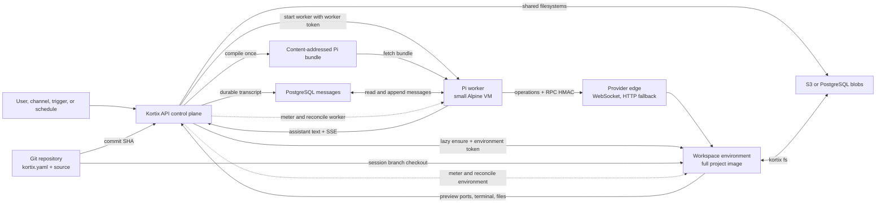
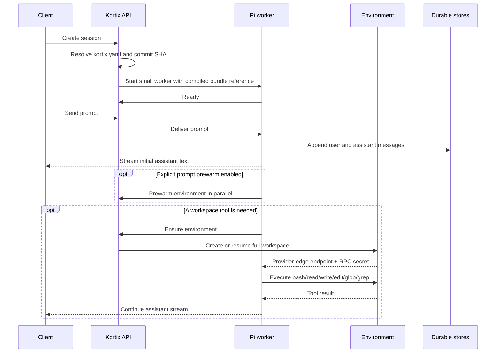

# Pi worker architecture

## Decision

A Kortix session is one logical conversation with two physical runtimes.

The Pi worker is the harness. It owns the model loop, messages, tool dispatch,
and turn authority. It boots from a small Alpine image and does not contain the
project repository.

The environment is the workspace. It owns the repository checkout, dependencies,
processes, ports, terminal, and mutable working tree. It starts lazily and can
stop independently when no compute is needed.

The API is the control plane. It compiles `kortix.yaml` at a Git commit into a
content-addressed Pi bundle. It authenticates both runtimes, coordinates their
lifecycle, stores messages, meters compute, and resolves routing.

## System diagram

## Request sequence

## Questions and answers

### What executes in the worker?

The worker executes the Pi model loop, prompt assembly, message mutation,
tool selection, tool-call bookkeeping, and the adapters for the six default
workspace tools. The adapters contain no local workspace implementation. They
send each operation to the environment.

### What executes in the environment?

The environment executes shell commands, file reads, writes and edits, glob and grep,
terminals, dev servers, browser-facing preview ports, the Kortix CLI, Claude
Code, Codex CLI, and any other project process. It contains the session branch
working tree and the dependencies from the project image.

### Where does the agent see files?

The default Pi tools expose the environment filesystem. A path such as
`/workspace/project/package.json` resolves inside the environment. It never
resolves against the worker root filesystem.

Project Git files and shared filesystems remain separate concepts:

- The session branch stores versioned project work.
- A Kortix filesystem stores mutable shared data in S3 or PostgreSQL.
- The worker stores neither one on its local disk.

### How is the worker runtime identity selected?

The control plane selects Pi when the manifest at the resolved session commit
declares `kortix_version: 3`. Version 2 selects OpenCode. An explicit `runtime`
field must match the version. No `pi_worker` feature flag is required. It resolves the
moving Git ref once and stores both that ref and its immutable 40-character SHA.
The selection sets Daytona as the effective worker provider. The create
response, session row, audit attribution, and provider request use that same
provider.

A missing manifest or v1 manifest remains on OpenCode for compatibility. Git,
read, parse, and invalid-runtime failures return
`409 PI_WORKER_RUNTIME_RESOLUTION_FAILED`. They never select OpenCode silently.

Restart and cold-open replacement use only the stored provider, ref, and SHA.
They rebuild the Pi-specific environment and do not inject OpenCode bootstrap
variables. Missing, malformed, or provider-inconsistent Pi identity fails
closed. It never boots an OpenCode runtime under a Pi session.

The `pi-worker` sandbox slug and its runtime metadata are server-owned. Public
session requests cannot set them. Custom templates and manifest sandbox fields
cannot claim the slug. The control plane also strips these fields from internal
caller metadata before it writes the authoritative identity.

The worker slug does not replace the selected compute template. The control
plane stores the request, agent, or project selection in
`environment_sandbox_slug`. The lazy environment resolves that template with
Git credentials and builds its Dockerfile from the immutable Pi SHA. Legacy Pi
sessions without this field use the platform default template.

### How restricted is the worker?

The image contains the Pi runtime bundle and the minimum process supervisor.
It has no project checkout, package toolchain, sandbox daemon, or user terminal.
The default tool implementations fail when the environment is unavailable.
They never fall back to local worker execution.

The isolation test records the worker disk before and after remote file
operations. It fails if a tool mutates that disk.

### Why is the initial response faster?

Session readiness requires only the small worker. It does not wait for a full
repository image, branch checkout, dependency restore, or workspace daemon.
The worker can begin the model turn without starting an environment. Explicit
prewarming can prepare the environment in parallel when that latency tradeoff
is desired.

The measured branch result is 4.25 seconds p50 to first assistant text for a
cold Pi worker. The compared OpenCode cold path is 29.19 seconds p50. The two
measurements used different providers, so they prove the branch improvement
but not a provider-neutral ratio.

### When does the environment start?

By default, the first workspace tool requests an environment. Text-only turns
do not request compute. `KORTIX_ENV_STARTUP=prewarm` explicitly starts the
attach when the worker owns a model turn. The first workspace tool joins the
same in-flight attach. If no environment row exists, the API creates one. If
the row is stopped, the API resumes it. If the provider removed the box, the
API rebuilds it.

Prewarm is an accelerator. Tool correctness depends on the lazy ensure path,
not on prewarm success.

### Does every session always consume two running boxes?

No. Every Pi session has a worker. An environment exists only after an explicit
prewarm or workspace operation needs it. The environment can stop while the worker
continues the conversation. A parked worker causes the control plane to stop
an active or provisioning environment.

### How do the boxes communicate?

The worker calls the environment through the provider edge. It negotiates one
multiplexed WebSocket per session. It falls back to pooled HTTP only when the
environment image predates WebSocket support. Traffic does not make an extra
round trip through the Kortix API data plane.

The API creates a random, purpose-bound RPC secret for each new environment.
The environment uses it to verify worker RPC signatures. The secret cannot call
the Kortix API and does not replace either runtime token. The authenticated
`ensure` response returns it to the owning worker. Read-only environment status
and stop responses do not return it.

An environment token can expire while a worker remains active. Each transport
classifies only a pre-execution authorization rejection as renewable. The worker
discards the stale client, calls `ensure`, and retries once. It does not replay an
ambiguous mutation, a timed-out mutation, or an unauthorized cancellation reply.

### Where do messages live?

Messages live in PostgreSQL. The worker writes durable transcript mutations and
reconstructs history from that store. A stopped or replaced worker does not own
the only copy of the conversation.

Prompt admission uses a separate append-only journal in the same session log.
The worker commits `accepted` before it returns `204`. It commits `started`
before the prompt reaches the model. Workers start only the oldest durable
nonterminal turn. Acceptance uses the transcript-wide wire-message floor, so
multiple workers cannot invert message order. An exact retry coalesces only when
its input matches. A reused message ID with different input returns `409`.

A started turn has one owner and a revisioned lease. The owner heartbeats while
the model runs. A replacement observes one unchanged full lease interval before
it can claim the turn. Heartbeat, reclaim, Stop, and completion all use
compare-and-append fences. Only one contender can own each transition.

Worker boot reconstructs the Pi tree and admission journal from one session-log
snapshot. A completion cannot appear in the journal without its transcript in
the boot projection because the two projections no longer perform independent
startup reads.

A restart replays an accepted turn only when it never reached `started`. It uses
the same user message ID and wire envelope. A replacement never reruns a started
turn. It claims an expired lease and records the terminal assistant already in
the durable tree. If no terminal assistant exists, it branches before partial
tool context and records one interruption. This preserves the at-most-once model
and tool-side-effect boundary. A legacy pending turn that already entered Pi's
tree is rewound only after this worker commits `started`. The lane move carries
the same owner lease fence.

One `completed` journal record contains the terminal status and assistant
metadata under the same lease fence. This prevents a crash between separate
assistant and completion transitions. Any worker can request Stop. The current
owner calls Pi abort, persists `abort_acknowledged`, and completes the turn as
an error. A non-owner abort route returns success only after acknowledgement or
terminal completion. Durable status reads refresh the journal on every worker.

Each remote append carries a unique persisted marker. If every append response
is lost, the worker reads the log and accepts the append only when the exact
JSON wire body exists. The same marker with different content is a
compare-and-append loss. It returns a conflict without poisoning the log, so the
journal can load the winning transition. A missing marker or unreadable or
malformed reconciliation snapshot poisons that worker process. Health reports
the store failure and later turns cannot reach the model until a fresh process
restores the durable log.

The live HTTP transcript is a cache of that durable state. If lease loss rejects
a locally emitted assistant message, the worker replaces the cache from the
durable log. It publishes removal and replacement events so existing SSE clients
and later message reads converge on the same transcript.

### Which OpenCode routes does the Pi worker support?

The raw OpenCode surface is a compatibility boundary. It does not imply that
Pi implements every OpenCode mutation.

| Route or input | Pi contract |
|---|---|
| `GET /session` and `GET /session/:id` | Returns the root session, including its `projectID`. |
| `GET /session/:id/message` | Returns durable messages. Positive `limit` plus an opaque `before` cursor pages backward. |
| `GET /session/:id/message/:messageID` | Returns one durable message or `404`. |
| `GET /session/status` | Returns the durable root-session status, including turns owned by another worker. |
| `GET /global/event` | Streams authenticated OpenCode v2 global-event envelopes. |
| `POST /session/:id/prompt_async` | Returns `204` only after durable acceptance. Execution continues on the serial queue. |
| `POST /session/:id/message` | Waits for completion and returns the assistant message. It returns `409` for cancellation or an unknown post-restart outcome. |
| `POST /session/:id/abort` | Requests durable Stop and waits for owner acknowledgement. It returns `503` if acknowledgement times out. |
| `DELETE /session/:id/message/:messageID` | Deletes only a queued turn before model execution. Running or durable history returns `409`. |
| `DELETE .../part/:partID` | Returns `409`. Part-only mutation is not durable. |
| `POST .../revert` and `POST .../unrevert` | Returns `501 feature_not_supported` without changing the transcript. |
| `GET /command` | Returns project commands compiled from the immutable session SHA. |
| `POST /session/:id/command` | Executes the supported command subset through the durable turn queue. Unsupported command features return an explicit capability error. |
| `GET /skill` | Returns authorized project skill Markdown compiled from the immutable session SHA. |
| `GET /agent` | Returns the selected compiled agent in the installed OpenCode SDK shape. |
| `GET /tool/ids` and `GET /tool` | Returns the eight effective built-in Pi tools and their JSON schemas. Experimental OpenCode aliases return the same data. |
| `GET /permission` and `GET /question` | Returns the current worker's pending requests. Pending requests are not durable across worker replacement yet. |
| `POST /permission/:id/reply` and `POST /question/:id/{reply,reject}` | Resolves the matching blocking tool request and publishes the OpenCode event. |
| Non-text parts, attachments, or unsupported prompt options | Returns `400` instead of silently dropping input. |
| Request bodies larger than 512 KiB | Returns `413` without waiting for the client to finish the body. |

The local `/prompt`, `/turn`, and `/say` benchmark routes require a JSON object
with a string `text`. `/prompt` and `/turn` accept only an array-valued `script`
when it is present. Deployed workers return `404` for all benchmark routes.

The web app detects Pi from the server-owned runtime metadata. It hides compact,
rewind, edit, and restore controls for Pi sessions. It locks the compiled agent
and model. It blocks unsupported context, file, image, paste, drop, and data URL
inputs. Prompt, command, and retry payloads omit stale agent, model, and variant
fields. Unsupported slash actions are hidden. Non-Pi compact requests use the
canonical `opencode_session_id`, not the Kortix project-session UUID.

### Where does agent configuration live?

`kortix.yaml` in Git is the source of truth. The API resolves the selected
commit, compiles the selected agent into one bundle, and stores it by content
hash. The worker fetches that bundle. The environment does not compile the
agent and does not need the full repository to start the model loop.

The artifact compiler uses the fatal selected-agent resolver. It rejects a
missing agent, malformed selected config, and null selected-agent config. The
artifact cache key includes the resolver version, and cache hydration rejects
older null-config artifacts.

### Can a project use custom Pi tools?

No. The worker currently registers eight built-in tools. Six workspace tools
execute through the environment. The worker hosts the `question` and `skill`
tools. No project extension loader exists yet.

Custom tools require a defined extension ABI and an isolation policy. Kortix
will not load arbitrary project JavaScript into the worker before those
contracts exist.

### How do Claude Code and Codex fit?

Pi remains the session harness. Claude Code and Codex run as CLI processes
inside the environment when the Pi agent invokes them. They are tools used by
the harness, not alternative server-side session harnesses.

### Do the worker and environment share a credential?

No. Each runtime has a distinct token row and stable UUID. The tokens carry the
same parent session and agent grant, but the API can distinguish their runtime
kind and runtime ID. Egress pins, token leases, revocation, boot callbacks, and
runtime projection checks use that exact principal.

Worker-to-environment RPC uses a third credential with one purpose: signing
requests to that environment's `/kortix/env-rpc` endpoint. This prevents either
runtime PAT from becoming a shared cross-runtime secret. Existing environment
boxes use their environment token as a compatibility RPC secret until the
control plane rebuilds them.

### Which runtime serves each product surface?

| Surface | Runtime |
|---|---|
| Model loop, transcript, SSE, turn state | worker |
| Bash and file tools | environment |
| Terminal and PTY | environment |
| Dev-server preview ports | environment |
| Static file preview | environment |
| Workspace file browser and Git changes | environment |
| Runtime projection | worker |
| Shared filesystem blobs | durable store, accessed through API or environment CLI |

### What happens when one runtime fails?

The worker owns turn authority. The environment is replaceable compute.

- A stopped environment resumes on the next ensure.
- A removed environment is rebuilt with a new provider external ID.
- A transport failure clears the worker's cached environment client and retries once.
- A pre-execution authorization rejection remints the environment client and retries once.
- A stale environment claimant never removes an external ID still owned by a newer claim.
- A stopped worker causes the environment to stop.
- A missing worker causes any remaining environment row to be deleted.
- A session deletion revokes both tokens and removes both boxes.

### How do triggers, schedules, and channels use Pi?

They enter the same `createProjectSession` pipeline as the web UI. Pi selection
uses `kortix_version: 3` at the selected Git ref.
It does not depend on invocation source. Slack, Teams, Telegram, email,
triggers, schedules, API calls, and interactive UI sessions therefore use the
same version-selected runtime contract.

### What remains deliberately outside this architecture?

- Filesystem version history is a later feature. The content-addressed blob
  store already provides the storage primitive.
- Transcript compaction is separate from durable message storage and is hidden
  for Pi sessions.
- Rewind, edit, and restore are hidden for Pi sessions. The worker cannot
  atomically mutate its model tree and durable append-only transcript yet.
- Durable Objects remain deferred. This deployment does not use them.
- A worker warm pool is an optional accelerator. Correctness uses cold create.
- Environment pooling is not used because an environment carries a
  project-specific image, session branch, token, and mutable working tree.
  Prompt prewarm preserves those boundaries without maintaining unowned
  full-compute boxes.

### Execution-only environment (2026-09-08)

Pi runs in the worker. The environment daemon boots with
`KORTIX_WORKLOAD=environment`. It does not start Pi or OpenCode. It ignores
inherited OpenCode warm-seed, initial-conversation, and compiled-OpenCode flags.
The daemon owns files, search, Git, terminals, previews, and the worker RPC.
The agent and conversation routes remain on the worker.

Environment health reports `workload: environment`, `opencode: disabled`, and
`runtimeReady: true` after workspace preparation. The worker waits for all
three fields before executing a workspace operation.

Existing environments upgrade through the provider execution channel. The
bootstrap verifies the daemon and entrypoint SHA-256 digests. It installs an
execution-capable fallback in a separate runtime directory. An artifact failure
preserves the existing process and working files. A failed replacement remains
unavailable; it never falls back to an OpenCode runtime.

The control plane explicitly marks a reused environment workspace. Subsequent
boots use a session ownership marker. Neither path clones over existing files
or changes the user's selected branch. A new environment performs the initial
session checkout. Missing storage during recovery is an error.

Workspace files remain on the provider sandbox disk. PostgreSQL stores the
conversation outside both sandboxes. These operations do not use Durable Objects.
