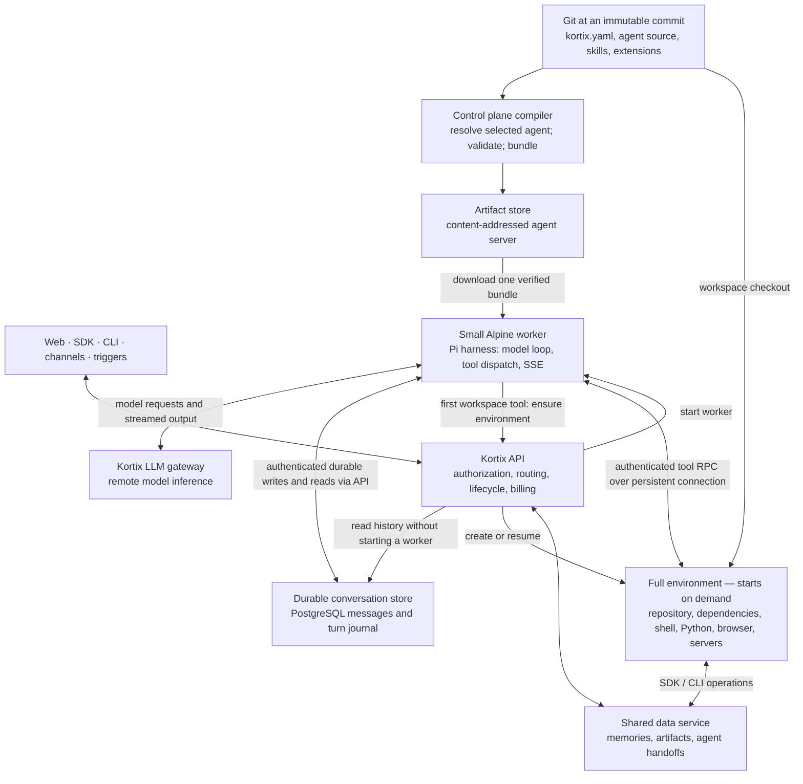

# Understanding the worker architecture

This walkthrough separates the intended design from the current implementation.
It follows the supplied huddle transcript and the
[Splitting the Harness reference](https://claude.ai/code/artifact/8c57beff-da78-4378-b249-55464252f69b).
See [the implementation plan](./PI_WORKER_PLAN.md) and
[the verification record](./PI_WORKER_VERIFICATION.md) for delivery evidence and remaining work.

## The change

The harness runs the agent loop. The worker is the small machine that hosts it.
The environment is the separate machine where the agent performs workspace operations.

Today’s coupled startup must prepare the workspace before the agent can answer.
The split removes workspace preparation from the initial response path.
It also separates conversation storage from either machine's lifetime.

The diagram shows the implemented boundaries. Compiled project skills and the durable
turn journal run on the Pi preview. The verification record lists remaining parity gaps.

The compiler may access a Git mirror. The worker does not clone the repository.
Git contains configuration **and its referenced code**. “Git only becomes config”
does not mean agent source files disappear from Git.

## Where each operation runs

| Operation | Location | What it accesses |
|---|---|---|
| Select an agent and compile its configuration | Control plane | Git files at one immutable SHA |
| Assemble a prompt and choose tools | Worker | Compiled configuration and conversation context |
| Perform model inference | Model provider through the gateway | The authorized model request |
| Stream text and tool status | Worker through the API | Events produced by the agent loop |
| Read skill instructions | Worker | Markdown baked into the agent artifact |
| Run a skill's Python or shell script | Environment | Script files and installed dependencies |
| Read, write, edit, glob, and grep workspace files | Environment | The session workspace, normally `/workspace` |
| Run Bash, builds, tests, or coding CLIs | Environment | Its processes and filesystem |
| Serve terminals and preview ports | Environment | PTYs and application servers |
| Store and read conversation history | Durable storage through the API | Session messages and turn records |
| Share memories and artifacts | Shared data service | Authorized shared filesystem objects |

Tool **dispatch** runs in the worker. Tool **effects** happen in the environment.
A file path in the default tools refers to the environment filesystem.
A native `node:fs` call inside custom worker code still refers to the worker filesystem.
Shell aliases cannot redirect native filesystem calls.

## Questions and answers

**Does the worker contain a full computer?**

It contains a minimal Linux runtime and the bundled agent server. It does not need
the project checkout, Python, browsers, document converters, or build dependencies.
The branch currently requests 1 vCPU, 2 GiB RAM, and 8 GiB disk capacity.
Those are allocation limits, not measured image size or restore bytes.

**Can the worker answer without starting an environment?**

That is the intended default. Reasoning and supported remote API tools do not need
workspace compute. A skill that runs Python does need it. Generating a document
through LibreOffice or a Python library also needs it; describing the document does not.

The deployed worker defaults to lazy startup. `KORTIX_ENV_STARTUP=prewarm` explicitly
prepares compute when the worker starts a model turn. This trades text-only compute
cost for lower first-tool latency. A live text-only probe streamed its reply with
zero environment RPC calls. The environment endpoint still returned `404` afterward.

**When does the full environment start?**

On the first workspace operation, or an explicit prewarm/ensure request. Concurrent
operations join the same provisioning attempt. Subsequent tools reuse the environment.
Opening a terminal or workspace file browser is also a compute request.

**Does a faster first response mean every operation becomes faster?**

No. Model inference and provider allocation remain separate costs. The first workspace
tool can wait for environment startup. Remote tools also add network latency.
Measure first assistant text and first completed workspace tool separately.
Compare identical provider, region, model, account, prompt, and lifecycle conditions.

The September 7 preview built a new environment image in about six minutes. That
exceeded the first tool's three-minute attachment budget. After the image became
ready, the retry completed all six tools. Image build time must be measured separately
from starting a worker or resuming an existing environment.

**Where is the “full data” when compute starts?**

The environment gets the selected project image, repository checkout, session branch,
dependencies, and authorized access to shared data. A resumed environment retains
its provider-persisted disk. A newly created environment does not recover uncommitted
files from a deleted disk. Important output must reach Git or durable shared storage.

**Are shared filesystems mounted disks?**

The branch exposes shared objects through REST, SDK, and CLI, backed by S3 or PostgreSQL.
That does not imply POSIX mounts, filesystem locking, atomic directory renames, or
local-disk latency. A mounted volume needs a separate filesystem contract and placement policy.

**Where do messages survive?**

In the durable Kortix store. The worker reconstructs its in-memory model context.
Reading history must not require a worker or environment to start. This is stateful
execution with replaceable compute, not a stateless conversation.

**What should happen after a worker crashes during a tool call?**

The local journal implementation distinguishes accepted turns from started turns. A replacement can execute
an accepted turn that never started. It must not automatically repeat a started turn
whose tool effects are unknown. It records an interruption or the durable completed
result. This gives an explicit recovery outcome instead of duplicate side effects.
This recovery implementation still needs committed-preview verification. The deployed
proof covers normal stop/resume and durable history while both machines are stopped.

**What happens if the environment stops?**

The next workspace operation ensures or resumes it. Read-only operations can retry
after an ambiguous connection failure. Mutations cannot replay unless the server proves
the original request never executed. A pre-execution authentication rejection permits
credential renewal and one retry.

**How restricted should custom tools be?**

Default tools use remote execution adapters. The worker runs without root privileges.
Its artifact should be read-only after startup, with bounded scratch space and resource limits.
These measures reduce accidental damage. They do not isolate arbitrary JavaScript
from a harness running in the same process. A safe extension contract must specify
which hooks run in the worker, which operations run remotely, and how failures behave.
The current branch does not yet load project tools or lifecycle extensions.

**Can one worker use several environments?**

The transcript leaves cardinality open. The implemented branch supports zero or one
environment per session. Multiple named targets require explicit selection, ownership,
authorization, billing, and concurrency policies. Shared writable workspaces also need
coordination. These features must not be implied by a diagram of the current implementation.

**Can Claude Code or Codex still run?**

Yes, as CLI processes inside the environment. Pi remains the conversation harness.
Their process output returns through the tool boundary. Their local state does not
replace Kortix's durable conversation record.

**Can the worker become a Durable Object later?**

The split makes that migration possible. It does not guarantee a byte-identical program.
The current worker uses Node HTTP, crypto, WebSockets, and package runtime assumptions.
Those need compatible adapters and separate verification on the future substrate.

**Is the branch ready now?**

The worker/environment split runs on `pi.kortix.com`. The preview verifies text-only
startup, six remote workspace tools, file outputs, the terminal, durable history,
stop/resume, and the shared-filesystem CLI. The verification record names each SHA.

This is an experimental Pi runtime. Full OpenCode replacement is not ready. Custom
extensions, durable blocking interactions, and several conversation features remain
incomplete or uncommitted. Production readiness also requires the full preview gate.
A healthy preview does not verify uncommitted code or a different commit.
