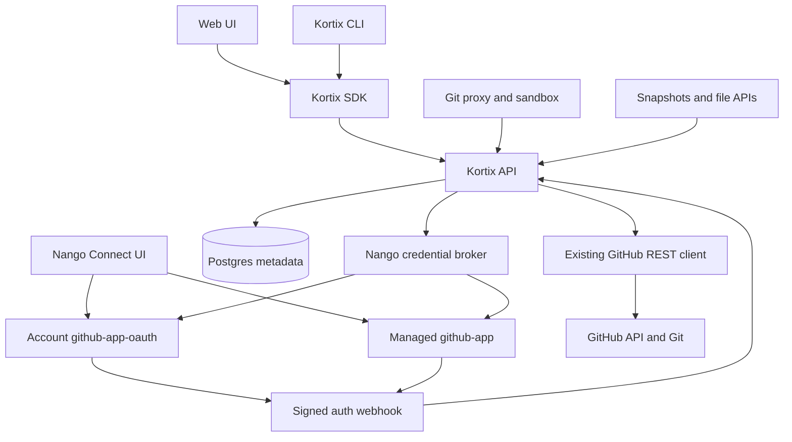
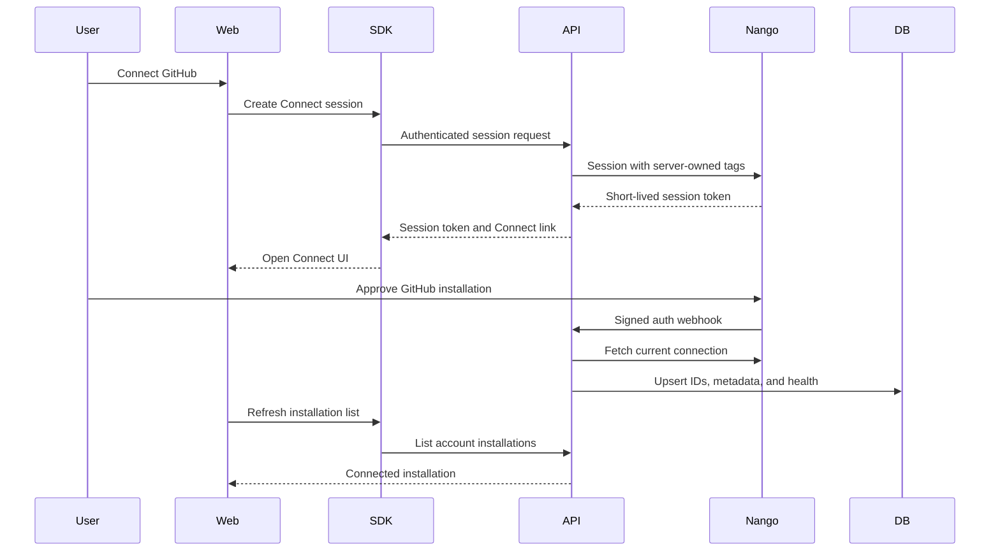
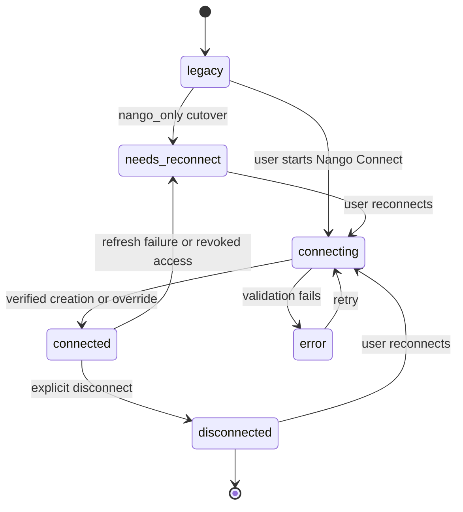
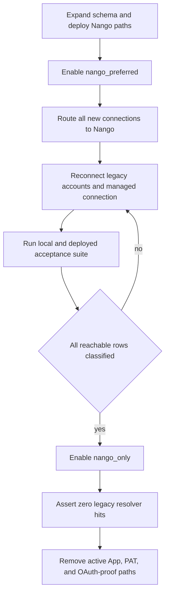

# Nango GitHub Integration Migration - Plan

## Goal Capsule

- **Objective:** Replace every Kortix-managed GitHub credential path with Nango while preserving GitHub repository workflows and public contracts.
- **Authority:** The user-confirmed Nango scope governs product behavior.
- **Architecture authority:** `@kortix/sdk` remains the only application-facing backend client.
- **Execution profile:** Deep.
- **Risk profile:** Authentication, third-party credentials, database migration, published SDK contracts, CLI behavior, and multi-surface rollout.
- **Stop condition:** Stop if the account `github-app-oauth` connection does not expose a GitHub App user token and installation metadata.
- **Stop condition:** Stop if the managed `github-app` connection does not expose a refreshable installation token.
- **Stop condition:** Stop live webhook verification until `NANGO_WEBHOOK_SIGNING_KEY` is present in the target environment.
- **Stop condition:** Stop any change that removes or renames an exported `@kortix/sdk` symbol.
- **Stop condition:** Stop the Nango-only cutover if a reachable project lacks either a Nango connection or an explicit `needs_reconnect` state.
- **Tail ownership:** Follow the repository lifecycle through scoped commits, PR review, merge to `main`, Deploy Dev, merged-SHA proof, and live dev verification.

---

## Product Contract

### Summary

Kortix will use Nango as the credential broker for GitHub user and installation credentials.
Kortix will retain its GitHub repository domain client, git proxy, project model, and SDK contracts.
Nango will own GitHub App credentials, installation authorization, credential refresh, and connection records.

### Problem Frame

Kortix currently signs GitHub App JWTs, mints installation tokens, accepts PATs, and links installations through a Supabase GitHub proof flow.
This creates two unrelated GitHub authorization systems.
The current setup also prevents reliable organization installation discovery when GitHub organization policy blocks the Supabase OAuth identity.

Nango can replace the credential lifecycle.
Nango cannot bypass GitHub organization installation policy.
The user must still have permission to install or approve the GitHub App for the selected organization.

Nango's `github-app-oauth` and `github-app` providers still require an underlying GitHub App.
The GitHub App credentials live in Nango instead of Kortix.
Supabase GitHub login remains an independent application sign-in option.
Account connections use `github-app-oauth` because GitHub rejects installation tokens on `POST /user/repos`.
The managed platform connection uses installation-only `github-app`.

### Actors

- A1. An account member with project-create permission connects a personal or organization GitHub installation.
- A2. An account manager disconnects or reconnects an account GitHub installation.
- A3. A platform admin connects and explicitly selects the Nango installation used for Kortix-managed repositories.
- A4. A CLI user or agent creates, imports, clones, and pushes projects through SDK-backed API contracts.
- A5. An operator configures Nango, observes rollout metrics, and controls the credential-resolution mode.

### Requirements

**Connection lifecycle**

- R1. An authorized account member can connect one or more personal or organization GitHub installations through Nango Connect.
- R2. A connection exposes `connected`, `needs_reconnect`, `error`, and `disconnected` states without exposing provider credentials.
- R3. A reconnect reuses the existing Nango connection ID and preserves project links.
- R4. Disconnecting a connection revokes Nango access and preserves repository and project metadata.
- R5. Supabase GitHub login remains separate from repository authorization.

**Repository workflows**

- R6. Connected users can list repositories, search repositories, list branches, import a repository, and create a repository.
- R7. Repository import revalidates repository identity, branch existence, and permissions before project creation.
- R8. Managed project creation uses one platform-admin-selected Nango connection.
- R9. Managed repository creation, deletion, seeding, collaboration, clone, fetch, and push preserve current behavior.

**Credential boundary**

- R10. Every GitHub operation resolves a fresh Nango-backed credential at the server operation boundary.
- R11. Nango API keys, GitHub App JWTs, GitHub user tokens, and installation access tokens never reach browser, SDK, CLI, sandbox, logs, or persistent project metadata.
- R12. CLI, sandbox, and agent Git operations use the Kortix git proxy instead of provider credentials.
- R13. Nango mode requires the git proxy, which continues to accept only Kortix credentials from callers.

**Public and agent contracts**

- R14. Existing repository, branch, import, project, and installation response fields remain available, while direct provider-token fields become nullable and deprecated.
- R15. `installation_id` remains the real GitHub installation ID.
- R16. Nango connection IDs use separate additive fields and database columns.
- R17. Existing exported `@kortix/sdk` names remain available through additive methods, aliases, or deprecation adapters.
- R18. Web code uses `@kortix/sdk` for every Kortix API call.
- R19. CLI and agent callers receive deterministic reconnect guidance when a human GitHub authorization is required.
- R20. GitHub consent remains a human-only action.

**Migration and operations**

- R21. Existing Kortix GitHub App and PAT credentials are not silently imported into Nango.
- R22. A user-initiated Nango reconnect attaches matching legacy projects to the new Nango connection.
- R23. New connection writes use Nango after the expand deployment.
- R24. A resolver flag permits legacy reads for unreconnected rows during rollback.
- R25. Nango-only mode removes legacy credential reads after migration verification.
- R26. Signed Nango auth webhooks reconcile creation, override, and refresh-failure events idempotently.
- R27. Invalid webhook signatures and mismatched ownership tags cannot mutate connection state.
- R28. Nango timeouts, unavailable responses, and rate limits map to stable API errors and preserve `Retry-After`.
- R29. Infisical stores all Nango secrets.
- R30. The final cleanup removes active Kortix GitHub App private-key, manifest, OAuth-proof, and PAT setup paths.

### Key Flows

- F1. Account connection
  - **Trigger:** A1 selects Connect GitHub from account settings or project import.
  - **Steps:** The API creates an account-tagged Nango Connect session; the web opens Nango Connect; Nango sends a signed auth webhook; the API validates the Nango connection and persists installation metadata.
  - **Outcome:** The installation appears under the selected Kortix account.
  - **Covered by:** R1, R2, R5, R15, R16, R26, R27

- F2. Account reconnect
  - **Trigger:** A2 selects Reconnect on a `needs_reconnect` installation.
  - **Steps:** The API creates a Nango reconnect session for the stored connection ID; Nango overrides the connection; the webhook reconciles current state.
  - **Outcome:** Existing project links return to `connected`.
  - **Covered by:** R2, R3, R22, R26

- F3. Repository import
  - **Trigger:** A1 or A4 selects an installation, repository, and branch.
  - **Steps:** The API resolves the Nango connection from the account installation; GitHub discovery runs with a fresh token; import revalidates the selection; the project stores Nango credential metadata.
  - **Outcome:** The imported project can read, snapshot, clone, and push.
  - **Covered by:** R6, R7, R10, R14

- F4. User-owned repository creation
  - **Trigger:** A1 creates a repository under a connected GitHub owner.
  - **Steps:** The API resolves the Nango connection; GitHub creates the repository; starter files are committed sequentially; the project stores the connection.
  - **Outcome:** The new project uses `auth_method = nango`.
  - **Covered by:** R6, R7, R10, R16

- F5. Managed repository creation
  - **Trigger:** A1 or A4 provisions a managed project.
  - **Steps:** The backend uses the selected managed Nango connection; GitHub creates and seeds the repository; the API stores the managed connection reference; the caller receives the proxy URL in the existing provision response shape.
  - **Outcome:** The project works without a Kortix-held GitHub App private key or PAT.
  - **Covered by:** R8, R9, R11, R12, R14

- F6. Runtime git operation
  - **Trigger:** The git proxy, sandbox, snapshot builder, file API, or trigger needs GitHub access.
  - **Steps:** The central resolver loads the project connection; the Nango broker fetches fresh credentials; the existing GitHub or git transport performs one operation; typed failures update connection health.
  - **Outcome:** All runtime GitHub access uses the same credential seam.
  - **Covered by:** R9, R10, R11, R13, R28

- F7. CLI human handoff
  - **Trigger:** A4 imports or ships a GitHub project without an active connection.
  - **Steps:** The SDK reports a stable reconnect code; the CLI requests a Connect session; interactive mode opens or prints the link; non-interactive mode prints the link and exits before git mutation; connected CLI pushes use the proxy.
  - **Outcome:** A human can finish consent without the CLI automating GitHub authorization.
  - **Covered by:** R17, R19, R20

- F8. Disconnect and revoke
  - **Trigger:** A2 disconnects an installation or Nango reports a refresh failure.
  - **Steps:** The API marks the account installation and matching projects unavailable; metadata remains; new credential resolution stops.
  - **Outcome:** Calls return typed reconnect guidance instead of anonymous git failures.
  - **Covered by:** R2, R4, R19, R26

### Acceptance Examples

- AE1. Given a GitHub organization installation connected through Nango, when the user opens repository import, then only repositories available to that installation appear.
- AE2. Given a legacy project without a Nango connection, when Nango-only mode resolves Git auth, then the API returns `github_reconnect_required` and does not attempt anonymous Git.
- AE3. Given a disconnected account installation, when the user reconnects it, then matching project rows become `connected` without changing repository identity.
- AE4. Given two managed Nango candidates, when the platform admin selects one, then managed provisioning uses only the selected connection.
- AE5. Given a CLI process in non-interactive mode, when GitHub consent is required, then it prints a Connect link, performs no push, and exits non-zero.
- AE6. Given an invalid Nango webhook HMAC, when the webhook endpoint receives it, then it rejects the request and changes no rows.
- AE7. Given Nango returns `429` with `Retry-After`, when repository discovery runs, then the API returns `429` with the same retry guidance.
- AE8. Given Supabase GitHub login is disabled, when a password-authenticated user connects GitHub through Nango, then repository authorization still succeeds.

### Success Criteria

- Every new account GitHub installation row has a Nango connection ID.
- Every new GitHub project connection uses `auth_method = nango`.
- Nango-only mode records zero legacy credential-resolution attempts during the full acceptance suite.
- No response or log contains a Nango API key, GitHub App JWT, GitHub user token, or installation access token.
- All account, import, create, managed, clone, push, snapshot, proxy, reconnect, revoke, and rollback tests pass.
- The deployed dev artifact contains the merged SHA and passes the same user-visible flows.

### Scope Boundaries

**In scope**

- Account and organization GitHub installation connection.
- Repository discovery, import, creation, and branch selection.
- Managed repository provisioning and administration.
- Project Git auth, snapshots, git proxy, sandbox Git, CLI ship, and CLI provision.
- Nango webhook verification, state reconciliation, observability, and rollback.
- Remote Supabase schema migration for the linked dev project.
- Infisical configuration for the existing project.

**Outside this product's identity**

- Replacing Supabase authentication.
- Bypassing GitHub organization owner or third-party application policies.
- Replacing Nango with a generic in-house OAuth broker.
- Folding GitHub into the broader Integrator gateway during this migration.
- Moving repository domain logic into Nango functions.

### Deferred to Follow-Up Work

- Remove deprecated exported SDK aliases only in a future major SDK release.
- Generalize the Nango broker for non-GitHub integrations after this migration proves the boundary.

---

## Planning Contract

### Key Technical Decisions

- KTD1. **Nango becomes the only new GitHub credential broker.** (session-settled: user-directed - chosen over retaining the Kortix GitHub App and PAT system: the user requested a complete Nango switch.) Kortix retains repository business logic and transports.
- KTD2. **Use account-scoped Nango connections plus one platform-managed connection.** (session-settled: user-approved - chosen over account-only Nango connections: managed repository provisioning needs a dedicated platform identity.) The platform admin selects the managed connection.
- KTD3. **Use `github-app-oauth` for account connections and `github-app` for the managed connection.** (session-settled: user-directed - chosen over installation-only account connections: the user selected full personal repository creation parity after GitHub's token restriction was surfaced.) Supabase login remains separate from both Nango integrations.
- KTD4. **Treat Nango as a credential broker, not a repository domain layer.** Existing code in `apps/api/src/projects/github.ts` continues to own GitHub REST behavior.
- KTD5. **Use a small Bun-native Nango HTTP client.** This avoids introducing Node SDK runtime assumptions and keeps timeout, retry, schema validation, and log redaction explicit.
- KTD6. **Keep GitHub installation IDs and Nango connection IDs separate.** `installation_id` remains a GitHub identifier; `nango_connection_id` becomes the credential reference.
- KTD7. **Use signed webhooks as the lifecycle reconciliation trigger.** The handler fetches current connection state from Nango before persistence, so duplicate or out-of-order notifications converge.
- KTD8. **Resolve credentials immediately before each operation.** The broker calls Nango `GET /connections/{connectionId}` because that call refreshes expired credentials.
- KTD9. **Require the Kortix git proxy in Nango mode.** A GitHub user or installation token can authorize more repositories than one Kortix project, so no provider token is exported.
- KTD10. **Keep the git proxy credential contract unchanged.** CLI, sandboxes, and proxy clients continue to present Kortix tokens; only the upstream resolver changes.
- KTD11. **Preserve public SDK names and route shapes.** New Nango fields and methods are additive; old App-specific methods become deprecated adapters during rollback.
- KTD12. **Use one resolver-mode flag.** `nango_preferred` permits legacy reads for rows without Nango metadata; `nango_only` rejects those rows with reconnect guidance.
- KTD13. **Block legacy writes after the expand deployment.** Rollback affects credential reads only and does not create new App or PAT connections.
- KTD14. **Persist connection health, not credentials.** Database rows contain IDs, owner metadata, permissions, status, and sanitized error codes.
- KTD15. **Model human consent as an explicit boundary.** SDK and CLI callers can create and surface a Connect session; they cannot approve GitHub access.

### High-Level Technical Design

#### Component and credential flow

#### Connect and reconcile protocol

#### Connection state machine

#### Rollout lifecycle

### Data Model

Extend `account_github_installations` with nullable Nango metadata.
Do not rename the table because it still models GitHub installations.

Add these columns:

- `nango_connection_id`
- `nango_integration_id`
- `connection_status`
- `last_validated_at`
- `last_error_code`
- `last_error_message`
- `disconnected_at`

Add a partial unique index for non-null `nango_connection_id`.
Keep the existing unique key on `(account_id, installation_id)`.

Use the existing `project_git_connections` columns:

- Set `auth_method` to `nango`.
- Set `credential_ref` to the Nango connection ID.
- Keep `installation_id` as the GitHub installation ID.
- Use `status`, `last_validated_at`, `last_error_code`, and `last_error_message` for project health.

Store the active managed connection under a new `platform_settings` key.
The value contains a schema version, Nango connection ID, integration ID, GitHub installation ID, owner metadata, status, selector user ID, and selection timestamp.
The value never contains credentials.

### API Compatibility Contract

Existing installation serializers retain these fields:

- `installation_id`
- `owner_login`
- `owner_type`
- `repository_selection`
- `permissions`
- `installation_url`

Add these fields:

- `connection_id`
- `connection_provider`
- `connection_status`
- `reconnect_required`

Add SDK-backed account operations for:

- Create a GitHub Connect session.
- Create a GitHub reconnect session.
- Refresh connection status.
- Disconnect a Nango GitHub connection.

Add SDK-backed platform operations for:

- Create a managed GitHub Connect session.
- List eligible managed Nango connections.
- Select the active managed connection.
- Reconnect or disconnect the active managed connection.

### Error Contract

| HTTP | Code | Meaning | Caller action |
|---|---|---|---|
| `403` | `github_insufficient_permissions` | GitHub App or Kortix IAM permissions deny the action. | Show required permission details. |
| `404` | `github_repository_not_found` | The repository or selected branch no longer exists. | Refresh repository discovery. |
| `409` | `github_connection_required` | No Nango connection exists for the account. | Create a Connect session. |
| `409` | `github_reconnect_required` | The stored connection cannot produce credentials. | Create a reconnect session. |
| `429` | `github_provider_rate_limited` | Nango or GitHub rate-limited the operation. | Honor `Retry-After`. |
| `502` | `github_provider_failed` | GitHub rejected or failed the operation. | Preserve the sanitized provider error. |
| `503` | `nango_unavailable` | Nango timed out or is unavailable. | Retry only safe operations. |

Connection-required errors include `account_id`, `installation_id` when known, `requires_human_oauth: true`, and the SDK action needed to create a session.
They do not create Connect sessions as a side effect.

### Configuration Contract

- `NANGO_API_KEY` is the canonical server API key.
- `NANGO_SECRET_KEY` remains a temporary compatibility alias.
- `NANGO_BASE_URL` selects Nango Cloud or a self-hosted Nango API.
- `NANGO_WEBHOOK_SIGNING_KEY` verifies `X-Nango-Hmac-Sha256`.
- `NANGO_GITHUB_ACCOUNT_INTEGRATION_ID` identifies `github-app-oauth`.
- `NANGO_GITHUB_MANAGED_INTEGRATION_ID` identifies `github-app`.
- `GITHUB_CREDENTIAL_RESOLUTION` accepts `nango_preferred` or `nango_only`.
- `KORTIX_URL` supplies the public webhook URL override during tunneled local development.
- `KORTIX_GIT_PROXY` is required when either Nango integration is enabled.

### System-Wide Impact

- **Database:** Account installations gain Nango identity and health metadata.
- **API:** Connection lifecycle routes, webhook ingress, repository routes, and the central Git resolver change.
- **SDK:** Published types gain fields and methods without removals.
- **Web:** Account settings, GitHub setup, project creation, and platform setup use Nango Connect.
- **CLI:** `ship` and self-host setup stop depending on Kortix App credentials or PAT input.
- **Git proxy:** Client authentication remains unchanged; upstream auth becomes Nango-backed.
- **Sandbox and snapshots:** Existing call sites receive fresh GitHub auth through `resolveProjectGitAuth()`.
- **Operations:** Infisical, Nango webhook settings, migration rollout, and credential-mode metrics become deployment prerequisites.
- **Agents:** Agents can detect connection state and surface a human setup link; they cannot complete GitHub consent.
- **Mobile:** Existing installation and project response fields remain compatible.

### Sequencing

1. Expand configuration and schema.
2. Add the Nango broker and webhook reconciliation.
3. Add SDK and API connection lifecycle contracts.
4. Replace account-facing web flows.
5. Route repository operations through Nango.
6. Route runtime Git and CLI push through Nango-backed credentials.
7. Replace managed platform and self-host setup.
8. Verify, cut over, remove active legacy paths, and deploy.

### Risks and Mitigations

| Risk | Impact | Mitigation |
|---|---|---|
| Nango changes either GitHub App credential shape. | Account or managed credential resolution fails. | Validate both modes with Zod, contract-test live dev connections, and block cutover on mismatch. |
| Nango webhooks arrive late, duplicate, or out of order. | UI state drifts from Nango. | Treat webhooks as reconciliation triggers and fetch current state before idempotent upsert. |
| A GitHub user or installation token leaks to CLI or sandbox. | A compromised caller can access unrelated repositories. | Require the Kortix git proxy and remove direct provider-token response paths. |
| An older CLI expects `/git-token` and direct `repo_url` push. | Ship fails after Nango-only cutover. | Release proxy-capable CLI first and return a deterministic minimum-version error to old clients. |
| Nango is unavailable during git operations. | Clone, push, snapshots, and file reads fail. | Return typed errors, preserve `Retry-After`, and retain `nango_preferred` legacy reads during rollout. |
| GitHub organization policy hides an organization. | The user cannot connect the desired owner. | Explain the GitHub owner approval requirement and avoid claiming Nango bypasses it. |
| Legacy rows are silently misbound. | A project can use another account's credential. | Match account ID and GitHub installation ID, validate server-owned tags, and require user-initiated reconnect. |
| Public SDK changes break consumers. | Web, mobile, CLI, and external consumers fail. | Use additive fields, aliases, deprecations, export snapshots, and install smoke tests. |
| PAT fallback remains reachable after cutover. | Kortix retains a second GitHub credential system. | Block new PAT writes in the expand release and remove active PAT resolution after Nango-only proof. |
| Nango rate limits multiply across git protocol requests. | Git operations become intermittent. | Fetch once per server request, preserve rate-limit headers, and do not retry streamed or mutating requests. |

### Assumptions

- The Nango dev environment retains the existing managed `github-app` integration.
- The Nango dev environment adds an account `github-app-oauth` integration before account-flow verification.
- Both integrations use GitHub App permissions equivalent to administration write, contents write, pull requests write, and metadata read.
- The account integration includes the GitHub user authorization required by `POST /user/repos`.
- The Nango API key can create Connect sessions, read credentials, list connections, and delete connections.
- The Nango webhook signing key can be added to Infisical before live webhook proof.
- The linked remote Supabase project permits additive migrations.
- Existing Nango connections with unrelated tags are not adopted automatically.

### Sources

**Repository**

- `apps/api/src/projects/github.ts`
- `apps/api/src/projects/lib/git.ts`
- `apps/api/src/projects/git-backends/github.ts`
- `apps/api/src/projects/routes/r1.ts`
- `apps/api/src/projects/routes/r2.ts`
- `apps/api/src/projects/routes/github-repositories.ts`
- `apps/api/src/git-proxy/index.ts`
- `apps/api/src/platform/routes/github-app.ts`
- `apps/api/src/platform/services/managed-github-app.ts`
- `packages/db/src/schema/kortix.ts`
- `packages/sdk/src/core/rest/projects-client/github.ts`
- `packages/sdk/src/core/rest/platform-client/github-app.ts`
- `apps/web/src/app/(auth)/github/setup/page.tsx`
- `apps/web/src/app/(app)/accounts/[id]/page.tsx`
- `apps/web/src/features/projects/modal/project-create-modal.tsx`
- `apps/web/src/components/iam/github-app-setup-card.tsx`
- `apps/cli/src/commands/ship.ts`
- `apps/cli/src/self-host/connect-github.ts`
- `apps/kortix-sandbox-agent-server/src/git.ts`
- `docs/specs/2026-07-24-integrator-universal-integration-gateway.md`
- `docs/superpowers/specs/2026-07-25-native-integration-auth-lifecycle-design.md`
- `docs/superpowers/specs/2026-07-24-web-sdk-only-boundary-design.md`

**External**

- [Nango Auth guide](https://nango.dev/docs/guides/auth/auth-guide)
- [Nango Connect session API](https://nango.dev/docs/reference/backend/http-api/connect/sessions/create)
- [Nango reconnect session API](https://nango.dev/docs/reference/backend/http-api/connect/sessions/reconnect)
- [Nango connection credential API](https://nango.dev/docs/reference/backend/http-api/connections/get)
- [Nango webhook verification](https://nango.dev/docs/guides/platform/webhooks-from-nango)
- [Nango GitHub App setup](https://nango.dev/docs/api-integrations/github/how-to-set-up-a-github-app-with-nango)
- [GitHub installation access tokens](https://docs.github.com/en/apps/creating-github-apps/authenticating-with-a-github-app/generating-an-installation-access-token-for-a-github-app)
- [GitHub create a repository for the authenticated user](https://docs.github.com/en/rest/repos/repos#create-a-repository-for-the-authenticated-user)
- [GitHub create an organization repository](https://docs.github.com/en/rest/repos/repos#create-an-organization-repository)
- [GitHub App permissions](https://docs.github.com/en/apps/creating-github-apps/registering-a-github-app/choosing-permissions-for-a-github-app)
- [GitHub organization application policy](https://docs.github.com/en/organizations/managing-programmatic-access-to-your-organization/limiting-oauth-app-and-github-app-access-requests-and-installations)

---

## Implementation Units

### U1. Expand Nango Configuration and GitHub Connection Schema

**Goal:** Add the configuration and persistent metadata required for a non-destructive Nango rollout.

**Requirements:** R2, R15, R16, R21, R23, R24, R29

**Dependencies:** None

**Files:**

- `apps/api/src/config.ts`
- `packages/db/src/schema/kortix.ts`
- `packages/db/migrations/`
- `packages/db/src/schema/github-connections.test.ts`
- `apps/api/src/__tests__/unit-nango-config.test.ts`

**Approach:**

1. Add the configuration contract from KTD12.
2. Extend `account_github_installations` with the Nango identity and health columns.
3. Add a partial unique index for non-null Nango connection IDs.
4. Leave every legacy row unmodified.
5. Add the managed Nango platform-setting schema without credential fields.
6. Generate an expand-only migration with no drop, rename, or destructive backfill.

**Patterns to follow:**

- `packages/db/MIGRATIONS.md`
- `packages/db/src/schema/kortix.ts`
- `apps/api/src/platform/services/managed-github-app.ts`

**Execution note:** Start with failing schema and configuration tests.

**Test scenarios:**

1. A row can store both a numeric GitHub installation ID and an opaque Nango connection ID.
2. Two accounts can reference the same GitHub installation ID without sharing a Nango connection row.
3. One Nango connection ID cannot bind to two account installation rows.
4. A legacy row with all Nango columns null remains readable.
5. `NANGO_API_KEY` wins over the compatibility alias.
6. Dotenvx ciphertext and missing signing keys fail configuration without entering cryptographic code.
7. The migration passes repository migration lint and applies to an empty and populated test database.

**Verification:** The migration is additive, legacy fixtures remain readable, and the new configuration parses without printing secrets.

### U2. Implement the Nango Broker and Signed Lifecycle Reconciliation

**Goal:** Create one server-side boundary for Nango sessions, connections, credentials, deletion, and webhook state.

**Requirements:** R1, R2, R3, R4, R10, R11, R26, R27, R28

**Dependencies:** U1

**Files:**

- `apps/api/src/projects/nango/client.ts`
- `apps/api/src/projects/nango/github-connection.ts`
- `apps/api/src/projects/nango/errors.ts`
- `apps/api/src/webhooks/nango.ts`
- `apps/api/src/index.ts`
- `apps/api/src/__tests__/unit-nango-client.test.ts`
- `apps/api/src/__tests__/unit-nango-github-connection.test.ts`
- `apps/api/src/__tests__/unit-nango-webhook.test.ts`

**Approach:**

1. Implement a Bun-native HTTP client with Zod response validation, abort timeouts, redacted diagnostics, and `Retry-After` propagation.
2. Support Connect session, reconnect session, list connection, get credential, and delete connection operations.
3. Decode account `github-app-oauth` credentials and managed `github-app` credentials through separate schemas.
4. Expose user or installation tokens, expiry, installation ID, owner metadata, and permissions only inside the server broker.
5. Verify `X-Nango-Hmac-Sha256` against the raw body with a timing-safe comparison.
6. Accept auth `creation`, `override`, and failed `refresh` operations.
7. Ignore unknown webhook types with a successful response.
8. Validate server-owned tags before account mutation.
9. Fetch the current Nango connection before upsert so retries converge.
10. Update matching project rows only after a user-initiated account connection is verified.

**Patterns to follow:**

- `apps/api/src/executor/pipedream.ts`
- `apps/api/src/projects/github.ts`
- `apps/api/src/openapi/index.ts`
- `docs/superpowers/specs/2026-07-25-native-integration-auth-lifecycle-design.md`

**Execution note:** Implement the broker and webhook test-first.

**Test scenarios:**

1. A Connect session includes only the configured integration and server-derived account, user, purpose, and display tags.
2. A local HTTPS `KORTIX_URL` becomes the per-session webhook override.
3. A reconnect session preserves the stored Nango connection ID.
4. A fresh account connection decodes a GitHub App user token and installation metadata.
5. A fresh managed connection decodes an installation token and installation metadata.
6. An API-key, malformed, wrong-mode, wrong-integration, or wrong-provider credential is rejected.
7. A Nango timeout returns `nango_unavailable` without token data.
8. A Nango `429` preserves `Retry-After`.
9. A valid creation webhook upserts one account installation and matching projects.
10. Replaying the same webhook produces the same row state.
11. An invalid HMAC, mismatched account tag, mismatched integration, or unrecognized connection changes no rows.
12. A failed refresh marks the connection and projects `needs_reconnect`.
13. Log snapshots contain no API key, App JWT, user token, installation token, or raw credential payload.

**Verification:** One tested module owns Nango I/O, webhook HMAC validation rejects tampering, and all persisted values are credential-free.

### U3. Add Account Connection API and SDK Contracts

**Goal:** Expose Nango connection lifecycle operations through stable API and published SDK surfaces.

**Requirements:** R1, R2, R3, R4, R14, R15, R16, R17, R18, R19

**Dependencies:** U2

**Files:**

- `apps/api/src/projects/routes/r1.ts`
- `apps/api/src/projects/routes/github-repositories.ts`
- `apps/api/src/projects/lib/git.ts`
- `apps/api/src/projects/lib/serializers.ts`
- `apps/api/src/__tests__/e2e-github-nango-connections.test.ts`
- `apps/api/src/__tests__/unit-github-nango-serializers.test.ts`
- `packages/sdk/src/core/rest/projects-client/github.ts`
- `packages/sdk/src/core/rest/projects-client/github.test.ts`
- `packages/sdk/src/core/client/kortix.ts`
- `packages/sdk/src/index.ts`
- `packages/sdk/PROGRESS.md`

**Approach:**

1. Add authenticated Connect and reconnect session routes under the existing GitHub project surface.
2. Preserve installation list and delete routes.
3. Serialize additive Nango identity and health fields.
4. Resolve route input by account ID plus GitHub installation ID, then load the Nango connection internally.
5. Return the stable error contract without creating sessions as a side effect.
6. Add SDK methods and types before changing web consumers.
7. Keep App-specific exported SDK names as deprecated adapters during rollout.
8. Update all required SDK export maps and `PROGRESS.md`.

**Patterns to follow:**

- `packages/sdk/AGENTS.md`
- `packages/sdk/src/core/rest/projects-client/github.ts`
- `packages/sdk/src/core/rest/projects-client/github.test.ts`
- `apps/api/src/projects/routes/r1.ts`

**Execution note:** Add failing SDK contract tests before implementation.

**Test scenarios:**

1. An authorized member creates an account Connect session with no client-controlled ownership tags.
2. A caller without project-create permission receives `403`.
3. A reconnect request for another account's installation returns `404`.
4. Installation list responses preserve legacy fields and add Nango state.
5. Disconnect removes Nango access, preserves project metadata, and marks matching projects disconnected.
6. A missing connection returns `github_connection_required`.
7. An unhealthy connection returns `github_reconnect_required`.
8. Existing repository and installation SDK methods preserve their request paths and response fields.
9. New SDK methods serialize snake-case wire fields and expose stable camel-case inputs.
10. Public export snapshots contain no removals.

**Verification:** API black-box tests and SDK tests prove authorization, ownership, compatibility, and deterministic reconnect responses.

### U4. Replace Account and Project GitHub Setup with Nango Connect UI

**Goal:** Replace Supabase GitHub proof and Kortix App installation UX with the Nango connection flow.

**Requirements:** R1, R2, R3, R5, R6, R18, R19, R20

**Dependencies:** U3

**Files:**

- `apps/web/package.json`
- `pnpm-lock.yaml`
- `apps/web/src/app/(auth)/github/setup/page.tsx`
- `apps/web/src/app/(auth)/github/setup/page.test.ts`
- `apps/web/src/app/(app)/accounts/[id]/page.tsx`
- `apps/web/src/features/projects/modal/project-create-modal.tsx`
- `apps/web/src/features/projects/modal/github-import-pickers.tsx`
- `apps/web/src/features/projects/modal/github-setup-required-panel.tsx`
- `apps/web/src/features/projects/modal/github-setup-required-panel.test.ts`
- `apps/web/src/lib/github-installations.ts`
- `apps/web/src/lib/github-installations.test.ts`
- `tests/e2e/github-nango-connect.spec.ts`

**Approach:**

1. Add `@nangohq/frontend`.
2. Request Connect session tokens through `@kortix/sdk`.
3. Open Nango Connect UI for the configured account `github-app-oauth` integration.
4. Refresh installation state through the SDK after Nango reports completion or close.
5. Present connection health, reconnect, disconnect, owner type, repository selection, and permissions.
6. Keep GitHub organization approval limitations visible in failure copy.
7. Remove all repository-authorization dependencies on Supabase GitHub session tokens.
8. Preserve the `/github/setup` route as a compatibility entry point.

**Patterns to follow:**

- `.claude/skills/kortix-design-system/SKILL.md`
- `apps/web/src/app/(app)/accounts/[id]/page.tsx`
- `apps/web/src/features/projects/modal/project-create-modal.tsx`
- `docs/superpowers/specs/2026-07-24-web-sdk-only-boundary-design.md`

**Execution note:** Use focused component tests before browser verification.

**Test scenarios:**

1. Connect from account settings requests a session for the current account and opens Nango Connect.
2. Connect from project import returns to the repository picker after reconciliation.
3. Closing the Connect UI without authorization leaves state unchanged.
4. A blocked popup produces a visible retry action.
5. A connected personal owner and organization owner render distinct labels.
6. `needs_reconnect` renders one reconnect action and no repository picker.
7. Disconnect requires confirmation and preserves linked project descriptions.
8. Password-authenticated users can connect GitHub when Supabase GitHub login is disabled.
9. Web network assertions show Kortix SDK routes only and no direct Nango API key or Kortix API fetch.
10. Desktop and mobile-width screenshots contain no overlap or clipped controls.

**Verification:** Component tests pass, lint is clean for touched files, and Playwright proves the real Connect UI handoff and post-webhook state.

### U5. Cut Repository Discovery, Import, and Creation to Nango

**Goal:** Route account repository operations through Nango-backed installation credentials.

**Requirements:** R6, R7, R10, R11, R14, R15, R16, R22, R28

**Dependencies:** U3

**Files:**

- `apps/api/src/projects/github.ts`
- `apps/api/src/projects/routes/github-repositories.ts`
- `apps/api/src/projects/routes/r1.ts`
- `apps/api/src/projects/routes/r2.ts`
- `apps/api/src/projects/lib/git.ts`
- `apps/api/src/projects/lib/project-registration.ts`
- `apps/api/src/__tests__/e2e-github-nango-projects.test.ts`
- `apps/api/src/__tests__/unit-github-owner-type-routing.test.ts`
- `apps/api/src/__tests__/unit-github-pat-import.test.ts`
- `tests/src/flows/github-app.flow.ts`
- `tests/src/flows/github-hosts-backlog.flow.ts`

**Approach:**

1. Resolve repository calls by the account installation row's Nango connection ID.
2. Pass the account connection's GitHub App user token into the existing GitHub REST client.
3. Remove direct App JWT and Supabase proof requirements from discovery and import.
4. Revalidate repository ID, owner, name, branch, and write permission before project insertion.
5. Store `auth_method = nango`, `credential_ref = nango_connection_id`, and the real installation ID.
6. Keep sequential starter-file commits and rollback behavior.
7. Deprecate PAT import in `nango_preferred`.
8. Reject PAT import in `nango_only`.

**Patterns to follow:**

- `apps/api/src/projects/routes/github-repositories.ts`
- `apps/api/src/projects/routes/r2.ts`
- `apps/api/src/projects/lib/project-registration.ts`

**Execution note:** Characterize existing repository and branch response shapes before changing credential resolution.

**Test scenarios:**

1. Repository listing uses the Nango connection bound to the requested account installation.
2. A connection from another account cannot list repositories.
3. Search and pagination limits preserve current behavior.
4. Branch listing returns the existing response shape.
5. Import rejects a transferred repository whose owner no longer matches.
6. Import rejects a deleted or stale branch.
7. Import stores Nango and GitHub identifiers in separate fields.
8. User-owned repository creation uses the account user token for `/user/repos` and `/orgs/{owner}/repos`.
9. Starter commit failure deletes the partial project and repository as before.
10. A GitHub `403`, `404`, `422`, and `429` maps to the stable error contract.
11. PAT input is logged as deprecated in fallback mode and rejected in Nango-only mode.

**Verification:** Live API tests list, search, branch, import, and create through Nango with no local GitHub App key.

### U6. Cut Runtime Git and CLI Ship to the Nango-Backed Proxy

**Goal:** Move every project-time Git credential consumer behind the Nango-backed resolver and proxy.

**Requirements:** R9, R10, R11, R12, R13, R14, R17, R19, R20, R28

**Dependencies:** U2, U5

**Files:**

- `apps/api/src/projects/lib/git.ts`
- `apps/api/src/projects/git-backends/github.ts`
- `apps/api/src/projects/git-backends/types.ts`
- `apps/api/src/git-proxy/index.ts`
- `apps/api/src/projects/git/mirror.ts`
- `apps/api/src/projects/suna-migration/suna-push.ts`
- `apps/api/src/snapshots/builder.ts`
- `apps/api/src/snapshots/warm-repo-credential.test.ts`
- `apps/api/src/projects/routes/r1.ts`
- `apps/api/src/marketplace/catalog.ts`
- `apps/api/src/__tests__/unit-managed-git-auth-order.test.ts`
- `apps/api/src/__tests__/unit-git-proxy-upstream.test.ts`
- `apps/api/src/__tests__/e2e-project-materialize-git.test.ts`
- `apps/api/src/__tests__/e2e-project-session-branch-git.test.ts`
- `apps/api/scripts/e2e-managed-flow.ts`
- `apps/api/scripts/e2e-git-proxy-all-cases.ts`
- `packages/sdk/src/core/rest/projects-client/projects.ts`
- `packages/sdk/src/core/rest/projects-client/manifest-git-token.test.ts`
- `packages/sdk/src/core/client/kortix.ts`
- `packages/sdk/src/core/client/kortix.test.ts`
- `packages/sdk/API-MAP.md`
- `packages/sdk/PROGRESS.md`
- `apps/cli/src/commands/ship.ts`
- `apps/cli/src/commands/projects.ts`
- `apps/cli/src/commands/git-credential.ts`
- `apps/cli/src/__tests__/ship.test.ts`
- `apps/cli/src/__tests__/projects-clone.test.ts`
- `apps/cli/src/__tests__/git-credential.test.ts`
- `apps/kortix-sandbox-agent-server/src/git.ts`
- `apps/kortix-sandbox-agent-server/src/__tests__/git-credential.test.ts`
- `tests/src/flows/git.flow.ts`
- `tests/src/flows/cli-ship.flow.ts`

**Approach:**

1. Make `resolveProjectGitAuth()` the only Nango credential consumer used by project runtime code.
2. Fetch a fresh connection once per server operation.
3. Use Nango user or installation tokens only for server-to-GitHub requests.
4. Require `git_origin_url` and the Kortix git proxy for CLI, sandbox, agent, mirror, migration, and runtime Git.
5. Preserve `/projects/provision` fields while returning null for deprecated direct provider-token fields on Nango GitHub projects.
6. Keep exported SDK git-token names as deprecated adapters, and return a typed proxy-upgrade response from `/projects/:id/git-token` in Nango mode.
7. Keep git smart-HTTP pack requests single-attempt and streamed.
8. Retry one forced credential refresh only for idempotent GitHub REST reads.
9. Return typed reconnect errors instead of anonymous or unauthenticated fallback.
10. Keep sandbox-agent input and git proxy caller credentials unchanged.
11. Update CLI ship and project clone to use proxy URLs, the SDK error contract, and human Connect-session handoff.
12. Remove the managed PAT fallback from marketplace GitHub requests.

**Patterns to follow:**

- `apps/api/src/projects/lib/git.ts`
- `apps/api/src/git-proxy/index.ts`
- `apps/api/src/git-proxy/upstream.ts`
- `apps/cli/src/commands/ship.ts`
- `apps/kortix-sandbox-agent-server/src/git.ts`

**Execution note:** Add failing resolver and process-level CLI tests before changing runtime behavior.

**Test scenarios:**

1. Connected imported and managed projects resolve a fresh Nango credential for read and write.
2. A legacy project resolves through fallback only in `nango_preferred`.
3. The same legacy project returns `github_reconnect_required` in `nango_only`.
4. Nango GitHub provisioning preserves `push_token` and `git_username` fields as null and returns a usable `git_origin_url`.
5. `/projects/:id/git-token` returns the documented proxy-upgrade error in Nango mode.
6. Git proxy clone and push succeed with only a Kortix caller token.
7. Sandbox credential output remains `{ username, token, type: "basic" }`, where the token is a Kortix proxy credential.
8. Snapshot and materialization flows clone through the central resolver.
9. A streamed receive-pack request is not replayed after `401`, timeout, or socket failure.
10. An idempotent GitHub read retries once after forced refresh and then succeeds.
11. CLI ship and project clone use `git_origin_url` with the existing Kortix credential.
12. CLI interactive mode opens or prints a Nango Connect link before retry.
13. CLI non-interactive mode prints machine-readable reconnect guidance, performs no git mutation, and exits non-zero.
14. An older CLI receives a deterministic minimum-version error before push.
15. CLI stdout, stderr, git config, and persisted project metadata contain no Nango or GitHub credential.

**Verification:** Real CLI processes, git clone, git push, sandbox credential helper, snapshot, and proxy flows pass against the running stack.

### U7. Replace Managed Platform and Self-Host GitHub Setup

**Goal:** Replace platform-owned GitHub App and PAT configuration with an explicitly selected managed Nango connection.

**Requirements:** R8, R9, R11, R14, R23, R29, R30

**Dependencies:** U2, U3, U6

**Files:**

- `apps/api/src/platform/routes/github-app.ts`
- `apps/api/src/platform/services/managed-github-app.ts`
- `apps/api/src/platform/services/managed-github-connection.ts`
- `apps/api/src/projects/git-backends/github.ts`
- `apps/api/src/platform/services/managed-github-connection.test.ts`
- `apps/api/src/__tests__/unit-git-backends.test.ts`
- `packages/sdk/src/core/rest/platform-client/github-app.ts`
- `packages/sdk/src/core/rest/platform-client/github-app.test.ts`
- `packages/sdk/src/core/client/kortix.ts`
- `packages/sdk/PROGRESS.md`
- `apps/web/src/components/iam/github-app-setup-card.tsx`
- `apps/web/src/components/iam/github-app-setup-card.test.tsx`
- `apps/cli/src/self-host/connect-github.ts`
- `apps/cli/src/self-host/secrets-registry.ts`
- `apps/cli/src/self-host/__tests__/connect-github.test.ts`
- `apps/cli/src/self-host/__tests__/secrets.test.ts`
- `apps/cli/src/commands/self-host.ts`

**Approach:**

1. Create platform-admin Connect sessions tagged as managed candidates.
2. List only managed candidates created for this Kortix environment.
3. Require an explicit platform-admin selection request.
4. Persist the selected connection metadata under the new platform setting.
5. Make the GitHub backend derive owner, installation, and server-only admin token inputs from that setting and Nango.
6. Preserve existing platform SDK names as deprecated adapters.
7. Replace the setup card with Connect, select, reconnect, and disconnect states.
8. Replace self-host App creation and PAT prompts with Nango configuration checks and a platform setup link.
9. Add Nango keys to the self-host secret registry.
10. Keep legacy env parsing only while `nango_preferred` exists.

**Patterns to follow:**

- `apps/api/src/platform/services/managed-github-app.ts`
- `apps/api/src/projects/git-backends/github.ts`
- `packages/sdk/src/core/rest/platform-client/github-app.ts`
- `apps/web/src/components/iam/github-app-setup-card.tsx`
- `apps/cli/src/self-host/secrets-registry.ts`

**Execution note:** Use SDK TDD and platform authorization tests before changing the admin UI.

**Test scenarios:**

1. A non-platform-admin cannot create, list, select, reconnect, or disconnect managed candidates.
2. Two candidates render separately and no first candidate is selected automatically.
3. Selecting a candidate stores identifiers and metadata but no credential.
4. Managed status becomes configured only after explicit selection and credential validation.
5. Managed repository creation, delete, seed, and collaborator operations use the selected connection.
6. Disconnect marks managed projects unavailable and does not delete their GitHub repositories.
7. Deprecated platform SDK methods remain exported.
8. Self-host validation requires the Nango API key, signing key, base URL, both integration IDs, and the git proxy.
9. Self-host help no longer asks operators to paste GitHub App private keys or PATs into Kortix.
10. Legacy managed env values work only in `nango_preferred`.

**Verification:** Platform API tests, SDK gates, admin browser tests, and self-host CLI tests prove explicit managed selection and zero Kortix-held GitHub credential setup.

### U8. Cut Over, Prove Every Surface, and Remove Active Legacy Paths

**Goal:** Complete the migration through local proof, dev deployment, Nango-only cutover, and active legacy-path cleanup.

**Requirements:** R21, R22, R23, R24, R25, R26, R28, R29, R30

**Dependencies:** U4, U5, U6, U7

**Files:**

- `apps/api/src/projects/github.ts`
- `apps/api/src/projects/lib/git.ts`
- `apps/api/src/projects/git-backends/github.ts`
- `apps/api/src/projects/git/mirror.ts`
- `apps/api/src/projects/suna-migration/`
- `apps/api/src/marketplace/catalog.ts`
- `apps/api/src/projects/routes/r1.ts`
- `apps/api/src/platform/routes/github-app.ts`
- `apps/api/src/platform/services/managed-github-app.ts`
- `apps/web/src/app/(auth)/auth/github-connect/page.tsx`
- `apps/web/src/app/(auth)/auth/github-popup/page.tsx`
- `apps/cli/src/commands/ship.ts`
- `apps/cli/src/commands/projects.ts`
- `apps/cli/src/commands/git-credential.ts`
- `apps/cli/src/self-host/connect-github.ts`
- `apps/cli/src/self-host/secrets-registry.ts`
- `tests/src/flows/git.flow.ts`
- `tests/src/flows/github-app.flow.ts`
- `tests/src/flows/github-hosts-backlog.flow.ts`
- `tests/src/flows/cli-ship.flow.ts`
- `tests/spec/end-to-end.md`
- `tests/spec/routes.generated.json`
- `packages/sdk/README.md`
- `apps/web/content/docs/sdk/`
- `docs/runbooks/self-hosting.md`

**Approach:**

1. Add metrics for credential source, connection state, webhook result, Nango latency, and sanitized provider errors.
2. Add the Infisical Nango API key, base URL, account integration ID, managed integration ID, signing key, resolver mode, and required git-proxy setting without writing plaintext secrets to tracked files.
3. Apply the expand migration to the linked remote dev Supabase project.
4. Enable `nango_preferred` and route all new connections through Nango.
5. Connect and explicitly select the managed Nango installation.
6. Reconnect test account installations and reconcile matching projects.
7. Run the full local and dev acceptance matrix.
8. Query for every reachable legacy row and classify it as connected, needs reconnect, or disconnected.
9. Enable `nango_only` and assert zero legacy resolver hits.
10. Remove active App JWT signing, App manifest setup, Supabase GitHub proof, PAT write, and PAT resolver paths.
11. Retain deprecated SDK aliases without retaining legacy credentials.
12. Regenerate the route manifest and update operator, SDK, CLI, and self-host documentation.

**Patterns to follow:**

- `tests/README.md`
- `tests/spec/end-to-end.md`
- `packages/sdk/README.md`
- `packages/db/MIGRATIONS.md`
- Root deployment and verification instructions

**Execution note:** Treat local, live Nango, real GitHub, and deployed dev behavior as required black-box proof.

**Test scenarios:**

1. A legacy account row is not converted until its user completes Nango Connect.
2. A completed reconnect updates matching account and project rows transactionally.
3. `nango_preferred` uses Nango first and falls back only for rows with no Nango reference.
4. `nango_only` never calls the legacy App signer or PAT resolver.
5. Invalid signing key configuration prevents webhook startup or returns a clear health/configuration failure.
6. Account connect, repository list, branch list, import, user repo creation, and disconnect pass with real Nango and GitHub.
7. Managed create, seed, clone, push, collaborator, and delete pass with the selected managed connection.
8. Snapshot build and sandbox session boot pass for imported and managed projects.
9. Real `kortix ship` passes for first managed ship, existing managed ship, and GitHub import.
10. Supabase password and GitHub login paths remain unchanged by repository authorization.
11. The deployed dev web UI emits the expected SDK requests and renders the post-operation state.
12. Deployment evidence maps the running web and API artifacts to the merged SHA.
13. A repository-wide secret scan finds no Nango or GitHub credential.
14. CLI, sandbox, mirror, migration, marketplace, and SDK paths contain no active direct GitHub token-export call.

**Verification:** Nango-only mode passes the complete matrix locally and on dev, deployment SHA evidence is recorded, and no active Kortix App or PAT credential path remains.

---

## Verification Contract

| Gate | Command or interaction | Applies to | Required result |
|---|---|---|---|
| Database typecheck | `pnpm --filter @kortix/db typecheck` | U1 | Exit `0`. |
| Database tests | `pnpm --filter @kortix/db test` | U1 | All tests pass. |
| Migration lint | `pnpm migrate:lint` | U1, U8 | No unsafe or invalid migration findings. |
| Squawk lint | `pnpm migrate:lint:squawk` | U1, U8 | No blocking SQL findings. |
| API typecheck | `pnpm --filter kortix-api typecheck` | U1-U3, U5-U8 | Exit `0`. |
| API focused tests | `pnpm --filter kortix-api test` | U1-U3, U5-U8 | GitHub, Nango, git, and platform suites pass. |
| SDK tests | `pnpm --filter @kortix/sdk test` | U3, U7, U8 | All tests pass with no public export removals. |
| SDK typecheck | `pnpm --filter @kortix/sdk typecheck` | U3, U7, U8 | Package and examples typecheck. |
| SDK install smoke | `pnpm --filter @kortix/sdk smoke:install` | U3, U7, U8 | Packed package installs and imports. |
| Web focused tests | `pnpm --filter Kortix-Computer-Frontend test` | U4, U7, U8 | GitHub setup and project creation tests pass. |
| Web lint | `git diff --name-only --diff-filter=ACMR origin/main...HEAD -- apps/web | rg '\.[cm]?[jt]sx?$' | xargs pnpm --filter Kortix-Computer-Frontend exec eslint` | U4, U7 | No lint errors in touched files. |
| Web build | `pnpm --filter Kortix-Computer-Frontend build` | U4, U7, U8 | Production build exits `0`. |
| CLI tests | `pnpm --filter @kortix/cli test` | U6-U8 | Process and self-host tests pass. |
| CLI typecheck | `pnpm --filter @kortix/cli typecheck` | U6-U8 | Exit `0`. |
| Sandbox tests | `pnpm --filter @kortix/sandbox-agent-server test` | U6, U8 | Credential helper tests pass. |
| Sandbox typecheck | `pnpm --filter @kortix/sandbox-agent-server typecheck` | U6, U8 | Exit `0`. |
| Route manifest | `bun run apps/api/scripts/dump-routes.ts` | U3, U7, U8 | Generated manifest contains the new routes and no accidental removals. |
| API black-box suite | `cd tests && bun bin/ke2e.ts run --domain system,access,git` | U5-U8 | Real HTTP flows pass and reports contain expected fields. |
| Browser E2E | `pnpm --filter @kortix/tests test:e2e` | U4, U7, U8 | Account and project GitHub flows pass in Chromium. |
| Local stack health | `curl -sS localhost:8008/v1/health` | U8 | API returns healthy JSON. |
| Web health | `curl -I http://localhost:30005` | U8 | Web returns an HTTP success or expected redirect. |
| Real CLI | Run the bundled `kortix ship` process for first and existing projects. | U6, U8 | Exit code, stdout, stderr, remote commit, and project state match each scenario. |
| Real git | Clone and push through `/v1/git/:project.git` with a Kortix token. | U6, U8 | Clone and push succeed without exposing upstream credentials. |
| Live Nango | Connect, reconnect, refresh, and disconnect a dev GitHub installation. | U2-U8 | Webhook state, database state, and GitHub access converge. |
| Deployment | Follow Deploy Dev and inspect artifact metadata. | U8 | Web and API artifacts contain the merged SHA. |
| Dev behavior | Repeat account, managed, CLI, proxy, and snapshot flows against `dev.kortix.com` and `dev-api.kortix.com`. | U8 | Visible state and network payloads satisfy AE1-AE8. |

The executor must record real command output for each applicable gate.
Mock-only proof does not satisfy U5-U8.

---

## Definition of Done

### Per-Unit Completion

- U1 is done when the additive migration, constraints, configuration parser, and legacy-row compatibility tests pass.
- U2 is done when Nango credentials decode safely and signed webhooks reconcile idempotently.
- U3 is done when account lifecycle routes and additive SDK contracts pass all package gates.
- U4 is done when real Nango Connect works from account settings and project import without Supabase GitHub proof.
- U5 is done when repository list, branch, import, and create use Nango-backed credentials.
- U6 is done when runtime Git, CLI push, project clone, proxy, sandbox, and snapshots use the central Nango resolver without exporting provider credentials.
- U7 is done when a platform admin explicitly selects the managed Nango connection and self-host setup no longer collects GitHub credentials.
- U8 is done when Nango-only mode passes local and deployed dev proof and active legacy credential code is removed.

### Global Completion

- All R1-R30 requirements have passing evidence.
- All AE1-AE8 acceptance examples pass.
- Every new GitHub credential reference is a Nango connection ID.
- Every public `installation_id` remains a GitHub installation ID.
- No exported SDK name or type is removed.
- No browser, SDK, CLI, sandbox, response, database row, or log exposes a Nango API key, GitHub App JWT, GitHub user token, or installation access token.
- The remote dev Supabase schema contains the additive migration.
- Infisical contains the required Nango values with no plaintext tracked secret.
- `nango_only` records zero legacy resolver calls during the acceptance suite.
- Supabase GitHub login remains independent and operational.
- GitHub organization policy failures produce accurate user guidance.
- The PR is merged to `main`.
- Deploy Dev succeeds with merged-SHA evidence.
- Local and deployed dev black-box tests pass.
- Dead code, superseded experiments, and unused dependencies from the migration are removed.
