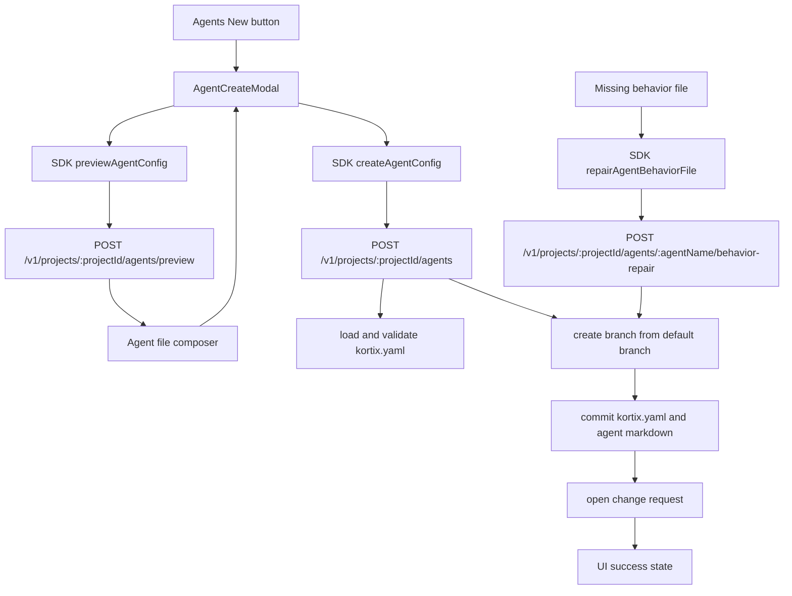

# Direct Agent Creation - Plan

## Goal Capsule

| Field | Value |
|---|---|
| Objective | Replace agent-led custom agent creation with a first-class Create agent flow in Customize. |
| Authority | User-confirmed scope in this conversation, then `docs/specs/2026-07-05-agent-first-config-unification.md`, then existing API/SDK/UI contracts. |
| Execution profile | API, SDK, web UI, tests, local black-box QA, PR, merge, Deploy Dev verification. |
| Stop conditions | Stop if v2 manifests cannot represent the requested agent, if the repo cannot create a branch from the default branch, or if the create route cannot open a reviewable change request. |
| Tail ownership | After merge, verify direct creation against `https://dev.kortix.com` and `https://dev-api.kortix.com` with the merged SHA. |

Product Contract preservation: no upstream requirements artifact exists. This plan bootstraps the Product Contract from the user-confirmed scope and the inspected failure path.

Terminology: `agentName` is the canonical API and SDK request field. It is a slug value that satisfies the existing agent-name validation. UI labels can say `Agent name`, but route payloads, SDK types, tests, and saved paths use `agentName`.

---

## Product Contract

### Summary

Users create custom agents from Customize without starting a session.
The flow collects the agent definition in a Kortix-owned form, shows the generated files, writes the repo changes to a branch, and opens a change request.
Phase 1 ships manual create, preview, review, and repair.
Phase 2 can add AI draft assistance after Phase 1 passes local and dev black-box QA.
AI draft can populate fields, but the form submission is the only persistence path.

### Problem Frame

The current `New` button in Customize starts a normal agent-led session with a prompt from `apps/web/src/features/workspace/customize/use-configure-thread.ts`.
That makes a file operation depend on sandbox provisioning, model enablement, and the selected agent's behavior.
The observed failure showed all three symptoms: a stuck `Reserving your computer` state, `This model is turned off for this project`, and a missing `.kortix/opencode/agents/reliance-cto.md` preview.

### Requirements

**Direct creation**

- R1. The Agents section must open a Create agent modal when the user clicks `New`.
- R2. The Create agent flow must not create a project session, reserve a sandbox, or send the creation prompt to a runtime agent.
- R3. The form must capture `agentName`, description, mode, model, prompt body, runtime settings, and Kortix governance grants needed by the existing v2 agent editor.
- R4. The form must render the generated behavior markdown before the user submits.

**Repo and review model**

- R5. Create agent must write `kortix.yaml` governance and `.kortix/opencode/agents/<agentName>.md` behavior in one branch commit.
- R6. Create agent must open a Kortix change request for that branch.
- R7. A created agent must not become an active default-branch agent until the change request merges.
- R8. The success state must show the created branch, behavior path, and change request entry point.

**Phase 2 AI assistance**

- R9. AI draft must be optional and must only populate editable form fields.
- R10. AI draft failure must leave the manual form usable.
- R11. A disabled or unavailable model must produce a field-level or banner error, not a failed agent creation.
- R11a. Phase 1 must not depend on the AI draft route.

**Recovery and errors**

- R12. A declared agent whose behavior file is missing must show a repair action on the Agents screen.
- R13. Repair must create a user-reviewed behavior scaffold through the same reviewed branch and change request path.
- R13a. Repair must not claim to recover behavior that is not available from the repository.
- R14. Duplicate `agentName` values, pending duplicate create CRs, invalid `agentName` values, v1 manifests, missing Git access, and missing permissions must return specific UI errors.
- R15. Existing Skills and Commands `New` behavior must stay unchanged in this scope.

### Actors

- A1. Project manager. Has permission to create agents and open change requests.
- A2. Read-only project member. Can view agents but cannot create or repair them.
- A3. Reviewer. Reviews and merges the change request.
- A4. Optional draft user. Uses AI draft help but still reviews the form before submit.
- A5. Scoped agent caller. Calls the API with an agent or session token and must pass human capability gates plus the `project.cr.open` agent grant.

### Key Flows

- F1. Create a new agent.
  - **Trigger:** A1 clicks `New` in Customize -> Agents.
  - **Steps:** The modal opens, A1 fills the form, A1 reviews generated markdown, A1 submits, the API creates a branch commit, and the API opens a change request.
  - **Outcome:** The UI shows the CR and the agent does not appear as active until merge.
  - **Covers:** R1, R2, R3, R4, R5, R6, R7, R8.
- F2. Draft with AI, then save manually.
  - **Trigger:** A4 clicks `Draft with AI` in the create modal.
  - **Steps:** The UI sends the draft brief, the API returns structured fields, A4 edits them, and A4 submits the form.
  - **Outcome:** Only the form submission writes files.
  - **Covers:** R9, R10, R11.
  - **Phase:** Phase 2 only.
- F3. Repair a missing behavior file.
  - **Trigger:** A1 opens an agent whose `.kortix/opencode/agents/<agentName>.md` file is missing.
  - **Steps:** The detail pane shows a missing behavior state, A1 reviews or edits the scaffold prompt, A1 clicks repair, the API creates a branch with the missing `.md`, and the API opens a change request.
  - **Outcome:** The generic file-preview failure is replaced by an agent-specific scaffold path.
  - **Covers:** R12, R13, R14.

### Acceptance Examples

- AE1. Given a v2 project and a manager with `project.agent.write` plus `project.gitops.push`, when the manager creates `reliance-cto`, then the API returns `201`, a branch name, a commit SHA, `change_request`, `kortix.yaml`, and `.kortix/opencode/agents/reliance-cto.md`.
- AE2. Given Phase 2 is enabled and the selected draft model is disabled, when the user clicks `Draft with AI`, then the modal shows an unavailable model error and keeps all manually typed values.
- AE3. Given a declared `reliance-cto` agent with no behavior file, when the manager reviews scaffold markdown and clicks repair, then the API opens a change request containing only the missing behavior file unless governance normalization is required.
- AE4. Given an existing `reliance-cto` agent, when the manager attempts to create `reliance-cto` again, then the API returns `409` and the modal keeps the draft open.
- AE5. Given a v1 manifest, when the manager opens Create agent, then the modal blocks submit and links to the v2 migration path.
- AE6. Given an open change request already creates `reliance-cto`, when the manager attempts to create `reliance-cto`, then the API returns `409` with the existing change request.

### Scope Boundaries

- In scope: direct creation for agents in Customize.
- In scope for Phase 2: AI draft assistance for agent fields.
- In scope: missing behavior file recovery for declared agents.
- In scope: SDK and React Query hooks for the new API contracts.
- Out of scope: direct Skill creation.
- Out of scope: direct Command creation.
- Out of scope: marketplace installs.
- Out of scope: a full prompt template marketplace.

---

## Planning Contract

### Key Technical Decisions

- KTD1. **Use a Kortix-owned form for agent creation** (session-settled: user-approved - chosen over agent-led file creation because the agent can reply with instructions and leave no file). This governs R1, R2, R3, and R4.
- KTD2. **Create agents through a reviewed branch and change request** (session-settled: user-approved - chosen over writing the default branch because new agents must stay repo-owned and reviewable). This governs R5, R6, R7, R8, and R13.
- KTD3. **Keep the existing two-home agent model.** Governance stays in `kortix.yaml`; OpenCode behavior stays in `.kortix/opencode/agents/<agentName>.md`. This follows `docs/specs/2026-07-05-agent-first-config-unification.md`.
- KTD4. **Add public SDK methods before web use.** `apps/web` must consume `@kortix/sdk` and `@kortix/sdk/react`; it must not add raw API calls.
- KTD5. **Do not reuse the existing `PUT /agents/:agentName/config` route for creation.** That route commits to `loaded.row.defaultBranch`. Create and repair need a branch plus CR path.
- KTD6. **Make preview deterministic on the API.** The preview endpoint uses the same validation and markdown serializer as create. The response includes `preview_revision`, which is a hash of the normalized draft. Submit includes `preview_revision`, and the API rejects stale revisions with `409`.
- KTD7. **AI draft is a Phase 2 field generator, not a writer.** Draft output never opens a branch, never writes files, and never creates a session. Phase 2 starts only after implementers identify an existing non-session model invocation path. If no path exists, leave the draft route disabled behind a feature flag.
- KTD8. **Creation requires both agent-write and GitOps-push authority.** Preview and draft require `project.agent.write`. Create and repair require `project.agent.write` plus `project.gitops.push`. Scoped agent callers must also pass the `project.cr.open` agent-grant gate.
- KTD9. **Repair is a first-class agent state.** Missing `.md` for a declared agent is not a generic source-read failure on the Agents screen. Repair creates a user-reviewed scaffold and never represents the file as recovered original behavior.
- KTD10. **Reserve `agentName` across open change requests.** Create rejects when an open CR already touches `kortix.yaml` and `.kortix/opencode/agents/<agentName>.md` for the same `agentName`. The response returns the existing `change_request`.
- KTD11. **Use predictable branch names with collision retry.** Branch names use `kortix/agents/<operation>/<agentName>-<yyyymmddHHMMss>-<shortId>`. The API retries once on branch-name collision, then returns `409`.

### High-Level Technical Design

The API owns the canonical file composition.
`agent-config.ts` gets one pure composer that returns the next manifest raw object, behavior file path, behavior markdown, and validation issues.
Preview calls the composer and returns generated content without writing.
Create calls the composer, creates a branch from the default branch, commits all files, and opens a CR.
Repair requires reviewed behavior markdown from the user or the UI scaffold.
Repair calls the composer with the existing governance block and reviewed behavior body, then uses the same branch and CR path.
Repair returns `400` if the request omits behavior markdown.
Branch creation uses `kortix/agents/create/<agentName>-<yyyymmddHHMMss>-<shortId>` and `kortix/agents/repair/<agentName>-<yyyymmddHHMMss>-<shortId>`.

### Existing Patterns To Follow

- `apps/api/src/projects/routes/agent-config.ts` already merges governance and behavior for existing agents.
- `apps/api/src/projects/lib/agent-config-v2.ts` already validates and upserts v2 `agents.<name>` blocks.
- `apps/api/src/projects/lib/agent-markdown.ts` already parses and serializes agent markdown.
- `apps/api/src/projects/git/branches.ts` already has `createRemoteSessionBranch()` and `commitMultipleFilesToBranch()`.
- `apps/api/src/projects/routes/r8.ts` already validates and inserts change requests.
- `packages/sdk/src/core/rest/projects-client/agent-config.ts` already exports agent config types and methods.
- `apps/web/src/features/workspace/customize/sections/view/agent-editor.tsx` already owns the full agent editor shell.
- `apps/web/src/features/workspace/customize/sections/view/runtime-layer-fields.tsx` and `apps/web/src/features/workspace/customize/sections/view/kortix-layer-fields.tsx` already own field blocks.
- `apps/web/src/features/workspace/customize/sections/component/config-entity-view.tsx` owns the generic `New` action that must become overrideable.

### Sequencing

1. Add backend composer, preview, create, repair, and CR-helper tests first.
2. Add SDK types, methods, facade entries, and React hooks with SDK TDD.
3. Add the Agents UI create modal and `ConfigEntityView` create override.
4. Add missing behavior file recovery state.
5. Run local black-box API and browser QA for manual create and repair.
6. Ship Phase 1 through PR, merge, Deploy Dev, and dev black-box QA.
7. Add optional AI draft in a Phase 2 PR after Phase 1 passes local and dev black-box QA.

### Risks And Dependencies

- Branch creation must start from the project default branch. `commitMultipleFilesToBranch()` alone is not enough for a new branch because a missing branch gets an empty-tree parent.
- CR creation logic currently lives inline in `apps/api/src/projects/routes/r8.ts`. The implementation must extract a helper instead of duplicating allocation and ahead-state logic.
- The SDK is a published package. Public type additions require TDD and synchronized exports per `packages/sdk/AGENTS.md`.
- Existing full agent config updates commit to the default branch. This plan only changes create and repair paths.
- AI draft depends on enabled model resolution. The base create flow must work when draft is unavailable.
- Missing behavior detection must distinguish `missing`, `exists`, and `read_error`. Empty files count as `exists`, not `missing`.
- CR lookup for duplicate pending creates depends on being able to read open CR file paths. If the existing CR storage lacks that query, add it to the CR helper in U1.

---

## Implementation Units

### U1. Backend file composition, preview, create, repair, and CR helper

- **Goal:** Add deterministic API routes that validate agent drafts, generate files, write a branch commit, and open a change request.
- **Requirements:** R4, R5, R6, R7, R8, R12, R13, R14.
- **Files:**
  - `apps/api/src/projects/routes/agent-config.ts`
  - `apps/api/src/projects/lib/agent-config-v2.ts`
  - `apps/api/src/projects/change-requests.ts`
  - `apps/api/src/projects/routes/r8.ts`
  - `apps/api/src/__tests__/unit-agent-config-v2.test.ts`
  - `apps/api/src/__tests__/integration-agent-config-create-route.test.ts`
  - `apps/api/src/__tests__/integration-project-write-leaf-gates-http.test.ts`
- **Approach:** Add a pure agent-file composer that accepts `agentName`, `block`, `baseRef`, `preview_revision`, and mode `create | repair | preview`. Use `applyAgentBlockV2()`, `validateAgentMdFrontmatter()`, `serializeAgentMarkdown()`, and `extractAgents()` before any write. Extract a reusable CR creation helper from `r8.ts`. In create and repair, call `createRemoteSessionBranch()` from the default branch before `commitMultipleFilesToBranch()`. Generate branch names with `kortix/agents/<operation>/<agentName>-<yyyymmddHHMMss>-<shortId>`. Check open CRs before branch creation and return `409` with the existing `change_request` when a pending CR reserves the same `agentName`. Return `409` for duplicates or stale preview revisions, `400` for invalid manifest, invalid `agentName`, or missing repair markdown, `403` for missing capability, and `502` for git write failures.
- **Test Scenarios:**
  - Preview returns generated markdown and paths without writing a branch.
  - Preview returns `preview_revision` for the normalized draft.
  - Create rejects a stale `preview_revision` with `409`.
  - Create writes `kortix.yaml` and `.kortix/opencode/agents/<agentName>.md` in one commit.
  - Create opens a CR whose `head_ref` is ahead of `base_ref`.
  - Create uses the branch pattern `kortix/agents/create/<agentName>-<yyyymmddHHMMss>-<shortId>`.
  - Create retries one branch-name collision and returns `409` on a second collision.
  - Create rejects an existing manifest agent with `409`.
  - Create rejects an existing behavior file without a manifest block with `409`.
  - Create rejects when an open CR already reserves the same `agentName`, and the response includes that CR.
  - Create rejects v1 manifests with a v2 migration error.
  - Create rejects `connectors_personal` values outside `connectors`.
  - Repair rejects when the behavior file exists.
  - Repair rejects missing behavior markdown with `400`.
  - Repair succeeds when the manifest block exists and the behavior file is missing.
  - Repair commits the reviewed scaffold body and does not claim to restore original behavior.
  - Gate tests prove `project.agent.write` and `project.gitops.push` are both required.
  - Gate tests prove scoped agent callers without `project.cr.open` are denied create and repair.
- **Verification:** Run `bun test apps/api/src/__tests__/unit-agent-config-v2.test.ts apps/api/src/__tests__/integration-agent-config-create-route.test.ts apps/api/src/__tests__/integration-project-write-leaf-gates-http.test.ts`.

### U2. SDK and React hooks

- **Goal:** Expose typed preview, create, and repair contracts through `@kortix/sdk`.
- **Requirements:** R1, R4, R5, R6, R8, R13.
- **Files:**
  - `packages/sdk/PROGRESS.md`
  - `packages/sdk/src/core/rest/projects-client/agent-config.ts`
  - `packages/sdk/src/core/rest/projects-client/agent-config.test.ts`
  - `packages/sdk/src/core/rest/projects-client/index.ts`
  - `packages/sdk/src/core/client/kortix.ts`
  - `packages/sdk/src/core/client/kortix.test.ts`
  - `packages/sdk/src/index.ts`
  - `packages/sdk/src/react/index.ts`
  - `packages/sdk/src/react/use-agent-config-create.ts`
  - `apps/web/src/hooks/projects/use-agent-config.ts`
- **Approach:** Add `PreviewAgentConfigRequest`, `PreviewAgentConfigResponse`, `CreateAgentConfigRequest`, `CreateAgentConfigResponse`, `RepairAgentBehaviorFileRequest`, and matching methods. Add a `project(projectId).agents` facade with `getConfig`, `preview`, `create`, and `repairBehaviorFile`. Add React hooks that invalidate `agent-config`, `project-detail`, `project-config`, and `project-change-requests` on success. Update public-surface snapshots if `packages/sdk` requires them for new exported names. Add draft SDK methods only when U5 is selected.
- **Test Scenarios:**
  - SDK preview posts to `/projects/:projectId/agents/preview`.
  - SDK create posts to `/projects/:projectId/agents`.
  - SDK repair posts to `/projects/:projectId/agents/:agentName/behavior-repair`.
  - The `createKortix().project(projectId).agents` facade binds `projectId`.
  - Root exports include the new request and response types.
- **Verification:** Run `pnpm --filter @kortix/sdk test`, `pnpm --filter @kortix/sdk typecheck`, and `pnpm --filter @kortix/sdk smoke:install`.

### U3. Agents create modal and `New` override

- **Goal:** Replace the Agents `New` session-start path with a first-class create modal.
- **Requirements:** R1, R2, R3, R4, R8, R14, R15.
- **Files:**
  - `apps/web/src/features/workspace/customize/sections/component/config-entity-view.tsx`
  - `apps/web/src/features/workspace/customize/sections/view/agents-view.tsx`
  - `apps/web/src/features/workspace/customize/sections/view/agent-create-modal.tsx`
  - `apps/web/src/features/workspace/customize/sections/view/agent-editor.tsx`
  - `apps/web/src/features/workspace/customize/sections/view/runtime-layer-fields.tsx`
  - `apps/web/src/features/workspace/customize/sections/view/kortix-layer-fields.tsx`
  - `apps/web/src/features/workspace/customize/sections/view/agent-create-modal.test.tsx`
- **Approach:** Add an optional `renderCreateAction` or `onCreate` prop to `ConfigEntityView`. Use it only from `AgentsView`. Keep Skills and Commands on `configure.start(newConfigPrompt(kind))`. Extract a reusable `AgentConfigFormFields` component from the existing editor so create and edit share validation, model selection, runtime fields, and governance fields. Build one create modal with a two-column desktop layout: form on the left, sticky markdown preview on the right. On mobile, stack form then preview. Group fields as Identity, Behavior, Runtime, Governance, and Preview. Show preview markdown from the SDK preview route. Disable submit when preview is missing, loading, failed, or stale. On successful create, show branch, behavior path, and a CR action.
- **UI State Contract:**
  - Initial empty form: preview area shows no markdown, submit is disabled, draft button is optional.
  - Invalid form: field error is visible, preview and submit are disabled for invalid blocking fields.
  - Preview loading: preview controls show progress, submit is disabled, existing preview remains visually marked stale.
  - Preview success: markdown, behavior path, and manifest changes render from the API response.
  - Preview error: error text maps the typed API error; retry stays available.
  - Edited after preview: preview is marked stale and submit is disabled until preview succeeds again.
  - Submit loading: close is guarded, create buttons are disabled, and the form values remain visible.
  - Submit validation error: modal stays open and highlights the failing field.
  - Submit permission error: modal stays open and names the missing permission.
  - Git or CR failure: modal stays open with retry and no local success state.
  - Create success: modal shows branch, commit SHA, behavior path, and CR action.
- **Accessibility and Responsive Contract:** Trap focus inside the modal, return focus to `New` on close, support `Esc` and explicit close, label every input, announce validation and async errors, keep preview, submit, draft, and repair reachable by keyboard, preserve touch targets of at least 44px, and verify mobile width without text overlap.
- **Test Scenarios:**
  - The Agents `New` button opens `AgentCreateModal`.
  - The Agents `New` button does not call `useConfigureThread().start`.
  - Skills and Commands `New` still call `useConfigureThread().start`.
  - Invalid `agentName` disables submit and shows the validation message.
  - Successful submit calls SDK create with `agentName`, `preview_revision`, and `block`.
  - Success state displays the CR number and behavior path.
  - Missing `project.agent.write` disables create or shows a specific agent-write permission error, even when `project.gitops.push` is present.
  - A `403` or missing GitOps permission disables create or shows a specific error.
  - Submit is disabled when the preview is stale.
  - Preview error keeps the modal open and preserves values.
  - Focus returns to `New` after modal close.
  - The modal layout has no clipped text at mobile and desktop widths.
- **Verification:** Run `pnpm --filter Kortix-Computer-Frontend test -- src/features/workspace/customize/sections/view/agent-create-modal.test.tsx` and `npx eslint apps/web/src/features/workspace/customize/sections/component/config-entity-view.tsx apps/web/src/features/workspace/customize/sections/view/agents-view.tsx apps/web/src/features/workspace/customize/sections/view/agent-create-modal.tsx`.

### U4. Missing behavior file recovery state

- **Goal:** Replace generic missing-source behavior with an agent-specific repair action.
- **Requirements:** R12, R13, R14.
- **Files:**
  - `apps/api/src/projects/routes/agent-config.ts`
  - `packages/sdk/src/core/rest/projects-client/agent-config.ts`
  - `apps/web/src/features/workspace/customize/sections/component/config-entity-view.tsx`
  - `apps/web/src/features/workspace/customize/sections/view/agents-view.tsx`
  - `apps/web/src/features/workspace/customize/sections/view/agent-missing-behavior.tsx`
  - `apps/web/src/features/workspace/customize/sections/view/agent-missing-behavior.test.tsx`
- **Approach:** Add `behavior_path` and `behavior_file_state` to `AgentConfigResponse`. `behavior_file_state` is `exists | missing | read_error`. Empty behavior files return `exists`. In the Agents detail pane, render repair only for `missing`. Render read retry for `read_error`. Render the generic source error for non-agent source failures. The repair view shows a behavior scaffold textarea that the user must review or edit before submit. The repair action calls the SDK repair method with `agentName` and behavior markdown, then returns the CR success state.
- **Test Scenarios:**
  - `behavior_file_state: missing` renders the repair CTA.
  - `behavior_file_state: exists` with an empty file does not render the repair CTA.
  - `behavior_file_state: read_error` renders retry and no repair CTA.
  - A non-agent source 404 still renders the generic source error.
  - A read-only user sees the missing behavior explanation without the repair CTA.
  - Repair requires non-empty behavior markdown before submit.
  - Repair success invalidates file source, agent config, project detail, and change request queries.
- **Verification:** Run `pnpm --filter Kortix-Computer-Frontend test -- src/features/workspace/customize/sections/view/agent-missing-behavior.test.tsx`.

### U5. Phase 2 optional AI draft

- **Goal:** Let users ask for a draft agent definition without giving AI ownership of persistence.
- **Requirements:** R9, R10, R11.
- **Files:**
  - `apps/api/src/projects/routes/agent-config.ts`
  - `apps/api/src/__tests__/integration-agent-config-draft-route.test.ts`
  - `packages/sdk/src/core/rest/projects-client/agent-config.ts`
  - `packages/sdk/src/core/rest/projects-client/agent-config.test.ts`
  - `apps/web/src/features/workspace/customize/sections/view/agent-create-modal.tsx`
  - `apps/web/src/features/workspace/customize/sections/view/agent-create-modal.test.tsx`
- **Approach:** Add `POST /v1/projects/:projectId/agents/draft` only after U1 through U4 and Phase 1 QA pass. Accept a short brief plus optional model. Resolve the model through the existing project model enablement path. Use an existing non-session model invocation path only. Do not start a session, reserve a sandbox, or send prompts to an agent runtime. Send only user-provided brief text and selected model metadata. Do not send project secrets, connector credentials, repo file contents, or existing manifest secret values. Do not log raw brief text. Return structured draft fields only after schema validation. On route failure, return a typed error and do not mutate repo state.
- **Replacement Flow:** `Draft with AI` fills empty fields automatically. If non-empty fields would change, show a comparison dialog with per-field checkboxes, `Apply selected`, `Keep current`, and `Cancel`. Preserve current values until the user applies changes. Keep an undo snapshot for the last applied draft. A typed error leaves every field unchanged.
- **Test Scenarios:**
  - Draft returns `agentName`, `description`, `mode`, and `prompt` for a valid brief.
  - Draft rejects disabled model with a typed error.
  - Draft failure leaves existing form values unchanged.
  - Draft requires `project.agent.write`.
  - Draft sends no project secrets, connector credentials, repo file contents, or manifest secret values to the model call.
  - Draft rejects malformed model output before it reaches the form.
  - Draft does not call create, preview, branch, commit, or CR helpers.
  - Non-empty field replacement requires explicit per-field confirmation.
- **Verification:** Run `bun test apps/api/src/__tests__/integration-agent-config-draft-route.test.ts` and the SDK/web tests listed in U2 and U3.

### U6. Black-box QA, docs, and delivery

- **Goal:** Prove the feature through real API and UI surfaces, then ship through dev.
- **Requirements:** R1 through R8 and R12 through R15 for Phase 1. R9 through R11 apply only when U5 is selected.
- **Files:**
  - `tests/e2e/`
  - `tests/spec/end-to-end.md`
  - `apps/web/content/docs/sdk/`
  - `packages/sdk/README.md`
- **Approach:** Add E2E coverage only if existing harnesses have a stable Customize flow helper. Otherwise perform manual Playwright QA and document the exact network and DOM assertions in the PR. Update SDK docs when new public SDK methods are added. Phase 1 QA must pass without the draft route enabled.
- **Test Scenarios:**
  - Local API call creates a real branch and CR for `reliance-cto`.
  - Local UI creates `reliance-cto` from Customize without creating a session.
  - Local UI shows preview markdown before save.
  - Local UI shows the created CR and does not show the agent as active before merge.
  - Local UI repairs a missing behavior file through a CR.
  - Dev UI repeats the same create flow after Deploy Dev reaches the merge SHA.
  - Phase 1 local and dev QA pass with AI draft disabled.
- **Verification:** Run `pnpm dev`, authenticate locally, drive Customize in Chromium, assert `POST /v1/projects/:projectId/agents` and visible CR state, then repeat against dev after merge.

---

## Verification Contract

Run the Phase 2 draft gate only when U5 is implemented.

| Gate | Command or action | Proves |
|---|---|---|
| API unit and integration | `bun test apps/api/src/__tests__/unit-agent-config-v2.test.ts apps/api/src/__tests__/integration-agent-config-create-route.test.ts apps/api/src/__tests__/integration-project-write-leaf-gates-http.test.ts` | Validation, branch/CR creation, repair scaffold behavior, IAM gates. |
| Phase 2 API draft | `bun test apps/api/src/__tests__/integration-agent-config-draft-route.test.ts` | If U5 is selected, draft non-write behavior, disabled-model handling, and data minimization. |
| SDK tests | `pnpm --filter @kortix/sdk test` | SDK request URLs, response types, and facade bindings. |
| SDK typecheck | `pnpm --filter @kortix/sdk typecheck` | Public type exports and examples compile. |
| SDK install smoke | `pnpm --filter @kortix/sdk smoke:install` | Packed package installs and imports through published entry points. |
| Web focused tests | `pnpm --filter Kortix-Computer-Frontend test -- src/features/workspace/customize/sections/view/agent-create-modal.test.tsx src/features/workspace/customize/sections/view/agent-missing-behavior.test.tsx` | Modal behavior, create override, stale preview handling, missing-file repair state, and permission errors. |
| Web lint | `npx eslint apps/web/src/features/workspace/customize/sections/component/config-entity-view.tsx apps/web/src/features/workspace/customize/sections/view/agents-view.tsx apps/web/src/features/workspace/customize/sections/view/agent-create-modal.tsx apps/web/src/features/workspace/customize/sections/view/agent-missing-behavior.tsx apps/web/src/hooks/projects/use-agent-config.ts` | Changed frontend files meet lint rules. |
| Local API black-box | Authenticated `POST /v1/projects/:projectId/agents/preview`, `POST /v1/projects/:projectId/agents`, and `GET /v1/projects/:projectId/change-requests/:crId/diff` | Real HTTP contract creates expected files on a branch and opens a CR. |
| Local browser QA | Chromium against `http://localhost:3000` with network assertion for `POST /v1/projects/:projectId/agents` | User can create an agent from Customize without a session boot, with accessible modal behavior. |
| Delivery | PR merged to `main`, Deploy Dev completed, deployed SHA equals merge SHA | The merged code is deployed. |
| Dev black-box | Repeat API and browser QA against `https://dev-api.kortix.com` and `https://dev.kortix.com` | Deployed behavior works with the real dev control plane. |

---

## Definition of Done

- D1. Agents `New` opens a modal and does not start a session.
- D2. Create agent writes `kortix.yaml` and `.kortix/opencode/agents/<agentName>.md` to a non-default branch.
- D3. Create agent opens a change request and returns its ID to the UI.
- D4. The new agent is inactive until the CR merges.
- D5. Missing behavior files show a repair action on the Agents screen.
- D6. Repair requires user-reviewed behavior markdown and does not claim original behavior recovery.
- D7. SDK public methods and exported types cover preview, create, and repair.
- D8. Focused API, SDK, and web tests pass.
- D9. Local API and browser black-box checks pass with real requests.
- D10. The PR is merged to `main`.
- D11. Deploy Dev completes for the merge SHA.
- D12. Dev API and browser black-box checks pass against the deployed SHA.
- D13. The final diff contains no abandoned experimental code.
- D14. If Phase 2 is selected, AI draft can fill the form but cannot write files, send secrets, or depend on sandbox boot.

---

## Appendix

### Code Research

- `apps/web/src/features/workspace/customize/use-configure-thread.ts` defines `NEW_PROMPTS.agent` and starts a new session for current agent creation.
- `apps/web/src/features/workspace/customize/sections/component/config-entity-view.tsx` hard-wires `New` to `configure.start(newConfigPrompt(kind))`.
- `apps/web/src/features/workspace/customize/sections/view/agents-view.tsx` renders `ConfigEntityView<Agent>` and the existing `AgentConfigEditor`.
- `apps/web/src/features/workspace/customize/sections/view/agent-editor.tsx` already edits an existing `AgentConfigBlock`.
- `apps/api/src/projects/routes/agent-config.ts` reads and updates existing agent config, but the PUT route commits to `loaded.row.defaultBranch`.
- `apps/api/src/projects/lib/agent-config-v2.ts` already validates and upserts v2 agent blocks.
- `apps/api/src/projects/git/branches.ts` provides branch and commit helpers. New-branch commits must call `createRemoteSessionBranch()` before `commitMultipleFilesToBranch()`.
- `apps/api/src/projects/routes/r8.ts` owns current CR creation validation and DB insertion.
- `packages/sdk/src/core/rest/projects-client/agent-config.ts` is the current SDK home for agent config calls.
